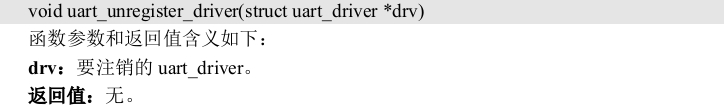
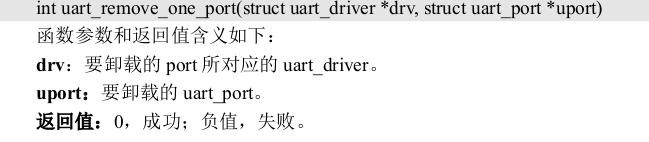

# Linux驱动开发与裸机开发的区别

## 逻辑开发

底层，跟寄存器打交道，有些MCU提供了库。

## Linux驱动开发的思维

1. Linux下驱动开发直接操作寄存器不现实。
2. 根据Linux下的各种驱动框架进行开发。一定要满足框架，也就是Linux下各种驱动框架的掌握。
3. 驱动最终表现就是/dev/xxx文件。打开、关闭、读写、。。。
4. 现在新的内核支持设备树，这个一个.dts文件，此文件 描述了板子的设备信息。

## Linux驱动分类

1. 字符设备驱动。
2. 块设备驱动，存储
3. 网络设备驱动

一个设备不说是一定只属于某一个类型。比如USB WIFI,SDIO WIFI，属于网络设备驱动，因为他又有USB和SDIO，因此也属于字符设备驱动。

# Linux驱动开发

## 字符设备驱动开发

以一个虚拟的设备为例，学习如何进行字符设备驱动开发，以及如何编写测试 APP 来测试驱动工作是否正常。

### 字符设备驱动简介

字符设备就是一个一个字节，按照字节流进行读写操作的设备，读写数据是分先后顺序的。常见的点灯、按键、IIC、SPI， LCD 等等都是字符设备，这些设备的驱动就叫做字符设备驱动。

### Linux 应用程序对驱动程序的调用流程

在 Linux 中一切皆为文件，驱动加载成功以后会在“/dev”目录下生成一个相应的文件，应用程序通过对这个名为“/dev/xxx”(xxx 是具体的驱动文件名字)的文件进行相应的操作即可实 现对硬件的操作。应用程序可以通过各种API函数来操作这个驱动文件以完成打开、关闭以及读写等任务。

应用程序运行在用户空间，而 Linux 驱动属于内核的一部分，因此驱动运行于内核空间。 当我们在用户空间想要实现对内核的操作，比如使用 open 函数打开/dev/led 这个驱动，因为用户空间不能直接对内核进行操作，因此必须使用一个叫做“系统调用”的方法来实现从用户空 间“陷入”（软件中断）到内核空间，这样才能实现对底层驱动的操作。open、close、write 和 read 等这些函数是由 C 库提供的，在 Linux 系统中，系统调用作为 C 库的一部分。


关于 C 库以及如何通过系统调用“陷入”到内核空间这个我们不用去管，我们重点关注的是应用程序和具体的驱动，应用程序使用到的函数在具体驱动程序中都有与之对应的函数， 比如应用程序中调用了 open 这个函数，那么在驱动程序中也得有一个名为 open 的函数。
每一个系统调用，在驱动中都有与之对应的一个驱动函数，在 Linux 内核文件 **include/linux/fs.h**中有个叫做 **file_operations** 的结构体，此结构体就是Linux内核驱动操作函数集合。

### 字符设备驱动开发步骤

在 Linux 驱动开发中需要按照其规定的框架来编写驱动，所以说学 Linux 驱动开发重点是学习其驱动框架。

#### 1、驱动模块的加载和卸载

Linux 驱动有两种运行方式：

1. 将驱动编译进 Linux 内核中，这样当 Linux 内核启 动的时候就会自动运行驱动程序
2. 将驱动编译成模块(Linux 下模块扩展名为.ko)，在 Linux 内核启动以后使用“insmod”命令加载驱动模块

在调试驱动的时候一般都选择将其编译 为模块，这样我们修改驱动以后只需要编译一下驱动代码即可，不需要编译整个 Linux 代码。而且在调试的时候只需要加载或者卸载驱动模块即可，不需要重启整个系统。

模块有加载和卸载两种操作，我们在编写驱动的时候需要注册这两种操作函数，模块的加载和 卸载注册函数如下：

```
module_init(xxx_init); //注册模块加载函数
module_exit(xxx_exit); //注册模块卸载函数
```

module_init 函数用来向 Linux 内核注册一个模块加载函数，参数 xxx_init 就是需要注册的具体函数，当使用“insmod”命令加载驱动的时候，xxx_init 这个函数就会被调用。module_exit() 函数用来向 Linux 内核注册一个模块卸载函数，参数 xxx_exit 就是需要注册的具体函数，当使 用“rmmod”命令卸载具体驱动的时候 xxx_exit 函数就会被调用。

驱动编译完成以后扩展名为.ko，有两种命令可以加载驱动模块：insmod和modprobe

这两个命令的区别在于：insmod不能解决模块之间的依赖关系，必须逐个加载模块。
modprobe命令可以解决问题，其会分析模块之间的依赖关系，然后会将所有的依赖模块都加载到内核中

modprobe 命令默认会去 /lib/modules/目录中查找模块，比如这里使用的 Linux kernel 的版本号为 4.1.15， 因此 modprobe 命令默认会到/lib/modules/4.1.15 这个目录中查找相应的驱动模块，一般自己制作的根文件系统中是不会有这个目录的，所以需要自己手动创建。

使用 modprobe 命令可以卸载掉驱动模块所依赖的其他模块，前提是这些依赖模块已经没 有被其他模块所使用，否则就不能使用 modprobe 来卸载驱动模块。所以对于模块的卸载，还是推荐使用 rmmod 命令。

#### 2、字符设备注册于注销

对于字符设备驱动而言，当驱动模块加载成功以后需要注册字符设备，同样，卸载驱动模 块的时候也需要注销掉字符设备。字符设备的注册和注销函数原型如下所示:

```c
static inline int register_chrdev(unsigned int major, const char *name,
									const struct file_operations *fops)
static inline void unregister_chrdev(unsigned int major, const char *name)
```

register_chrdev 函数用于注册字符设备，此函数一共有三个参数，这三个参数的含义如下：

- major：主设备号，Linux 下每个设备都有一个设备号，设备号分为主设备号和次设备号两部分
- name：设备名字，指向一串字符串。
- fops：结构体 file_operations 类型指针，指向设备的操作函数集合变量。

unregister_chrdev 函数用户注销字符设备，此函数有两个参数，这两个参数含义如下：

- major：要注销的设备对应的主设备号。
- name：要注销的设备对应的设备名。

一般字符设备的注册在驱动模块的入口函数 xxx_init 中进行，字符设备的注销在驱动模块 的出口函数 xxx_exit 中进行。

#### 3、实现设备的具体操作函数

file_operations 结构体就是设备的具体操作函数。要使用该结构体中的函数需要对其进行初始化，也就是初始化其中的open、 release、read 和 write 等具体的设备操作函数。

假设对 chrtest 这个设备有如下两个要求：

1. **能够对 chrtest 进行打开和关闭操作**

   设备打开和关闭是最基本的要求，几乎所有的设备都得提供打开和关闭的功能。因此我们需要实现 file_operations 中的 open 和 release 这两个函数。

2. **对 chrtest 进行读写操作**

   假设 chrtest 这个设备控制着一段缓冲区(内存)，应用程序需要通过 read 和 write 这两个函数对 chrtest 的缓冲区进行读写操作。所以需要实现 file_operations 中的 read 和 write 这两个函数。

#### 4、添加 LICENSE 和作者信息

最后我们需要在驱动中加入 LICENSE 信息和作者信息，其中 LICENSE 是必须添加的，否则的话编译的时候会报错，作者信息可以添加也可以不添加。LICENSE 和作者信息的添加使用 如下两个函数：

```
MODULE_LICENSE() //添加模块 LICENSE 信息
MODULE_AUTHOR() //添加模块作者信息
```

### Linux设备号

#### 设备号的组成

为了方便管理，Linux 中每个设备都有一个设备号，设备号由主设备号和次设备号两部分组成，主设备号表示某一个具体的驱动，次设备号表示使用这个驱动的各个设备。

Linux 提供了 一个名为 dev_t 的数据类型表示设备号，dev_t 定义在文件 include/linux/types.h 里面，定义如下：

```
typedef __u32 __kernel_dev_t;
......
typedef __kernel_dev_t dev_t;
```

dev_t 是__u32 类型的，而__u32 定义在文件 include/uapi/asm-generic/int-ll64.h 里面：

typedef unsigned int __u32;

dev_t 其实就是 unsigned int 类型，是一个 32 位的数据类型。这 32 位的数据构成了主设备号和次设备号两部分，其中高 12 位为主设备号，低 20 位为次设备号。因此 Linux 系统中主设备号范围为 0~4095，所以在选择主设备号的时候一定不要超过这个范围。在文件 include/linux/kdev_t.h 中提供了几个关于设备号的操作函数(本质是宏)，如下所示：

```
#define MINORBITS 20
#define MINORMASK ((1U << MINORBITS) - 1)

#define MAJOR(dev) ((unsigned int) ((dev) >> MINORBITS))
#define MINOR(dev) ((unsigned int) ((dev) & MINORMASK))
#define MKDEV(ma,mi) (((ma) << MINORBITS) | (mi))
```

#### 设备号的分配

##### 1、静态分配设备号

本小节讲的设备号分配主要是主设备号的分配。前面讲解字符设备驱动的时候说过了，注 册字符设备的时候需要给设备指定一个设备号，这个设备号可以是驱动开发者静态的指定一个 设备号，比如选择 200 这个主设备号。有一些常用的设备号已经被 Linux 内核开发者给分配掉 了，具体分配的内容可以查看文档 Documentation/devices.txt。并不是说内核开发者已经分配掉 的主设备号我们就不能用了，具体能不能用还得看我们的硬件平台运行过程中有没有使用这个 主设备号，使用“cat /proc/devices”命令即可查看当前系统中所有已经使用了的设备号。

##### 2、动态分配设备号

静态分配设备号需要我们检查当前系统中所有被使用了的设备号，然后挑选一个没有使用 的。而且静态分配设备号很容易带来冲突问题，Linux 社区推荐使用动态分配设备号，在注册字 符设备之前先申请一个设备号，系统会自动给你一个没有被使用的设备号，这样就避免了冲突。 卸载驱动的时候释放掉这个设备号即可，设备号的申请函数如下：

```
int alloc_chrdev_region(dev_t *dev, unsigned baseminor, unsigned count, const char *name)
```

函数 alloc_chrdev_region 用于申请设备号，此函数有 4 个参数：

1. dev：保存申请到的设备号。
2. baseminor：次设备号起始地址，alloc_chrdev_region 可以申请一段连续的多个设备号，这 些设备号的主设备号一样，但是次设备号不同，次设备号以 baseminor 为起始地址地址开始递 增。一般 baseminor 为 0，也就是说次设备号从 0 开始。
3. count：要申请的设备号数量。
4. name：设备名字。

注销字符设备之后要释放掉设备号，设备号释放函数如下：

```
void unregister_chrdev_region(dev_t from, unsigned count)
```

两个参数：

1. from：要释放的设备号。
2. count：表示从 from 开始，要释放的设备号数量。

### chrdevbase 字符设备驱动开发实验

以 chrdevbase 这个虚拟设备为例，完整的编写一个字符设备驱动模块。chrdevbase 不是实际存在的一个设备，是为了方便讲解字符设备的开发而引入的一个虚拟设备。chrdevbase 设备有两个缓冲区，一个为读缓冲区，一个为写缓冲区，这两个缓冲区的大小都为 100 字节。在应用程序中可以向 chrdevbase 设备的写缓冲区中写入数据，从读缓冲区中读取数据。chrdevbase 这个虚拟设备的功能很简单，但是它包含了字符设备的最基本功能。

#### 1、准备工作

创建VSCode工程并给工程命名

添加头文件路径，需要用到Linux 源码中的函数，所以需要添加 Linux 源码中的头文件路径。
已有c_cpp_properties.json文件。

#### 2、编写驱动程序

新建 chrdevbase.c，完成驱动的编写

主要是实现各个函数然后初始化给到设备操作函数结构体

详见开发指南P1070

#### 3、编写测试APP

编写测试 APP 就是编写 Linux 应用，需要用到 C 库里面和文件操作有关的一些函数，比如 open、read、write 和 close 这四个函数。

详见开发指南P1072

#### 4、编译驱动程序和测试App

```makefile
KERNELDIR := /home/rodney/linux/linux-imx-rel_imx_4.1.15_2.1.0_ga_alientek
CURRENT_PATH := $(shell pwd)
obj-m := chrdevbase.o

build: kernel_modules

kernel_modules:
	$(MAKE) -C $(KERNELDIR) M=$(CURRENT_PATH) modules
clean:
	$(MAKE) -C $(KERNELDIR) M=$(CURRENT_PATH) clean
```

编译测试 APP：

arm-linux-gnueabihf-gcc chrdevbaseApp.c -o chrdevbaseApp

#### 5、运行测试

1. 网络启动并将文件拷贝到rootfs/lib/modules/4.1.15中

2. 加载 chrdevbase.ko 驱动文件

   insmod chrdevbase.ko   或    modprobe chrdevbase.ko
   可能遇到modprobe 提示无法打开“modules.dep”这个文件，直接运行depmod即可

3. 创建设备节点文件

   mknod /dev/chrdevbase c 200 0

4. chrdevbase 设备操作测试


### LED灯驱动实验见开发指南41、42章

### 设备树

描述设备树的文件叫做 DTS(Device  Tree Source)，这个 DTS 文件采用**树形结**构描述**板级设备**，也就是开发板上的设备信息，比如 CPU 数量、 内存基地址、IIC 接口上接了哪些设备、SPI 接口上接了哪些设备等等


树的主干就是系统总线，IIC 控制器、GPIO 控制器、SPI 控制器等都是接 到系统主线上的分支。IIC 控制器有分为 IIC1 和 IIC2 两种，其中 IIC1 上接了 FT5206 和 AT24C02 这两个 IIC 设备，IIC2 上只接了 MPU6050 这个设备。DTS 文件的主要功能就是按照上图所示的结构来描述板子上的设备信息，DTS 文件描述设备信息是有相应的语法规则要求。

#### 为什么使用设备树

在 Linux 内核源码中 大量的 arch/arm/mach-xxx 和 arch/arm/plat-xxx 文件夹，这些文件夹里面的文件就是对应平台下的板级信息。

这样的方式会导致linux内核中出现大量重复、冗余的文件。所以引入设备树将这些描述板级硬件信息的内容都从 Linux 内核中分离开来，用一个专属的文件格式来描述。文件扩展名为.dts

一个 SOC 可以作出很多不同的板子，这些不同的板子肯 定是有共同的信息，将这些共同的信息提取出来作为一个通用的文件，其他的.dts 文件直接引 用这个通用文件即可，这个通用文件就是.dtsi 文件，类似于 C 语言中的头文件。一般.dts 描述 板级信息(也就是开发板上有哪些 IIC 设备、SPI 设备等)，.dtsi 描述 SOC 级信息(也就是 SOC 有 几个 CPU、主频是多少、各个外设控制器信息等)。

#### DTS、DTB 和 DTC

DTS 是设备树源码文件，DTB 是将 DTS 编译以后得到的二进制文件。

将DTS文件编译得到DTB文件的工具是DTC

DTC 工具源码在 Linux 内核的 scripts/dtc 目录下， scripts/dtc/Makefile 文件内容如下：

```makefile
hostprogs-y := dtc
always := $(hostprogs-y)

dtc-objs:= dtc.o flattree.o fstree.o data.o livetree.o treesource.o \
srcpos.o checks.o util.o
dtc-objs += dtc-lexer.lex.o dtc-parser.tab.o
......
```

DTC 工具依赖于 dtc.c、flattree.c、fstree.c 等文件，最终编译并链接出 DTC 这 个主机文件。如果要编译 DTS 文件的话只需要进入到 Linux 源码根目录下，然后执行如下命令：	make all    或者    make dtbs

使用 I.MX6ULL 新做 了一个板子，只需要新建一个此板子对应的.dts 文件，然后将对应的.dtb 文件名添加到 dtb- $(CONFIG_SOC_IMX6ULL)下，这样在编译设备树的时候就会将对应的.dts 编译为二进制的.dtb 文件。

#### DTS 语法

详细语法规参考《 Devicetree SpecificationV0.2.pdf 》 和 《Power_ePAPR_APPROVED_v1.12.pdf》。

##### .dtsi 头文件

和 C 语言一样，设备树也支持头文件，设备树的头文件扩展名为.dtsi。

dts文件可以像C语言哪有使用#include引入dtsi头文件、dts文件甚至是.h头文件

一般.dtsi 文件用于描述 SOC 的内部外设信息，比如 CPU 架构、主频、外设寄存器地址范 围，比如 UART、IIC 等等。比如 imx6ull.dtsi 就是描述 I.MX6ULL 这颗 SOC 内部外设情况信息的。

#####  设备节点

设备树是采用树形结构来描述板子上的设备信息的文件，每个设备都是一个节点，叫做设 备节点，每个节点都通过一些属性信息来描述节点信息，属性就是键—值对。如：

```dts
/ {
aliases {
can0 = &flexcan1;
};

cpus {
#address-cells = <1>;
#size-cells = <0>;

cpu0: cpu@0 {
compatible = "arm,cortex-a7";
device_type = "cpu";
reg = <0>;
};
};

intc: interrupt-controller@00a01000 {
compatible = "arm,cortex-a7-gic";
#interrupt-cells = <3>;
interrupt-controller;
reg = <0x00a01000 0x1000>,
<0x00a02000 0x100>;
};
}

```

- “/”是根节点，每个设备树文件只有一个根节点。

- aliases、cpus 和 intc 是三个子节点，在设备树中节点命名格式如下：

  **node-name@unit-address**
  “node-name”是节点名字，为 ASCII 字符串，节点名字应该能够清晰的描述出节点的 功能，比如“uart1”就表示这个节点是 UART1 外设。
  “unit-address”一般表示设备的地址或寄存器首地址，如果某个节点没有地址或者寄存器的话“unit-address”可以不要，比如“cpu@0”、 “interrupt-controller@00a01000”

  另外一种节点命名格式：

  **label: node-name@unit-address**
  label是节点标签，引入 label 的目的就是为了方便访问节点，可以直接通过&label 来访问这个节点，比如通过 &cpu0 就可以访问“cpu@0”这个节点，而不需要输入完整的节点名字

- cpu0 也是一个节点，只是 cpu0 是 cpus 的子节点。

- 每个节点都有不同属性，不同的属性又有不同的内容，属性都是键值对，值可以为空或任意的字节流。设备树源码中常用的几种**数据形式**如下所示：

  - 字符串

    compatible = "arm,cortex-a7";

  - 32 位无符号整数

    reg = <0>;

  - 字符串列表

    compatible = "fsl,imx6ull-gpmi-nand", "fsl, imx6ul-gpmi-nand";
    属性值也可以为字符串列表，字符串和字符串之间采用“,”隔开

##### 标准属性

节点是由一堆的属性组成，节点都是具体的设备，不同的设备需要的属性不同，用户可以 自定义属性。除了用户自定义属性，有很多属性是标准属性，Linux 下的很多外设驱动都会使用 这些标准属性

###### 1、compatible 属性

描述：		“兼容性属性”，非常重要
作用：		用于将设备和驱动绑定起来，字符串列表用于选择设备所要 使用的驱动程序
值类型：	字符串列表
值格式：	"manufacturer,model"
	manufacturer 表示厂商，model 一般是模块对应的驱动名字。
	当字符串列表中有多个值时，首先使用第一个兼容值在 Linux 内核里面查找，看看能不能找到与之匹配的驱动文件， 如果没有找到的话就使用第二个兼容值查。
	一般驱动程序文件都会有一个 OF 匹配表，此 OF 匹配表保存着一些 compatible 值，如果设 备节点的 compatible 属性值和 OF 匹配表中的任何一个值相等，那么就表示设备可以使用这个 驱动。

###### 2、model属性

描述：		描述设备模块信息，比如名字
作用：		-
值类型：	字符串
值格式：	eg：model = "wm8960-audio";

###### 3、status属性

描述：		和设备状态有关的属性
作用：		描述设备状态信息，如是否可操作
值类型：	字符串
值格式：	值是字符串可选状态见下表：
		

|     值     |                             描述                             |
| :--------: | :----------------------------------------------------------: |
|   “okay”   |                     表明设备是可操作的。                     |
| “disabled” | 表明设备当前是不可操作的，但是在未来可以变为可操作的，比如热插拔设备 插入以后。至于 disabled 的具体含义还要看设备的绑定文档。 |
|   “fail”   | 表明设备不可操作，设备检测到了一系列的错误，而且设备也不大可能变得可 操作。 |
| “fail-sss” |    含义和“fail”相同，后面的 sss 部分是检测到的错误内容。     |

###### 4、\#address-cells 和#size-cells 属性

描述：		可以用在任何拥有子节点的设备中
作用：		用于描述子节点的地址信息
					\#address-cells 属性值决定了子节点 reg 属 性中地址信息所占用的字长(32 位)
					\#size-cells 属性值决定了子节点 reg 属性中长度信息所占的字长(32为)
值类型：	两个属性的值都是无符号 32 位整形
\#address-cells 和#size-cells 表明了子节点应该如何编写 reg 属性值，一般 reg 属性 都是和地址有关的内容，和地址相关的信息有两种：起始地址和地址长度，reg 属性的格式一为：
**reg = <address1 length1 address2 length2 address3 length3……>**

每个“address length”组合表示一个地址范围，其中 address 是起始地址，length 是地址长度，#address-cells 表明 address 这个数据所占用的字长，#size-cells 表明 length 这个数据所占用 的字长

###### 5、reg属性

描述：		值一般是(address，length)对
作用：		用于描述设备地址空间资源信息，一般都是某个外设的寄存器地址范围信息。
值类型：	无符号整数
值格式见前文

###### 6、ranges 属性

描述：		可以为空或者按照一定格式编写数字矩阵
作用：		ranges 是一个地址映射/转换表
值类型：	无符号整数
值格式：	ranges = <child-bus-address	parent-bus-address	length>;
				child-bus-address：子总线地址空间的物理地址，由父节点的#address-cells 确定此物理地址 所占用的字长。	
				parent-bus-address：父总线地址空间的物理地址，同样由父节点的#address-cells 确定此物 理地址所占用的字长。
				length：子地址空间的长度，由父节点的#size-cells 确定此地址长度所占用的字长。

如果 ranges 属性值为空值，说明子地址空间和父地址空间完全相同，不需要进行地址转换

###### 7、name 属性

name 属性值为字符串，name 属性用于记录节点名字，name 属性已经被弃用，不推荐使用 name 属性，一些老的设备树文件可能会使用此属性。

###### 8、device_type 属性

device_type 属性值为字符串，IEEE 1275 会用到此属性，用于描述设备的 FCode，但是设 备树没有 FCode，所以此属性也被抛弃了。此属性只能用于 cpu 节点或者 memory 节点。

##### 根节点 compatible 属性

每个节点都有 compatible 属性，根节点“/”也不例外。imx6ull-alientek-emmc.dts 文件中根 节点的 compatible 属性内容如下所示：


```dtd
/ {
model = "Freescale i.MX6 ULL 14x14 EVK Board";
compatible = "fsl,imx6ull-14x14-evk", "fsl,imx6ull";
...
	}
```

根节点的 compatible 属性可以知道我们所使用的设备，一般第一个值描述了所使用的硬件设备名字，比如这里使用的是“imx6ull-14x14-evk”这个设备，第二 个值描述了设备所使用的 SOC，比如这里使用的是“imx6ull”这颗 SOC。Linux 内核会通过根节点的 compoatible 属性查看是否支持此设备，如果支持的话设备就会启动 Linux 内核

###### 使用设备树之前设备匹配方法

在没有使用设备树以前，uboot 会向 Linux 内核传递一个叫做 machine id 的值，machine id 也就是设备 ID，告诉 Linux 内核自己是个什么设备，看看 Linux 内核是否支持。Linux 内核是 支持很多设备的，针对每一个设备(板子)，Linux内核都用MACHINE_START和MACHINE_END 来定义一个 machine_desc 结构体来描述这个设备

详见开发指南P1124

###### 使用设备树以后的设备匹配方法

当 Linux 内 核 引 入 设 备 树 以 后 就 不 再 使 用 MACHINE_START 了 ， 而 是 换 为 了 DT_MACHINE_START。DT_MACHINE_START 也定义在文件 arch/arm/include/asm/mach/arch.h 里面.

DT_MACHINE_START 和 MACHINE_START 基本相同，只是.nr 的设置不同， 在 DT_MACHINE_START 里面直接将.nr 设置为~0。说明引入设备树以后不会再根据 machine id 来检查 Linux 内核是否支持某个设备了。

machine_desc 结构体中有个.dt_compat 成员变量，此成员变量保存着本设备兼容属性，源码中设置.dt_compat = imx6ul_dt_compat，imx6ul_dt_compat 表里面有"fsl,imx6ul" 和"fsl,imx6ull"这两个兼容值。只要某个设备(板子)根节点“/”的 compatible 属性值与 imx6ul_dt_compat 表中的任何一个值相等，那么就表示 Linux 内核支持此设备。前文中imx6ull-alientek-emmc.dts 文件中根 节点的 compatible 属性为：compatible = "fsl,imx6ull-14x14-evk", "fsl,imx6ull";
其中“fsl,imx6ull”与 imx6ul_dt_compat 中的“fsl,imx6ull”匹配，因此 I.MX6U-ALPHA 开 发板可以正常启动 Linux 内核。

**根据设备树根节点的 compatible 属性来匹配出对 应的 machine_desc**：

1. Linux 内核调用 start_kernel 函数来启动内核，
2. start_kernel 函数会调用 setup_arch 函数来匹配 machine_desc，setup_arch 函数定义在文件 arch/arm/kernel/setup.c 中
3. setup_arch调用setup_machine_fdt 函数来获取匹配的 machine_desc，参数就是 atags 的首地址，也就是 uboot 传递给 Linux 内核的 dtb 文件首地址，setup_machine_fdt 函数的返回值就是 找到的最匹配的 machine_desc。setup_machine_fdt 定义在文件 arch/arm/kernel/devtree.c 中
4. setup_machine_fdt 调用of_flat_dt_match_machine 来获取匹配的 machine_desc。
   参数 mdesc_best 是默认的 machine_desc ，
   参数 arch_get_next_mach 是个函数，此函数定义在定义在 arch/arm/kernel/devtree.c 文件中。
   找到匹配的 machine_desc 的过程就是用设备树根节点的 compatible 属性值和 Linux 内核中 machine_desc 下.dt_compat 的值比较，看看那个相等，如果相 等的话就表示找到匹配的 machine_desc，arch_get_next_mach 函数的工作就是获取 Linux 内核中 下一个 machine_desc 结构体。
   of_flat_dt_match_machine 函数定义在文件 drivers/of/fdt.c 中。通过函数 of_get_flat_dt_root 获取设备树根节点。of_flat_dt_match 函 数会将根节点 compatible 属性的值和每个 machine_desc 结构体中. dt_compat 的值进行比较，直 至找到匹配的那个 machine_desc。

Linux 内核通过根节点 compatible 属性找到对应的设备的函数调用过程，如图：


##### 向节点追加或修改内容

当需要向设备树文件中添加硬件时，最简单的方法就是在需要添加的设备的父设备节点下创建一个子节点。但是这样的方式存在一个严重的问题，当父设备节点定义在dtsi文件中时，其代表所有使用这个SOC的板子，如果在dtsi文件中修改则表示在所有使用这个SOC的板子上都添加了这个设备。所以应该使用向节点追加数据的方式来添加子节点。

eg：

```
&i2c1 {
/* 要追加或修改的内容 */
};
```

&i2c1 表示要访问 i2c1 这个 label 所对应的节点

打开 imx6ull-alientek-emmc.dts，可以找到如下内容：

```
&i2c1 {
clock-frequency = <100000>;
pinctrl-names = "default";
pinctrl-0 = <&pinctrl_i2c1>;
status = "okay";

mag3110@0e {
compatible = "fsl,mag3110";
reg = <0x0e>;
position = <2>;
};

fxls8471@1e {
compatible = "fsl,fxls8471";
reg = <0x1e>;
position = <0>;
interrupt-parent = <&gpio5>;
interrupts = <0 8>;
};
};
```

- “clock-frequency” 就表示 i2c1 时钟为 100KHz。“clock-frequency”就是新添加的属性。
- 将 status 属性的值由原来的 disabled 改为 okay。
- i2c1 子节点 mag3110，因为 NXP 官方开发板在 I2C1 上接了一个磁力计芯 片 mag3110，I.MX6U-ALPHA 开发板并没有使用 mag3110。
- i2c1 子节点 fxls8471，同样是因为 NXP 官方开发板在 I2C1 上接了 fxls8471 这颗六轴芯片。

#### 创建小型模板设备树

详见开发指南第43章

#### 设备树常用 OF 操作函数

设备树描述了设备的详细信息，这些信息包括数字类型的、字符串类型的、数组类型的， 我们在编写驱动的时候需要获取到这些信息。比如设备树使用 reg 属性描述了某个外设的寄存 器地址为 0X02005482，长度为 0X400，我们在编写驱动的时候需要获取到 reg 属性的0X02005482 和 0X400 这两个值，然后初始化外设。Linux 内核给我们提供了一系列的函数来获 取设备树中的节点或者属性信息，这一系列的函数都有一个统一的前缀“of_”，所以在很多资 料里面也被叫做 OF 函数。这些 OF 函数原型都定义在 include/linux/of.h 文件中。

##### device_node 结构体

设备都是以节点的形式“挂”到设备树上的，因此要想获取这个设备的其他属性信息，必 须先获取到这个设备的节点。Linux 内核使用 device_node 结构体来描述一个节点，此结构体定 义在文件 include/linux/of.h 中，定义如下：

```c
struct device_node {
	const char *name; /* 节点名字 */
	const char *type; /* 设备类型 */
	phandle phandle;
	const char *full_name; /* 节点全名 */
	struct fwnode_handle fwnode;
	
	struct property *properties; /* 属性 */
	struct property *deadprops; /* removed 属性 */
	struct device_node *parent; /* 父节点 */
	struct device_node *child; /* 子节点 */
	struct device_node *sibling;
	struct kobject kobj;
	unsigned long _flags;
	void *data;
	#if defined(CONFIG_SPARC)
	const char *path_component_name;
	unsigned int unique_id;
	struct of_irq_controller *irq_trans;
	#endif
};
```

##### 查找节点的 OF 函数

与查找节点有关的 OF 函数有 5 个

- **of_find_node_by_name 函数**

  of_find_node_by_name 函数通过节点名字查找指定的节点，函数原型如下：

  ```c
  struct device_node *of_find_node_by_name(struct device_node *from, const char *name);
  ```

  **from：**开始查找的节点，如果为 NULL 表示从根节点开始查找整个设备树。
  **name：**要查找的节点名字。
  **返回值：**找到的节点，如果为 NULL 表示查找失败。

- **of_find_node_by_type 函数**

  of_find_node_by_type 函数通过 device_type 属性查找指定的节点，函数原型如下：

  ```c
  struct device_node *of_find_node_by_type(struct device_node *from, const char *type)
  ```

  **from：**开始查找的节点，如果为 NULL 表示从根节点开始查找整个设备树。
  **type：**要查找的节点对应的 type 字符串，也就是 device_type 属性值。 
  **返回值：**找到的节点，如果为 NULL 表示查找失败。

- **of_find_compatible_node 函数**

  of_find_compatible_node 函数根据 device_type 和 compatible 这两个属性查找指定的节点， 函数原型如下：

  ```c
  struct device_node *of_find_compatible_node(struct device_node *from, const char *type, const char *compatible)
  ```

  **from：**开始查找的节点，如果为 NULL 表示从根节点开始查找整个设备树。
  **type：**要查找的节点对应的 type 字符串，也就是 device_type 属性值，可以为 NULL，表示 忽略掉 device_type 属性。 
  **compatible：**要查找的节点所对应的 compatible 属性列表。
  **返回值：**找到的节点，如果为 NULL 表示查找失败

- **of_find_matching_node_and_match 函数**

  of_find_matching_node_and_match 函数通过 of_device_id 匹配表来查找指定的节点，函数原 型如下：

  ```c
  struct device_node *of_find_matching_node_and_match(struct device_node *from, const struct of_device_id *matches, const struct of_device_id **match)
  ```

  **from：**开始查找的节点，如果为 NULL 表示从根节点开始查找整个设备树。 
  **matches：**of_device_id 匹配表，也就是在此匹配表里面查找节点。 
  **match：**找到的匹配的 of_device_id。 
  **返回值：**找到的节点，如果为 NULL 表示查找失败

- **of_find_node_by_path 函数**

  of_find_node_by_path 函数通过路径来查找指定的节点，函数原型如下：

  ```c
  inline struct device_node *of_find_node_by_path(const char *path)
  ```

  **path：**带有全路径的节点名，可以使用节点的别名，比如“/backlight”就是 backlight 这个 节点的全路径。 
  **返回值：**找到的节点，如果为 NULL 表示查找失败

##### 查找父/子节点的 OF 函数

1. **of_get_parent 函数**

   of_get_parent 函数用于获取指定节点的父节点(如果有父节点的话)，函数原型如下：

   ```c
   struct device_node *of_get_parent(const struct device_node *node)
   ```

   **node：**要查找的父节点的节点。 
   **返回值：**找到的父节点。

2. **of_get_next_child 函数**

   of_get_next_child 函数用迭代的方式查找子节点，函数原型如下：

   ```c
   struct device_node *of_get_next_child(const struct device_node *node, struct device_node *prev)
   ```

   **node：**父节点。 
   **prev：**前一个子节点，也就是从哪一个子节点开始迭代的查找下一个子节点。可以设置为 NULL，表示从第一个子节点开始。 
   **返回值：**找到的下一个子节点。

##### 提取属性值的 OF 函数

节点的属性信息里面保存了驱动所需要的内容，因此对于属性值的提取非常重要，Linux 内核中使用结构体 property 表示属性，此结构体同样定义在文件 include/linux/of.h 中，内容如下：

```c
struct property {
	char *name; /* 属性名字 */
	int length; /* 属性长度 */
	void *value; /* 属性值 */
	struct property *next; /* 下一个属性 */
	unsigned long _flags;
	unsigned int unique_id;
	struct bin_attribute attr;
};
```

1. **of_find_property 函数**

   of_find_property 函数用于查找指定的属性，函数原型如下：

   ```c
   property *of_find_property(const struct device_node *np, const char *name, int *lenp)
   ```

   **np：**设备节点。 
   **name：** 属性名字。 
   **lenp：**属性值的字节数 
   **返回值：**找到的属性。

2. **of_property_count_elems_of_size 函数**

   of_property_count_elems_of_size 函数用于获取属性中元素的数量，比如 reg 属性值是一个 数组，那么使用此函数可以获取到这个数组的大小，此函数原型如下：

   ```c
   int of_property_count_elems_of_size(const struct device_node *np, const char *propname, int elem_size)
   ```

   **np：**设备节点。 
   **proname：** 需要统计元素数量的属性名字。 
   **elem_size：**元素长度。
   **返回值：**得到的属性元素数量。

3. **of_property_read_u32_index 函数**

   of_property_read_u32_index 函数用于从属性中获取指定标号的 u32 类型数据值(无符号 32 位)，比如某个属性有多个 u32 类型的值，那么就可以使用此函数来获取指定标号的数据值，此 函数原型如下：

   ```c
   int of_property_read_u32_index(const struct device_node *np, const char *propname, u32 index, u32 *out_value)
   ```

   **np：**设备节点。
   **proname：** 要读取的属性名字。
   **index：**要读取的值标号。 
   **out_value：**读取到的值 
   **返回值：**0 读取成功，负值，读取失败，-EINVAL 表示属性不存在，-ENODATA 表示没有 要读取的数据，-EOVERFLOW 表示属性值列表太小。

4. **of_property_read_u8_array 函数** 
   **of_property_read_u16_array 函数** 
   **of_property_read_u32_array 函数** 
   **of_property_read_u64_array 函数**

   这 4 个函数分别是读取属性中 u8、u16、u32 和 u64 类型的数组数据，比如大多数的 reg 属 性都是数组数据，可以使用这 4 个函数一次读取出 reg 属性中的所有数据。这四个函数的原型 如下：

   ```c
   int of_property_read_u8_array(const struct device_node *np, const char *propname, u8 *out_values, size_t sz)
       
   int of_property_read_u16_array(const struct device_node *np, const char *propname,  u16 *out_values, size_t sz)
       
   int of_property_read_u32_array(const struct device_node *np, const char *propname, u32 *out_values, size_t sz)
       
   int of_property_read_u64_array(const struct device_node *np, const char *propname, u64 *out_values, size_t sz)
   ```

   **np：**设备节点。
   **proname：** 要读取的属性名字。 
   **out_value：**读取到的数组值，分别为 u8、u16、u32 和 u64。 
   **sz：**要读取的数组元素数量。 
   **返回值：**0，读取成功，负值，读取失败，-EINVAL 表示属性不存在，-ENODATA 表示没 有要读取的数据，-EOVERFLOW 表示属性值列表太小。

5. **of_property_read_u8 函数**
   **of_property_read_u16 函数** 
   **of_property_read_u32 函数** 
   **of_property_read_u64 函数**

   有些属性只有一个整形值，这四个函数就是用于读取这种只有一个整形值的属性，分别用 于读取 u8、u16、u32 和 u64 类型属性值，函数原型如下：

   ```c
   nt of_property_read_u8(const struct device_node *np, const char *propname, u8 *out_value)
   int of_property_read_u16(const struct device_node *np, const char *propname, u16 *out_value)
   int of_property_read_u32(const struct device_node *np, const char *propname, u32 *out_value)
   int of_property_read_u64(const struct device_node *np, const char *propname, u64 *out_value)
   ```

   **np：**设备节点。 
   **proname：** 要读取的属性名字。 
   **out_value：**读取到的数组值。 
   **返回值：**0，读取成功，负值，读取失败，-EINVAL 表示属性不存在，-ENODATA 表示没 有要读取的数据，-EOVERFLOW 表示属性值列表太小。

6. **of_property_read_string 函数**

   of_property_read_string 函数用于读取属性中字符串值，函数原型如下：

   ```c
   int of_property_read_string(struct device_node *np,  const char *propname, const char **out_string)
   ```

   np：设备节点。 
   proname： 要读取的属性名字。 
   out_string：读取到的字符串值。 
   返回值：0，读取成功，负值，读取失败。

7. **of_n_addr_cells 函数**

   of_n_addr_cells 函数用于获取#address-cells 属性值，函数原型如下：

   ```
   int of_n_addr_cells(struct device_node *np)
   ```

   np：设备节点。 
   返回值：获取到的#address-cells 属性值。

8. **of_n_size_cells 函数**

   of_size_cells 函数用于获取#size-cells 属性值，函数原型如下：

   ```
   int of_n_size_cells(struct device_node *np)
   ```

   np：设备节点。 
   返回值：获取到的#size-cells 属性值。

##### 其他常用的 OF 函数

1. **of_device_is_compatible 函数**

   of_device_is_compatible 函数用于查看节点的 compatible 属性是否有包含 compat 指定的字符串，也就是检查设备节点的兼容性，函数原型如下：

   ```c
   int of_device_is_compatible(const struct device_node *device,
    							const char *compat)
   ```

   device：设备节点。 
   compat：要查看的字符串。 
   返回值：0，节点的 compatible 属性中不包含 compat 指定的字符串；正数，节点的 compatible 属性中包含 compat 指定的字符串。

2. **of_get_address 函数**

   of_get_address 函数用于获取地址相关属性，主要是“reg”或者“assigned-addresses”属性 值，函数原型如下：

   ```c
   const __be32 *of_get_address(struct device_node *dev, 
   							int index, 
   							u64 *size,
    							unsigned int *flags)
   ```

   dev：设备节点。 
   index：要读取的地址标号。 
   size：地址长度。 
   flags：参数，比如 IORESOURCE_IO、IORESOURCE_MEM 等
   返回值：读取到的地址数据首地址，为 NULL 的话表示读取失败。

3. **of_translate_address 函数**
   of_translate_address 函数负责将从设备树读取到的地址转换为物理地址，函数原型如下：

   ```c
   u64 of_translate_address(struct device_node *dev,
   					const __be32 *in_addr)	
   ```

   dev：设备节点。 
   in_addr：要转换的地址。 
   返回值：得到的物理地址，如果为 OF_BAD_ADDR 的话表示转换失败。

4. **of_address_to_resource 函数**

   IIC、SPI、GPIO 等这些外设都有对应的寄存器，这些寄存器其实就是一组内存空间，Linux 内核使用 resource 结构体来描述一段内存空间，“resource”翻译出来就是“资源”，因此用 resource 结构体描述的都是设备资源信息，resource 结构体定义在文件 include/linux/ioport.h 中，定义如 下：

   ```c
   struct resource {
   	resource_size_t start;
   	resource_size_t end;
   	const char *name;
   	unsigned long flags;
   	struct resource *parent, *sibling, *child;
   };
   ```

   对于 32 位的 SOC 来说，resource_size_t 是 u32 类型的。其中 start 表示开始地址，end 表示 结束地址，name 是这个资源的名字，flags 是资源标志位，一般表示资源类型，可选的资源标志 定义在文件 include/linux/ioport.h 中，如下所示：

   ```c
   #define IORESOURCE_BITS 			0x000000ff 
   #define IORESOURCE_TYPE_BITS 		0x00001f00 
   #define IORESOURCE_IO 				0x00000100 
   #define IORESOURCE_MEM 				0x00000200
   #define IORESOURCE_REG 				0x00000300 
   #define IORESOURCE_IRQ 				0x00000400
   #define IORESOURCE_DMA 				0x00000800
   #define IORESOURCE_BUS 				0x00001000
   #define IORESOURCE_PREFETCH 		0x00002000 
   #define IORESOURCE_READONLY 		0x00004000
   #define IORESOURCE_CACHEABLE 		0x00008000
   #define IORESOURCE_RANGELENGTH 		0x00010000
   #define IORESOURCE_SHADOWABLE 		0x00020000
   #define IORESOURCE_SIZEALIGN 		0x00040000 
   #define IORESOURCE_STARTALIGN 		0x00080000 
   #define IORESOURCE_MEM_64 			0x00100000
   #define IORESOURCE_WINDOW 			0x00200000 
   #define IORESOURCE_MUXED 			0x00400000 
   #define IORESOURCE_EXCLUSIVE 		0x08000000 
   #define IORESOURCE_DISABLED 		0x10000000
   #define IORESOURCE_UNSET 			0x20000000
   #define IORESOURCE_AUTO 			0x40000000
   #define IORESOURCE_BUSY 			0x80000000 
   ```

   一 般 最 常 见 的 资 源 标 志 就 是 IORESOURCE_MEM 、 IORESOURCE_REG 和 IORESOURCE_IRQ 等。

   of_address_to_resource 函数是从设 备树里面提取资源值，但是本质上就是将 reg 属性值，然后将其转换为 resource 结构体类型， 函数原型如下所示：

   ```c
   int of_address_to_resource(struct device_node *dev, 
    						int index,
    						struct resource *r)
   ```

   dev：设备节点。 
   index：地址资源标号。 
   r：得到的 resource 类型的资源值。 
   返回值：0，成功；负值，失败。

5. **of_iomap 函数**

   of_iomap 函数用于直接内存映射，以前我们会通过 ioremap 函数来完成物理地址到虚拟地址的映射，采用设备树以后就可以直接通过 of_iomap 函数来获取内存地址所对应的虚拟地址， 不需要使用 ioremap 函数了。当然了，你也可以使用 ioremap 函数来完成物理地址到虚拟地址的内存映射，只是在采用设备树以后，大部分的驱动都使用 of_iomap 函数了。of_iomap 函数本质上也是将 reg 属性中地址信息转换为虚拟地址，如果 reg 属性有多段的话，可以通过 index 参数指定要完成内存映射的是哪一段，of_iomap 函数原型如下：

   ```c
   void __iomem *of_iomap(struct device_node *np, 
   						int index)
   ```

   np：设备节点。 
   index：reg 属性中要完成内存映射的段，如果 reg 属性只有一段的话 index 就设置为 0。
   返回值：经过内存映射后的虚拟内存首地址，如果为 NULL 的话表示内存映射失败。 关于设备树常用的 OF 函数就先讲解到这里，Linux 内核中关于设备树的 OF 函数不仅仅只 有前面讲的这几个，还有很多 OF 函数我们并没有讲解，这些没有讲解的 OF 函数要结合具体 的驱动，比如获取中断号的 OF 函数、获取 GPIO 的 OF 函数等等，这些 OF 函数我们在后面的 驱动实验中再详细的讲解。

### 设备树下的 LED 驱动实验

具体步骤：

1. 修改设备树，添加相应的节点，节点里面重点是设置 reg 属性，reg 属性包括了 GPIO 相关寄存器。
2. 修改设备树，添加相应的节点，节点里面重点是设置 reg 属性，reg 属性包括了 GPIO 相关寄存器。
3. 在②里面将 GPIO1_IO03 这个 PIN 复用为了 GPIO 功能，因此需要设置 GPIO1_IO03 这个 GPIO 相关的寄存器，也就是 GPIO1_DR 和 GPIO1_GDIR 这两个寄存器。

### pinctrl 和 gpio 子系统实验

Linux 驱动讲究驱动分离与分层，pinctrl 和 gpio 子系统就是驱动分离与分层思想下的产物， 驱动分离与分层其实就是按照面向对象编程的设计思想而设计的设备驱动框架

对于大多数的 32 位 SOC 而言，引脚的设置基本都是**设置某个 PIN 的复用功 能、速度、上下拉等，然后再设置 PIN 所对应的 GPIO**这两方面，因此 Linux 内核针对 PIN 的配置推出了 pinctrl 子系统，对于 GPIO 的配置推出了 gpio 子系统。

#### pinctrl 子系统

大多数 SOC 的 pin 都是支持复用的，比如 I.MX6ULL 的 GPIO1_IO03 既可以作为普通的 GPIO 使用，也可以作为 I2C1 的 SDA 等等。此外我们还需要配置 pin 的电气特性，比如上/下 拉、速度、驱动能力等等。传统的配置 pin 的方式就是直接操作相应的寄存器，但是这种配置 方式比较繁琐、而且容易出问题(比如 pin 功能冲突)。pinctrl 子系统就是为了解决这个问题而引 入的，pinctrl 子系统主要工作内容如下：

1. 获取设备树中 pin 信息。
2. 根据获取到的 pin 信息来设置 pin 的复用功能
3. 根据获取到的 pin 信息来设置 pin 的电气特性，比如上/下拉、速度、驱动能力等。

### linux中的并发与竞争

原子操作、自旋锁、信号量、互斥量对linux中资源的保护实验，详见47、48章。

### Linux内核定时器

硬件定时器提供时钟源，时钟源的频率可以设置， 设置好以后就周期性的产生定时中断，系统使用定时中断来计时。中断周期性产生的频率就是系统频率，
也叫做节拍率(tick rate)(有的资料也叫系统频率)，比如 1000Hz，100Hz 等等说的就是系统节拍率。系统节拍率是可以设置的，单位是 Hz，我们在编译 Linux 内核的时候可以通过图形化界面设置系统节拍率。

Linux 内核使用全局变量 jiffies 来记录系统从启动以来的系统节拍数，系统启动的时候会 将 jiffies 初始化为 0，jiffies 定义在文件 include/linux/jiffies.h 中

```c
extern u64 __jiffy_data jiffies_64;
extern unsigned long volatile __jiffy_data jiffies;
```

当我们访问 jiffies 的时候其实访问的是 jiffies_64 的低 32 位，使用 get_jiffies_64 这个函数 可以获取 jiffies_64 的值。在 32 位的系统上读取 jiffies 的值，在 64 位的系统上 jiffes 和 jiffies_64 表示同一个变量，因此也可以直接读取 jiffies 的值。所以不管是 32 位的系统还是 64 位系统， 都可以使用 jiffies。

处理 32 位 jiffies 的绕回显得尤为重要， Linux 内核提供了几个 API 函数来处理绕回：


为了方便开发，Linux 内核提供了几个 jiffies 和 ms、us、ns 之间的转换函数


Linux 内核使用 timer_list 结构体表示内核定时器，timer_list 定义在文件 include/linux/timer.h 中，定义如下：


#### API函数：

##### 1、init_timer 函数  

负责初始化 timer_list 类型变量，当我们定义了一个 timer_list 变量以后一定 要先用 init_timer 初始化一下。


##### 2、add_timer 函数

用于向 Linux 内核注册定时器，使用 add_timer 函数向内核注册定时器以后， 定时器就会开始运行

##### 

##### 3、del_timer 函数

用于删除一个定时器，不管定时器有没有被激活，都可以使用此函数删除。 在多处理器系统上，定时器可能会在其他的处理器上运行，因此在调用 del_timer 函数删除定时 器之前要先等待其他处理器的定时处理器函数退出。


##### 4、del_timer_sync 函数

del_timer_sync 函数是 del_timer 函数的同步版，会等待其他处理器使用完定时器再删除， del_timer_sync 不能使用在中断上下文中。


##### 5、mod_timer 函数

用于修改定时值，如果定时器还没有激活的话，mod_timer 函数会激活定时 器！


### Linux中断

#### 裸机实验里面中断的处理方法：

1. 使能中断，初始化相应的寄存器。
2. 注册中断服务函数，也就是向 irqTable 数组的指定标号处写入中断服务函数
3. 中断发生以后进入 IRQ 中断服务函数，在 IRQ 中断服务函数在数组 irqTable 里面查找 具体的中断处理函数，找到以后执行相应的中断处理函数。

#### Linux中断：

每个中断都有一个中断号，通过中断号即可区分不同的中断，有的资料也把中断号叫做中 断线。在 Linux 内核中使用一个 int 变量表示中断号

#### request_irq 函数

在 Linux 内核中要想使用某个中断是需要申请的，request_irq 函数用于申请中断，**request_irq 函数可能会导致睡眠，因此不能在中断上下文或者其他禁止睡眠的代码段中使用** request_irq 函 数。request_irq 函数会激活(使能)中断，所以不需要我们手动去使能中断，request_irq 函数原型 如下：


表中的这些标志可以通过“|”来实现多种组合。

**name：**中断名字，设置以后可以在/proc/interrupts 文件中看到对应的中断名字。
 **dev：**如果将 flags 设置为 IRQF_SHARED 的话，dev 用来区分不同的中断，**一般情况下将 dev 设置为设备结构体**，dev 会传递给中断处理函数 irq_handler_t 的第二个参数。
 **返回值：**0 中断申请成功，其他负值 中断申请失败，如果返回-EBUSY 的话表示中断已经被申请了

#### free_irq 函数

使用中断的时候需要通过 request_irq 函数申请，使用完成以后就要通过 free_irq 函数释放 掉相应的中断。如果中断不是共享的，那么 free_irq 会删除中断处理函数并且禁止中断。


#### 中断处理函数

使用 request_irq 函数申请中断的时候需要设置中断处理函数，中断处理函数格式如下所示：

```
irqreturn_t (*irq_handler_t) (int, void *)
```

第一个参数是要中断处理函数要相应的中断号。第二个参数是一个指向 void 的指针，也就 是个通用指针，需要与 request_irq 函数的 dev 参数保持一致。用于区分共享中断的不同设备， dev 也可以指向设备数据结构。中断处理函数的返回值为 irqreturn_t 类型，irqreturn_t 类型定义 如下所示：


#### 中断使能与禁止函数


enable_irq 和 disable_irq 用于使能和禁止指定的中断，irq 就是要禁止的中断号。disable_irq函数要等到当前正在执行的中断处理函数执行完才返回，因此使用者需要保证不会产生新的中 断，并且确保所有已经开始执行的中断处理程序已经全部退出。在这种情况下，可以使用另外 一个中断禁止函数：

void disable_irq_nosync(unsigned int irq)

disable_irq_nosync 函数调用以后立即返回，不会等待当前中断处理程序执行完毕。上面三 个函数都是使能或者禁止某一个中断，有时候我们需要关闭当前处理器的整个中断系统，也就 是在学习 STM32 的时候常说的关闭全局中断，这个时候可以使用如下两个函数：


local_irq_enable 用于使能当前处理器中断系统，local_irq_disable 用于禁止当前处理器中断 系统。假如 A 任务调用 local_irq_disable 关闭全局中断 10S，当关闭了 2S 的时候 B 任务开始运 行，B 任务也调用 local_irq_disable 关闭全局中断 3S，3 秒以后 B 任务调用 local_irq_enable 函 数将全局中断打开了。此时才过去 2+3=5 秒的时间，然后全局中断就被打开了，此时 A 任务要 关闭 10S 全局中断的愿望就破灭了，然后 A 任务就“生气了”，结果很严重，可能系统都要被 A 任务整崩溃。为了解决这个问题，B 任务不能直接简单粗暴的通过 local_irq_enable 函数来打 开全局中断，而是将中断状态恢复到以前的状态，要考虑到别的任务的感受，此时就要用到下 面两个函数：


#### 上半部与下半部

在有些资料中也将上半部和下半部称为顶半部和底半部，都是一个意思。我们在使用 request_irq 申请中断的时候注册的中断服务函数属于中断处理的上半部，只要中断触发，那么 中断处理函数就会执行。我们都知道中断处理函数一定要快点执行完毕，越短越好，但是现实 往往是残酷的，有些中断处理过程就是比较费时间，我们必须要对其进行处理，缩小中断处理 函数的执行时间。比如电容触摸屏通过中断通知 SOC 有触摸事件发生，SOC 响应中断，然后 通过 IIC 接口读取触摸坐标值并将其上报给系统。但是我们都知道 IIC 的速度最高也只有 400Kbit/S，所以在中断中通过 IIC 读取数据就会浪费时间。我们可以将通过 IIC 读取触摸数据 的操作暂后执行，中断处理函数仅仅相应中断，然后清除中断标志位即可。这个时候中断处理 过程就分为了两部分：

- **上半部：**上半部就是中断处理函数，那些处理过程比较快，不会占用很长时间的处理就可 以放在上半部完成。
- **下半部：**如果中断处理过程比较耗时，那么就将这些比较耗时的代码提出来，交给下半部去执行，这样中断处理函数就会快进快出。

因此，Linux 内核将中断分为上半部和下半部的主要目的就是实现中断处理函数的快进快 出，那些对时间敏感、执行速度快的操作可以放到中断处理函数中，也就是上半部。剩下的所 有工作都可以放到下半部去执行，比如在上半部将数据拷贝到内存中，关于数据的具体处理就 可以放到下半部去执行。至于哪些代码属于上半部，哪些代码属于下半部并没有明确的规定， 一切根据实际使用情况去判断，这个就很考验驱动编写人员的功底了。这里有一些可以借鉴的 参考点：

1. 如果要处理的内容不希望被其他中断打断，那么可以放到上半部。
2. 如果要处理的任务对时间敏感，可以放到上半部。
3. 如果要处理的任务与硬件有关，可以放到上半部
4. 除了上述三点以外的其他任务，优先考虑放到下半部。

**Linux 内 核提供了多种下半部机制，接下来我们来学习一下这些下半部机制。**

##### 软中断

一开始 Linux 内核提供了“bottom half”机制来实现下半部，简称“BH”。后面引入了软中 断和 tasklet 来替代“BH”机制，完全可以使用软中断和 tasklet 来替代 BH，从 2.5 版本的 Linux 内核开始 BH 已经被抛弃了。Linux 内核使用结构体 softirq_action 表示软中断， softirq_action 结构体定义在文件 include/linux/interrupt.h 中

```
struct softirq_action
{
	void (*action)(struct softirq_action *);
};
```

在 kernel/softirq.c 文件中一共定义了 10 个软中断：


可以看出，一共有 10 个软中断，因此 NR_SOFTIRQS 为 10，因此数组 softirq_vec 有 10 个 元素。softirq_action 结构体中的 action 成员变量就是软中断的服务函数，数组 softirq_vec 是个 全局数组，因此所有的 CPU(对于 SMP 系统而言)都可以访问到，每个 CPU 都有自己的触发和 控制机制，并且只执行自己所触发的软中断。但是各个 CPU 所执行的软中断服务函数确是相同 的，都是数组 softirq_vec 中定义的 action 函数。**要使用软中断，必须先使用 open_softirq 函数注 册对应的软中断处理函数**，open_softirq 函数原型如下：
void open_softirq(int nr, void (*action)(struct softirq_action *))

**nr：**要开启的软中断，在示例代码 51.1.2.3 中选择一个。 
**action：**软中断对应的处理函数。 
**返回值：**没有返回值。

注册好软中断以后需要通过 raise_softirq 函数触发，raise_softirq 函数原型如下：


软中断必须在编译的时候静态注册！Linux 内核使用 softirq_init 函数初始化软中断， softirq_init 函数定义在 kernel/softirq.c 文件里面：


##### tasklet

tasklet 是利用软中断来实现的另外一种下半部机制，在软中断和 tasklet 之间，建议大家使 用 tasklet。Linux 内核使用 tasklet_struct 结构体来表示 tasklet：


第 489 行的 func 函数就是 tasklet 要执行的处理函数，用户定义函数内容，相当于中断处理 函数。如果要使用 tasklet，必须先定义一个 tasklet，然后使用 **tasklet_init 函数初始化 tasklet**：

```c
void tasklet_init(struct tasklet_struct *t,
				void (*func)(unsigned long), 
					unsigned long data);
```

**t：**				要初始化的 tasklet
**func：**		 tasklet 的处理函数。 
**data：**		 要传递给 func 函数的参数 
**返回值：**	   没有返回值。

也可以使用**宏 DECLARE_TASKLET** 来一次性完成 tasklet 的定义和初始化， DECLARE_TASKLET 定义在 include/linux/interrupt.h 文件中，定义如下:


在上半部，也就是中断处理函数中调用 tasklet_schedule 函数就能使 tasklet 在合适的时间运 行，tasklet_schedule 函数原型如下：


##### 工作队列

工作队列是另外一种下半部执行方式，工作队列在进程上下文执行，工作队列将要推后的 工作交给一个内核线程去执行，因为工作队列工作在进程上下文，因此工作队列允许睡眠或重 新调度。因此如果你要推后的工作可以睡眠那么就可以选择工作队列，否则的话就只能选择软 中断或 tasklet。

Linux 内核使用 work_struct 结构体表示一个工作，内容如下(省略掉条件编译)：


这些工作组织成工作队列，工作队列使用 workqueue_struct 结构体表示，内容如下(省略掉 条件编译)：


Linux 内核使用工作者线程(worker thread)来处理工作队列中的各个工作，Linux 内核使用 worker 结构体表示工作者线程，worker 结构体内容如下：


每个 worker 都有一个工作队列，工作者线程处理自己工 作队列中的所有工作。**在实际的驱动开发中，我们只需要定义工作(work_struct)即可**，关于工作 队列和工作者线程我们基本不用去管。
简单创建工作很简单，直接定义一个 work_struct 结构体 变量即可，然后使用 INIT_WORK 宏来初始化工作，INIT_WORK 宏定义如下：
**#define INIT_WORK(_work, _func)**
_work 表示要初始化的工作，_func 是工作对应的处理函数。

也可以使用 DECLARE_WORK 宏一次性完成工作的创建和初始化，宏定义如下：
**\**#define DECLARE_WORK(n, f)****
n 表示定义的工作(work_struct)，f 表示工作对应的处理函数。

和 tasklet 一样，工作也是需要调度才能运行的，工作的调度函数为 schedule_work，函数原 型如下所示：


#### 设备树中断信息节点

如果使用设备树的话就需要在设备树中设置好中断属性信息，Linux 内核通过读取设备树 中 的 中断 属性 信息 来配 置中 断。 对于 中断 控制 器 而言 ，设 备树 绑定 信息 参考 文档 Documentation/devicetree/bindings/arm/gic.txt
imx6ull.dtsi 文件中的 intc 节点就是 I.MX6ULL 的中断控制器节点


第 2 行，compatible 属性值为“arm,cortex-a7-gic”在 Linux 内核源码中搜索“arm,cortex-a7- gic”即可找到 GIC 中断控制器驱动文件。
第 3 行，#interrupt-cells 和#address-cells、#size-cells 一样。表示此中断控制器下设备的 cells 大小，对于设备而言，会使用 interrupts 属性描述中断信息，#interrupt-cells 描述了 interrupts 属性的 cells 大小，也就是一条信息有几个 cells。每个 cells 都是 32 位整形值，对于 ARM 处理的 GIC 来说，一共有 3 个 cells，这三个 cells 的含义如下：

1. 第一个 cells：中断类型，0 表示 SPI 中断，1 表示 PPI 中断。
2. 第二个 cells：中断号，对于 SPI 中断来说中断号的范围为 0~987，对于 PPI 中断来说中断 号的范围为 0~15。
3. 第三个 cells：标志，bit[3:0]表示中断触发类型，为 1 的时候表示上升沿触发，为 2 的时候 表示下降沿触发，为 4 的时候表示高电平触发，为 8 的时候表示低电平触发。bit[15:8]为 PPI 中 断的 CPU 掩码。

第 4 行，interrupt-controller 节点为空，表示当前节点是中断控制器。

关于GPIO5的中断控制设备树相关描述见P1281

简单总结一下与**中断有关的设备树属性信息**：

- \#interrupt-cells，指定中断源的信息 cells 个数。
- interrupt-controller，表示当前节点为中断控制器。
- interrupts，指定中断号，触发方式等。
- interrupt-parent，指定父中断，也就是中断控制器。

##### 获取中断号

编写驱动的时候需要用到中断号，我们用到中断号，中断信息已经写到了设备树里面，因 此可以通过 irq_of_parse_and_map 函数从 interupts 属性中提取到对应的设备号，函数原型如下：


如果使用 GPIO 的话，可以使用 **gpio_to_irq** 函数来获取 gpio 对应的中断号，函数原型如 下：


### 阻塞与非阻塞

这里的 IO 指的是 Input/Output，也就是输入/输出，是应用程序对驱动设备的输入/输出操作。
当 应用程序对设备驱动进行操作的时候，**如果不能获取到设备资源**，**那么阻塞式 IO 就会将应用程 序对应的线程挂起，直到设备资源可以获取为止**。
**对于非阻塞 IO，应用程序对应的线程不会挂 起，它要么一直轮询等待**，直到设备资源可以使用，要么就**直接放弃**。

#### 等待队列

阻塞访问最大的好处就是当设备文件不可操作的时候进程可以进入休眠态，这样可以将 CPU 资源让出来。但是，当设备文件可以操作的时候就必须唤醒进程，一般在中断函数里面完成唤醒工作。
Linux 内核提供了等待队列(wait queue)来实现阻塞进程的唤醒工作

##### 等待队列头

要 在驱动中使用等待队列，必须创建并初始化一个等待队列头，等待队列头使用结构体 wait_queue_head_t 表示，wait_queue_head_t 结构体定义在文件 include/linux/wait.h 中，结构体定义：

```c
struct __wait_queue_head {
	spinlock_t lock;
	struct list_head task_list;
};
typedef struct __wait_queue_head wait_queue_head_t;
```

定义好等待队列头以后需要初始化，使用 init_waitqueue_head 函数初始化等待队列头，函 数原型如下：

**void init_waitqueue_head(wait_queue_head_t *q)**
参数q即要初始化的等待队列头

也可以使用宏 DECLARE_WAIT_QUEUE_HEAD 来一次性完成等待队列头的定义的初始 化。

##### 等待队列项

等待队列头就是一个等待队列的头部，每个访问设备的进程都是一个队列项，当设备不可 用的时候就要将这些进程对应的等待队列项添加到等待队列里面。结构体 wait_queue_t 表示等 待队列项，结构体内容如下：

```c
struct __wait_queue {
 unsigned int flags;
 void *private;
 wait_queue_func_t func;
 struct list_head task_list;
};
typedef struct __wait_queue wait_queue_t;
```

使用宏 DECLARE_WAITQUEUE 定义并初始化一个等待队列项，宏的内容如下：

**DECLARE_WAITQUEUE(name, tsk)**

name 就是等待队列项的名字，tsk 表示这个等待队列项属于哪个任务(进程)，一般设置为 current ， 在 Linux 内 核 中 current 相 当 于 一 个 全 局 变 量 ， 表 示 当 前 进 程 。 因 此 宏DECLARE_WAITQUEUE 就是**给当前正在运行的进程创建并初始化了一个等待队列项。**

##### 将队列项添加/移除等待队列头

当设备不可访问的时候就需要将进程对应的等待队列项添加到前面创建的等待队列头中， 只有添加到等待队列头中以后进程才能进入休眠态。当设备可以访问以后再将进程对应的等待 队列项从等待队列头中移除即可。
**等待队列项添加** API 函数如下：


**等待队列项移除** API 函数如下：


##### 等待唤醒

当设备可以使用的时候就要唤醒进入休眠态的进程，唤醒可以使用如下两个函数：

```c
void wake_up(wait_queue_head_t *q)
void wake_up_interruptible(wait_queue_head_t *q)
```

参数 q 就是要唤醒的等待队列头，这两个函数会将这个等待队列头中的所有进程都唤醒。 wake_up 函数可以唤醒处于 TASK_INTERRUPTIBLE 和 TASK_UNINTERRUPTIBLE 状态的进 程，而 wake_up_interruptible 函数只能唤醒处于 TASK_INTERRUPTIBLE 状态的进程。

##### 等待事件

除了主动唤醒以外，也可以设置等待队列等待某个事件，当这个事件满足以后就自动唤醒 等待队列中的进程。相关函数：

| 函数                                                      | 描述                                                         |
| --------------------------------------------------------- | ------------------------------------------------------------ |
| wait_event(wq, condition)                                 | 等待以 wq 为等待队列头的等待队列被唤醒，前提是 condition 条件必须满足(为真)，否则一直阻塞。此函数会将进程设置为 TASK_UNINTERRUPTIBLE 状态 |
| wait_event_timeout(wq, condition, timeout)                | 功能和 wait_event 类似，但是此函数可以添加超时时间，以 jiffies 为单位。此函数有返回值，如果返回 0 的话表示超时时间到，而且 condition 为假。为 1 的话表示 condition 为真，也就是条件满足了。 |
| wait_event_interruptible(wq, condition)                   | 与 wait_event 函数类似，但是此函数将进程设置为 TASK_INTERRUPTIBLE，就是可以被信号打断。 |
| wait_event_interruptible_timeout(wq,  condition, timeout) | 与 wait_event_timeout 函数类似，此函数也将进程设置为 TASK_INTERRUPTIBLE，可以被信号打断。 |

##### 轮询

如果用户应用程序以非阻塞的方式访问设备，设备驱动程序就要提供非阻塞的处理方式， 也就是轮询。**poll、epoll 和 select 可以用于处理轮询**，应用程序通过 **select、epoll 或 poll 函数**来查询设备是否可以操作，**如果可以操作的话就从设备读取或者向设备写入数**据。当应用程序调用 select、epoll 或 poll 函数的时候设备驱动程序中的poll函数就会执行，因此需要在设备驱动程序中编写 poll 函数。

###### select 函数

原型：


比如我们现在要从一个设备文件中读取数据，那么就可以定义一个 fd_set 变量，这个变量 要传递给参数 readfds。当我们定义好一个 fd_set 变量以后可以使用如下所示几个宏进行操作：


**FD_ZERO** 用于将 fd_set 变量的所有位都清零，
**FD_SET** 用于将 fd_set 变量的某个位置 1， 也就是向 fd_set 添加一个文件描述符，参数 fd 就是要加入的文件描述符。
**FD_CLR** 用于将 fd_set变量的某个位清零，也就是将一个文件描述符从 fd_set 中删除，参数 fd 就是要删除的文件描述 符。
**FD_ISSET** 用于测试一个文件是否属于某个集合，参数 fd 就是要判断的文件描述符。


###### poll函数

在单个线程中，select 函数能够监视的文件描述符数量有最大的限制，一般为 1024，可以 修改内核将监视的文件描述符数量改大，但是这样会降低效率！这个时候就可以使用 poll 函数， poll 函数本质上和 select 没有太大的差别，但是 poll 函数没有最大文件描述符限制，Linux 应用 程序中 poll 函数原型如下所示：


###### epoll函数

见P1302.

##### Linux驱动下的poll操作函数

**当应用程序调用 select 或 poll 函数来对驱动程序进行非阻塞访问的时候，驱动程序 file_operations 操作集中的 poll 函数就会执行。**

所以驱动程序的编写者需要提供对应的 poll 函 数，poll 函数原型如下所示：


我们需要在驱动程序的 poll 函数中调用 poll_wait 函数，poll_wait 函数不会引起阻塞，只是 将应用程序添加到 poll_table 中，poll_wait 函数原型如下：


### 异步通知

#### 简介

前文中的阻塞与非阻塞方式访问驱动设备，其中通过阻塞方式访问的话应用程序会处于休眠态，等待驱动设备可以使用；非阻塞方式的话会通过 poll 函数来不断的轮询，查看驱动设备文件是否可以使用。这两种方式都需要应用程序主动的去查询设备是否可以使用。而异步通知就是一种能够让驱动程序可以访问的时候主动告诉应用程序的机制。

**“信号”**为此应运而生，信号类似于我们硬件上使用的“中断”，只不过信号是软件层次上 的。算是在软件层次上对中断的一种模拟，驱动可以通过主动向应用程序发送信号的方式来报 告自己可以访问了，应用程序获取到信号以后就可以从驱动设备中读取或者写入数据了。整个 过程就相当于应用程序收到了驱动发送过来了的一个中断，然后应用程序去响应这个中断，在 整个处理过程中应用程序并没有去查询驱动设备是否可以访问，一切都是由驱动设备自己告诉 给应用程序的。

阻塞、非阻塞、异步通知，这三种是针对不同的场合提出来的不同的解决方法，**没有优劣之分**，在实际的工作和学习中，根据自己的实际需求选择合适的处理方法即可。

异步通知的**核心就是信号**，在 arch/xtensa/include/uapi/asm/signal.h 文件中定义了 Linux 所支 持的所有信号：


上述信号中除了 SIGKILL(9)和 SIGSTOP(19)这两个信号不能被忽略外，**其他的信号都可以忽略**。这些信号就相当于中断号，不同的中断号代表了不同的中断， 不同的中断所做的处理不同，因此，驱动程序可以通过向应用程序发送不同的信号来实现不同 的功能。

使用中断的时候需要设置中断处理函数，同样的，如果要在应用程序中使用信号，那么就必须**设置信号所使用的信号处理函数**，在应用程序中**使用 signal 函数来设置**指定信号的处理函数，signal 函数原型如下所示：


信号处理函数的原型：

typedef void (*sighandler_t)(int)

#### 驱动中的信息处理

##### 1、fasync_struct 结构体

在驱动中使用信号需要在驱动程序中定义一个 fasync_struct 结构体指针变量，fasync_struct 结构体内 容如下：


一般将 fasync_struct 结构体指针变量**定义到设备结构体中**

##### 2、fasync 函数

如果要使用异步通知，需要在设备驱动中实现 file_operations 操作集中的 fasync 函数。函数原型：
**int (*fasync) (int fd, struct file *filp, int on)**

fasync 函数里面一般通过调用 **fasync_helper** 函数来初始化前面定义的 fasync_struct 结构体指针，原型：
**int fasync_helper(int fd, struct file * filp, int on, struct fasync_struct **fapp)**
fasync_helper 函数的前三个参数就是 fasync 函数的那三个参数
第四个参数就是**要初始化 的 fasync_struct 结构体指针变量**。

当应用程序通过**“fcntl(fd, F_SETFL, flags | FASYNC)”**改变 fasync 标记的时候，驱动程序 file_operations 操作集中的 fasync 函数就会执行。

在关闭驱动文件的时候需要在 file_operations 操作集中的 release 函数中释放 fasync_struct， **fasync_struct 的释放函数同样为 fasync_helper**

##### 3、kill_fasync 函数

当设备可以访问的时候，驱动程序需要向应用程序发出信号，相当于产生“中断”。kill_fasync 函数负责发送指定的信号。其函数原型如下：


#### 应用程序对异步通知的处理

应用程序对异步通知的处理包括以下三步：

1. ##### 注册信号处理函数

   应用程序根据驱动程序所使用的信号来设置信号的处理函数，应用程序使用 signal 函数来 设置信号的处理函数。

2. 将本应用程序的进程号告诉给内核

   使用 **fcntl(fd, F_SETOWN, getpid())**将本应用程序的进程号告诉给内核。

3. 开启异步通知

   使用如下两行程序开启异步通知：

   ```c
   flags = fcntl(fd, F_GETFL); /* 获取当前的进程状态 */
   fcntl(fd, F_SETFL, flags | FASYNC); /* 开启当前进程异步通知功能 */
   ```


### platform 设备驱动实验

#### Linux 驱动的分离与分层

对于 Linux 这样一个成熟、庞大、复杂的操作系统，代码的重用性非常重要，否则的话就会在 Linux 内核中存在大量无意义的重复代码。尤其是驱动程序，因为驱动程序占用了 Linux 内核代码量的大头，如果不对驱动程序加以管理，任由重复的代码肆意增加，那么用不了多久 Linux 内核的文件数量就庞大到无法接受的地步。

##### 驱动的分隔与分离


驱动的分隔，也就是将主机驱动和设备驱动分隔开来，比如 I2C、SPI 等等都会采用驱动分隔的方式来简化驱动的开发。

在实际的驱动开发中，一般 I2C 主机控制器驱动已经由半导体厂家编写好了，而设备驱动一般也由设备器件的厂家编写好了，我们只需要提供设备信息即可，比如 I2C 设备的话提供设备连接到了哪个 I2C 接口上，I2C 的速度是多少等等。相当于将设备信息从设备驱动中剥离开来，驱动使用标准方法去获取到设备信息(比如从设备树中获取到设备信息)，然后根据获取到的设备信息来初始化设备。 这样就相当于驱动只负责驱动，设备只负责设备，想办法将两者进行匹配即可。这个就是 Linux 中的**总线(bus)、驱动(driver)和 设备(device)模型**，也就是常说的驱动分离。

具体见开发指南54章

。。。

#### platform 平台驱动模型简介

前面我们讲了设备驱动的分离，并且引出了总线(bus)、驱动(driver)和设备(device)模型，比 如 I2C、SPI、USB 等总线。但是在 SOC 中有些外设是没有总线这个概念的，但是又要使用总 线、驱动和设备模型该怎么办呢？为了解决此问题，**Linux 提出了 platform 这个虚拟总线**，相应 的就有 platform_driver 和 platform_device。

##### platform 总线

Linux系统内核使用bus_type 结构体表示总线，此结构体定义在文件 include/linux/device.h


第 10 行，match 函数，此函数很重要，单词 match 的意思就是“匹配、相配”，因此**此函数就是完成设备和驱动之间匹配的**，总线就是使用 match 函数来根据注册的设备来查找对应的驱动，或者根据注册的驱动来查找相应的设备，因此**每一条总线都必须实现此函数**。match 函数有 两个参数：dev 和 drv，这**两个参数分别为 device 和 device_driver 类型，也就是设备和驱动。**

platform 总线是 bus_type 的一个具体实例，定义在文件 drivers/base/platform.c，platform 总 线定义如下：


platform_bus_type 就是 platform 平台总线，其中 platform_match 就是匹配函数。
platform_match 函数定义在文件 drivers/base/platform.c 中

```c
static int platform_match(struct device *dev, struct device_driver *drv)
{
	struct platform_device *pdev = to_platform_device(dev);
	struct platform_driver *pdrv = to_platform_driver(drv);
	
	/*When driver_override is set,only bind to the matching driver*/
	if (pdev->driver_override)
	return !strcmp(pdev->driver_override, drv->name);
	
	/* Attempt an OF style match first */
	if (of_driver_match_device(dev, drv))
		return 1;
	
	/* Then try ACPI style match */
	if (acpi_driver_match_device(dev, drv))
		return 1;
	
	/* Then try to match against the id table */
	if (pdrv->id_table)
		return platform_match_id(pdrv->id_table, pdev) != NULL;
	
	/* fall-back to driver name match */
	return (strcmp(pdev->name, drv->name) == 0);
}
```

驱动和设备的匹配有四种方法:

1. **OF 类型的匹配**，也就是设备树采用的匹配方式， of_driver_match_device 函数定义在文件 include/linux/of_device.h 中。device_driver 结构体(表示设备驱动)中有个名为of_match_table的成员变量，此成员变量保存着驱动的compatible匹配表， 设备树中的每个设备节点的 compatible 属性会和 of_match_table 表中的所有成员比较，查看是否有相同的条目，如果有的话就表示设备和此驱动匹配，设备和驱动匹配成功以后 **probe** 函数就会执行。
2. **ACPI 匹配方式**。
3. **id_table 匹配**，每个 platform_driver 结构体有一个 id_table 成员变量，顾名思义，保存了很多 id 信息。这些 id 信息存放着这个 platformd 驱动所支持的驱动类型。
4. 如果第三种匹配方式的 id_table 不存在的话就直接比较驱动和 设备的 name 字段，看看是不是相等，如果相等的话就匹配成功。

对于支持设备树的 Linux 版本号，一般设备驱动为了兼容性都支持设备树和无设备树两种 匹配方式。也就是第一种匹配方式一般都会存在，第三种和第四种只要存在一种就可以，一般 用的最多的还是第四种，也就是直接比较驱动和设备的 name 字段，毕竟这种方式最简单了。

##### platform 驱动

platform_driver 结构体表示 platform 驱动，此结构体定义在文件 include/linux/platform_device.h中：

```c
struct platform_driver {
	int (*probe)(struct platform_device *);
	int (*remove)(struct platform_device *);
	void (*shutdown)(struct platform_device *);
	int (*suspend)(struct platform_device *, pm_message_t state);
	int (*resume)(struct platform_device *);
	struct device_driver driver;
	const struct platform_device_id *id_table;
	bool prevent_deferred_probe;
 };
```

**probe 函数**，当驱动与设备**匹配成功以后** probe 函数就会执行，**非常重要的函数一般驱动的提供者会编写，如果自己要编写一个全新的驱动，那么 probe 就需要自行实现。**

**driver 成员**，为 device_driver 结构体变量，Linux 内核里面大量使用到了面向对象的思维，device_driver 相当于基类，提供了最基础的驱动框架。plaform_driver 继承了这个基类， 然后在此基础上又添加了一些特有的成员变量。

**id_table 表**，也就是前面提到 platform 总线匹配驱动和设备的时候采用的第三种方法，id_table 是个表( 也就是数组) ，每个元素的类型为 platform_device_id，其结构体定义为：


device_driver 结构体定义在 include/linux/device.h：


第 10 行，of_match_table 就是采用设备树的时候驱动使用的匹配表，同样是数组，每个匹配项都为 of_device_id结构体类型，此结构体定义在文件 include/linux/mod_devicetable.h 中：


第 4 行的 compatible 非常重要，因为对于设备树而言，就是通过设备节点的 compatible 属 性值和 of_match_table 中每个项目的 compatible 成员变量进行比较，如果有相等的就表示设备 和此驱动匹配成功。

在编写 platform 驱动的时候，首先定义一个 platform_driver 结构体变量，然后实现结构体 中的各个成员变量，重点是实现匹配方法以及 probe 函数。当驱动和设备匹配成功以后 probe 函数就会执行，具体的驱动程序在 probe 函数里面编写，比如字符设备驱动等等。

当我们定义并初始化好 platform_driver 结构体变量以后，需要在驱动入口函数里面调用 platform_driver_register 函数向 Linux 内核注册一个 platform 驱动，platform_driver_register 函数 原型如下所示：


还需要在驱动卸载函数中通过 platform_driver_unregister 函数卸载 platform 驱动， platform_driver_unregister 函数原型如下：


##### platform 设备

platform 驱动已经准备好了，我们还需要 platform 设备。platform_device 这个结构体表示 platform 设备。**注意**：如果内核支持设备树 的话就不要再使用 platform_device 来描述设备了，因为改用设备树去描述了。当然一定要用platform_device 来描述设备信息的话也是可以的。

platform_device 结构体定义在文件 include/linux/platform_device.h 中：


第 23 行，name 表示设备名字，要和所使用的 platform 驱动的 name 字段相同，否则的话设 备就无法匹配到对应的驱动。

第 27 行，num_resources 表示资源数量，一般为第 28 行 resource 资源的大小。

第 28 行，resource 表示资源，也就是设备信息，比如外设寄存器等。Linux 内核使用 resource 结构体表示资源，resource 结构体内容如下：

start 和 end 分别表示资源的起始和终止信息，对于内存类的资源，就表示内存起始和终止 地址，name 表示资源名字，flags 表示资源类型，可选的资源类型都定义在了文件 include/linux/ioport.h 里面。

在以前不支持设备树的Linux版本中，用户需要编写platform_device变量来描述设备信息， 然后使用 platform_device_register 函数将设备信息注册到 Linux 内核中，此函数原型如下所示：


如果不再使用 platform 的话可以通过 platform_device_unregister 函数注销掉相应的 platform 设备，platform_device_unregister 函数原型如下：


### Linux MISC驱动

MISC 驱动其实就是最简单的字符设备驱 动，通常嵌套在 platform 总线驱动中，实现复杂的驱动

所有的 MISC 设备驱动的主设备号都为 10，不同的设备使用不同的从设备号。随着 Linux 字符设备驱动的不断增加，设备号变得越来越紧张，尤其是主设备号，MISC 设备驱动就用于解 决此问题。MISC 设备会自动创建 cdev，不需要像我们以前那样手动创建，因此采用 MISC 设 备驱动可以简化字符设备驱动的编写
需要向 Linux 注册一个 miscdevice 设备，miscdevice 是一个结构体，定义在文件 include/linux/miscdevice.h 中:

```c
struct miscdevice {
	int minor; /* 子设备号 */
	const char *name; /* 设备名字 */ 
	const struct file_operations *fops; /* 设备操作集 */
	struct list_head list;
	struct device *parent;
	struct device *this_device;
	const struct attribute_group **groups;
	const char *nodename;
	umode_t mode;
};
```

定义一个 MISC 设备(miscdevice 类型)以后需要设置 **minor、name 和 fops** 这三个成员变量。

minor 表示子设备号，MISC 设备的主设备号为 10，这个是固定的，需要用户指定子设备号Linux 系统已经预定义了一些 MISC 设备的子设备号，这些预定义的子设备号定义在 include/linux/miscdevice.h 文件中:


使用的时候可以从这些预定义的子设备号中挑选一个，当然也可以自己定义，只要 这个子设备号没有被其他设备使用接口。
name 就是此 MISC 设备名字，当此设备注册成功以后就会在/dev 目录下生成一个名为 name 的设备文件。
fops 就是字符设备的操作集合，MISC 设备驱动最终是需要使用用户提供的 fops 操作集合。

当设置好 miscdevice 以后就需要使用 misc_register 函数向系统中注册一个 MISC 设备，此函数原型如下：


以前我们需要自己调用一堆的函数去创建设备,现在我们可以直接使用 misc_register 一个函数来完成.
卸载设备驱动模块的时候需要调用 misc_deregister 函数来注销掉 MISC 设备，函数原型如下：

同理，我们在注销设备驱动的时候也可以使用这函数来代替以前的一系列函数。

### Linux INPUT子系统

按键、鼠标、键盘、触摸屏等都属于输入(input)设备，Linux 内核为此专门做了一个叫做 input 子系统的框架来处理输入事件。
输入设备本质上还是字符设备，只是在此基础上套上了input框架，用户只需要负责上报输入事件，比如按键值、坐标等信息，input 核心层负责处理这些事件。

不同的输入设备所代表的含义不同，按键和键盘就是代表按键信息， 鼠标和触摸屏代表坐标信息，因此在应用层的处理就不同，对于驱动编写者而言不需要去关心 应用层的事情，我们只需要按照要求上报这些输入事件即可。为此 input 子系统分为 input 驱动 层、input 核心层、input 事件处理层，最终给用户空间提供可访问的设备节点。


我 们编写驱动程序的时候只需要关注中间的驱动层、核心层和事件层，这三个层的分工如下：

**驱动层**：输入设备的具体驱动程序，比如按键驱动程序，向内核层报告输入内容。

**核心层**：承上启下，为驱动层提供输入设备注册和操作接口。通知事件层对输入事件进行 处理。

**事件层**：主要和用户空间进行交互。

#### input 驱动编写流程

input 核心层会向 Linux 内核注册一个字符设备，drivers/input/input.c 这个文件， input.c 就是 input 输入子系统的核心层，此文件里面有如下所示代码：

```c
1767 struct class input_class = {
1768 	.name = "input",
1769 	.devnode = input_devnode,
1770 };
......
2414 static int __init input_init(void)
2415 {
2416 	int err;
2417	
2418 	err = class_register(&input_class);
2419 	if (err) {
2420 		pr_err("unable to register input_dev class\n");
2421 		return err;
2422 	}
2423	
2424 	err = input_proc_init();
2425 	if (err)
2426 		goto fail1;
2427	
2428 	err = register_chrdev_region(MKDEV(INPUT_MAJOR, 0),
2429 					INPUT_MAX_CHAR_DEVICES, "input");
2430 	if (err) {
2431 		pr_err("unable to register char major %d", INPUT_MAJOR);
2432 		goto fail2;
2433 	}
2434	
2435 	return 0;
2436	
2437 fail2: input_proc_exit();
2438 fail1: class_unregister(&input_class);
2439 	return err;
2440 }
```

第 2418 行，注册一个 input 类，这样系统启动以后就会在/sys/class 目录下有一个 input 子 目录

第 2428~2429 行，注册一个字符设备，主设备号为 INPUT_MAJOR，INPUT_MAJOR 定义 在 include/uapi/linux/major.h 文件中:
	\#define INPUT_MAJOR 13
因此，input 子系统的所有设备主设备号都为 13，在使用 input 子系统处理输入设备的时候就不需要去注册字符设备了，我们只需要向系统注册一个 input_device 即可。

##### 1、注册 input_dev

在使用 input 子系统的时候只需要注册一个 input 设备即可，input_dev 结构体表示 input 设备，此结构体定义在 include/linux/input.h 文件中：

```c
121 struct input_dev {
122 	const char *name;
123 	const char *phys;
124 	const char *uniq;
125 	struct input_id id;
126	
127 	unsigned long propbit[BITS_TO_LONGS(INPUT_PROP_CNT)];
128	
129 	unsigned long evbit[BITS_TO_LONGS(EV_CNT)]; /* 事件类型的位图 */
130 	unsigned long keybit[BITS_TO_LONGS(KEY_CNT)]; /* 按键值的位图 */
131 	unsigned long relbit[BITS_TO_LONGS(REL_CNT)]; /* 相对坐标的位图 */ 
132 	unsigned long absbit[BITS_TO_LONGS(ABS_CNT)]; /* 绝对坐标的位图 */
133 	unsigned long mscbit[BITS_TO_LONGS(MSC_CNT)]; /* 杂项事件的位图 */
134 	unsigned long ledbit[BITS_TO_LONGS(LED_CNT)]; /*LED 相关的位图 */
135 	unsigned long sndbit[BITS_TO_LONGS(SND_CNT)];/* sound 有关的位图*/
136 	unsigned long ffbit[BITS_TO_LONGS(FF_CNT)]; /* 压力反馈的位图 */
137 	unsigned long swbit[BITS_TO_LONGS(SW_CNT)]; /*开关状态的位图 */
......
189 	bool devres_managed;
190 };
```

第 129 行，evbit 表示输入事件类型，可选的事件类型定义在 include/uapi/linux/input.h 文件 中，事件类型如下：

```c
#define EV_SYN 0x00 		/* 同步事件 */
#define EV_KEY 0x01 		/* 按键事件 */
#define EV_REL 0x02 		/* 相对坐标事件 */
#define EV_ABS 0x03 		/* 绝对坐标事件 */
#define EV_MSC 0x04 		/* 杂项(其他)事件 */
#define EV_SW 0x05  		/* 开关事件 */
#define EV_LED 0x11 		/* LED */
#define EV_SND 0x12 		/* sound(声音) */
#define EV_REP 0x14 		/* 重复事件 */
#define EV_FF 0x15  		/* 压力事件 */
#define EV_PWR 0x16 		/* 电源事件 */
#define EV_FF_STATUS 0x17   /* 压力状态事件 */

```

例如下面马上使用到的按键，就需要注册EV_KEY事件，如果要使用连按功能还需要注册EV_REP 事件。

第 129 行~137 行的 evbit、keybit、relbit 等等都是存放不同事件对应的值。比如要使用按键事件，因此要用到 keybit，keybit 就是按键事件使用的位图，Linux 内核定义了很多按键值，这些按键值定义在 include/uapi/linux/input.h 文件中，按键值如下：

```c
#define KEY_RESERVED 0
#define KEY_ESC 1
#define KEY_1 2
#define KEY_2 3
#define KEY_3 4
#define KEY_4 5
#define KEY_5 6
#define KEY_6 7
#define KEY_7 8
#define KEY_8 9
#define KEY_9 10
#define KEY_0 11
......
#define BTN_TRIGGER_HAPPY39 0x2e6
#define BTN_TRIGGER_HAPPY40 0x2e7
```

可以将开发板上的按键值设置为上面的任意一个，比如等会将开发板上的KEY设置为KEY_0。

在编写 input 设备驱动的时候我们需要先申请一个 input_dev 结构体变量，使用 input_allocate_device 函数来**申请**一个 input_dev，此函数原型如下所示：


要注销的 input 设备的话需要使用 input_free_device 函数来释放掉前面申请到的 input_dev，input_free_device 函数原型如下：


申请好一个 input_dev 以后就需要**初始化**这个 input_dev，需要初始化的内容主要为事件类 型(evbit)和事件值(keybit)这两种。

input_dev 初始化完成以后就需要**向 Linux 内核注册 input_dev** 了，需要用到 input_register_device 函数，此函数原型如下：


同样的，注销 input 驱动的时候也需要使用 input_unregister_device 函数来注销掉前面注册 的 input_dev，input_unregister_device 函数原型如下：


##### 2、上报输入事件

向 Linux 内核注册好 input_dev 以后还不能高枕无忧的使用 input 设备，input 设备都 是具有输入功能的，但是具体是什么样的输入值 Linux 内核是不知道的，我们需要获取到具体 的输入值，或者说是输入事件，然后将输入事件上报给 Linux 内核。比如按键，我们需要在按 键中断处理函数，或者消抖定时器中断函数中将按键值上报给 Linux 内核，这样 Linux 内核才 能获取到正确的输入值。不同的事件，其上报事件的 API 函数不同，我们依次来看一下一些常 用的事件上报 API 函数。

首先是 input_event 函数，此函数用于上报指定的事件以及对应的值，函数原型如下：


input_event 函数可以上报所有的事件类型和事件值，Linux 内核也提供了其他的针对具体 事件的上报函数，这些函数其实都用到了 input_event 函数。

比如上报按键所使用的 input_report_key 函数：


同样的还有一些其他的事件上报函数，这些函数如下所示：

```c
void input_report_rel(struct input_dev *dev, unsigned int code, int value)
void input_report_abs(struct input_dev *dev, unsigned int code, int value)
void input_report_ff_status(struct input_dev *dev, unsigned int code, int value)
void input_report_switch(struct input_dev *dev, unsigned int code, int value)
void input_mt_sync(struct input_dev *dev)
```

当我们上报事件以后还需要**使用 input_sync 函数来告诉 Linux 内核 input 子系统上报结束**， input_sync 函数本质是上报一个同步事件，此函数原型如下所示：


#### input_event 结构体

Linux 内核使用 input_event 这个结构体来表示所有的输入事件，input_envent 结构体定义在 include/uapi/linux/input.h 文件中

```c
struct input_event {
	struct timeval time;
	__u16 type;
	__u16 code;
	__s32 value;
};
```

input_event 结构体中的各个成员变量:

1. time：时间，也就是此事件发生的时间，为 timeval 结构体类型

   timeval 结构体定义如下：
   
   tv_sec 和 tv_usec 这两个成员变量都为 long 类型，也就是 **32 位**，这个一定要记住

2. type：事件类型.比如 EV_KEY，表示此次事件为按键事件，此成员变量为 **16 位**。

3. code：事件码.比如在 EV_KEY 事件中 code 就表示具体的按键码，如：KEY_0、KEY_1 等等这些按键。此成员变量为 **16 位**。

4. value：值.比如 EV_KEY 事件中 value 就是按键值，表示按键有没有被按下，如果为 1 的 话说明按键按下，如果为 0 的话说明按键没有被按下或者按键松开了。

input_envent 这个结构体非常重要，因为所有的输入设备最终都是按照 input_event 结构体 呈现给用户的，用户应用程序可以通过 input_event 来获取到具体的输入事件或相关的值，比如 按键值等。

### Linux下LCD驱动

#### Framebuffer 设备

##### 裸机下LCD驱动的编写

1. 初始化 I.MX6U 的 eLCDIF 控制器，重点是 LCD 屏幕宽(width)、高(height)、hspw、
   hbp、hfp、vspw、vbp 和 vfp 等信息。
2. 初始化 LCD 像素时钟。
3. 设置 RGBLCD 显存。
4. 应用程序直接通过操作显存来操作 LCD，实现在 LCD 上显示字符、图片等信息。

在 Linux 中应用程序最终也是通过操作 RGB LCD 的显存来实现在 LCD 上显示字符、图片 等信息。在裸机中我们可以随意的分配显存，但是在 Linux 系统中内存的管理很严格，显存是 **需要申**请的，而且因为虚拟内存的存在，驱动程序设置的显存和应用程 序访问的显存要是同一片物理内存。

**Framebuffer**就是为了解决上面的问题，帧缓冲，简称fb。

fb 是一种机制，将系统中所有跟显示有关的硬件以及软件集合起来，虚拟出一 个 fb 设备，当我们编写好 LCD 驱动以后会生成一个名为/dev/fbX(X=0~n)的设备。

应用程序通 过访问/dev/fbX 这个设备就可以访问 LCD。NXP 官方的 Linux 内核默认已经开启了 LCD 驱动， 因此我们是可以看到/dev/fb0 这样一个设备。/dev/fb0 是个字符设备，因此肯定有 file_operations 操作集，fb 的 file_operations 操作集定义在 drivers/video/fbdev/core/fbmem.c 文件中：

```c
static const struct file_operations fb_fops = {
	.owner = THIS_MODULE,
	.read = fb_read,
	.write = fb_write,
	.unlocked_ioctl = fb_ioctl,
#ifdef CONFIG_COMPAT
	.compat_ioctl = fb_compat_ioctl,
#endif
	.mmap = fb_mmap,
	.open = fb_open,
	.release = fb_release,
#ifdef HAVE_ARCH_FB_UNMAPPED_AREA
	.get_unmapped_area = get_fb_unmapped_area,
#endif
#ifdef CONFIG_FB_DEFERRED_IO
	.fsync = fb_deferred_io_fsync,
#endif
	.llseek = default_llseek,
};
```

#### LCD驱动简析

LCD 裸机例程主要分两部分：

1. 获取 LCD 的屏幕参数。
2. 根据屏幕参数信息来初始化 eLCDIF 接口控制器。

不同分辨率的 LCD 屏幕其 eLCDIF 控制器驱动代码都是一样的，只需要修改好对应的屏 幕参数即可。屏幕参数信息属于屏幕设备信息内容，这些肯定是要放到设备树中的，因此我们本实验的主要工作就是修改设备数。

NXP 官方的设备树已经添加了 LCD 设备节点，只是此 节点的 LCD 屏幕信息是针对 NXP 官方 EVK 开发板所使用的 4.3 寸 480*272 编写的，我们需 要将其改为我们所使用的屏幕参数。

看一下 NXP 官方编写的 Linux 下的 LCD 驱动，打开 imx6ull.dtsi，然后找到 lcdif 节点内容，如下所示：


lcdif 节点信息是所有使用 I.MX6ULL 芯片的板子所共有的，并不是 完整的 lcdif 节点信息。像屏幕参数这些需要根据不同的硬件平台去添加。可以看出 lcdif 节点 的 compatible 属性值为“fsl,imx6ul-lcdif”和“fsl,imx28-lcdif”，因此在 Linux 源码中搜索这两个 字符串即可找到 I.MX6ULL 的 LCD 驱动文件，这个文件为 drivers/video/fbdev/mxsfb.c，mxsfb.c 就是 I.MX6ULL 的 LCD 驱动文件，在此文件中找到如下内容：

```c
static const struct of_device_id mxsfb_dt_ids[] = {
	{ .compatible = "fsl,imx23-lcdif", .data = &mxsfb_devtype[0], },
	{ .compatible = "fsl,imx28-lcdif", .data = &mxsfb_devtype[1], },
	{ /* sentinel */ }
};
.....
static struct platform_driver mxsfb_driver = {
	.probe = mxsfb_probe,
	.remove = mxsfb_remove,
	.shutdown = mxsfb_shutdown,
	.id_table = mxsfb_devtype,
	.driver = {
	.name = DRIVER_NAME,
	.of_match_table = mxsfb_dt_ids,
	.pm = &mxsfb_pm_ops,
	},
};

module_platform_driver(mxsfb_driver);
```

这是一个标准的 platform 驱动，当驱动和设备匹配以后 mxsfb_probe 函数就会执行

 Linux 下 Framebuffer 驱动的编写流程:Linux 内核将所有的 Framebuffer 抽象为一个叫做 fb_info 的结构 体，fb_info 结构体包含了 Framebuffer 设备的完整属性和操作集合，因此每一个 Framebuffer 设 备都必须有一个 fb_info。换言之就是，**LCD 的驱动就是构建 fb_info，并且向系统注册 fb_info 的过程**。fb_info 结构体定义在 include/linux/fb.h 文件里面:

```c
struct fb_info {
	atomic_t count;
	int node;
	int flags;
	struct mutex lock; /* 互斥锁 */
	struct mutex mm_lock; /* 互斥锁，用于 fb_mmap 和 smem_*域*/
	struct fb_var_screeninfo var; /* 当前可变参数 */
	struct fb_fix_screeninfo fix; /* 当前固定参数 */
	struct fb_monspecs monspecs; /* 当前显示器特性 */
	struct work_struct queue; /* 帧缓冲事件队列 */
	struct fb_pixmap pixmap; /* 图像硬件映射 */
	struct fb_pixmap sprite; /* 光标硬件映射 */
	struct fb_cmap cmap; /* 当前调色板 */
	struct list_head modelist; /* 当前模式列表 */
	struct fb_videomode *mode; /* 当前视频模式 */

#ifdef CONFIG_FB_BACKLIGHT /* 如果 LCD 支持背光的话 */
	/* assigned backlight device */
	/* set before framebuffer registration, 
	remove after unregister */
	struct backlight_device *bl_dev; /* 背光设备 */
	
	/* Backlight level curve */
	struct mutex bl_curve_mutex; 
	u8 bl_curve[FB_BACKLIGHT_LEVELS];
#endif
......
	struct fb_ops *fbops; /* 帧缓冲操作函数集 */ 
	struct device *device; /* 父设备 */
	struct device *dev; /* 当前 fb 设备 */
	int class_flag; /* 私有 sysfs 标志 */
	..
	char __iomem *screen_base; /* 虚拟内存基地址(屏幕显存) */
	unsigned long screen_size; /* 虚拟内存大小(屏幕显存大小) */
	void *pseudo_palette; /* 伪 16 位调色板 */
......
};
```

重点关注 var、fix、fbops、screen_base、screen_size 和 pseudo_palette。

mxsfb_probe 函数的主要工作内容为：

1. 申请 fb_info。
2. 初始化 fb_info 结构体中的各个成员变量。
3. 初始化 eLCDIF 控制器。
4. 使用 register_framebuffer 函数向 Linux 内核注册初始化好的 fb_info
   register_framebuffer 函数原型如下：
   

mxsfb_probe 函数（见开发指南P1423）

### Linux RTC驱动实验

RTC 设备驱动是一个标准的字符设备驱动，应用程序通过 open、release、read、write 和 ioctl 等函数完成对 RTC 设备的操作。RTC 硬件原理：开发指南C25

Linux 内核将 RTC 设备抽象为 **rtc_device 结构体**，因此 RTC 设备驱动就是申请并初始化 rtc_device，最后将 rtc_device 注册到 Linux 内核里面，这样 Linux 内核就有一个 RTC 设备了。此结构体定义在 include/linux/rtc.h 文件中:

```c
struct rtc_device
{
	struct device dev; /* 设备 */
	struct module *owner;
	
	int id; /* ID */ 
	char name[RTC_DEVICE_NAME_SIZE]; /* 名字 */
	
	const struct rtc_class_ops *ops; /* RTC 设备底层操作函数 */
	struct mutex ops_lock;
	
	struct cdev char_dev; /* 字符设备 */
	unsigned long flags;
	
	unsigned long irq_data;
	spinlock_t irq_lock;
	wait_queue_head_t irq_queue;
	struct fasync_struct *async_queue;
	
	struct rtc_task *irq_task;
	spinlock_t irq_task_lock;
	int irq_freq;
	int max_user_freq;
	
	struct timerqueue_head timerqueue;
	struct rtc_timer aie_timer;
	struct rtc_timer uie_rtctimer;
	struct hrtimer pie_timer; /* sub second exp, so needs hrtimer */
	int pie_enabled;
	struct work_struct irqwork;
	/* Some hardware can't support UIE mode */
	int uie_unsupported;
......
};
```

显然RTC设备结构体中**struct rtc_class_ops *ops**是操作函数集合，这是一个 rtc_class_ops 类型的指针变量，rtc_class_ops 为 RTC 设备的最底层操作函数集合，包括从 RTC 设备中读取时间、向 RTC 设备写入新的时间值等。此结构体定义在 include/linux/rtc.h 文件中，内容如下：

```c
struct rtc_class_ops {
	int (*open)(struct device *);
	void (*release)(struct device *);
	int (*ioctl)(struct device *, unsigned int, unsigned long);
	int (*read_time)(struct device *, struct rtc_time *);
	int (*set_time)(struct device *, struct rtc_time *);
	int (*read_alarm)(struct device *, struct rtc_wkalrm *);
	int (*set_alarm)(struct device *, struct rtc_wkalrm *);
	int (*proc)(struct device *, struct seq_file *);
	int (*set_mmss64)(struct device *, time64_t secs);
	int (*set_mmss)(struct device *, unsigned long secs);
	int (*read_callback)(struct device *, int data);
	int (*alarm_irq_enable)(struct device *, unsigned int enabled);
};

```

注意， rtc_class_ops 中的这些函数只是最底层的 RTC 设备操作函数，并不是提供给应用层的 file_operations 函数操作集。RTC 是个字符设备，那么肯定有字符设备的 file_operations 函数操 作集，Linux 内核提供了一个 RTC 通用字符设备驱动文件，文件名为 drivers/rtc/rtc-dev.c，其中提供了所有RTC设备公用的file_operations 函数操作集：

```c
static const struct file_operations rtc_dev_fops = {
	.owner = THIS_MODULE,
	.llseek = no_llseek,
	.read = rtc_dev_read,
	.poll = rtc_dev_poll,
	.unlocked_ioctl = rtc_dev_ioctl,
	.open = rtc_dev_open,
	.release = rtc_dev_release,
	.fasync = rtc_dev_fasync,
};

```

应用程序可以通过 ioctl 函 数来设置/读取时间、设置/读取闹钟的操作，那么对应的 **rtc_dev_ioctl** 函数就会执行， rtc_dev_ioctl 最终会通过操作 rtc_class_ops 中的 read_time、set_time 等函数来对具体 RTC 设备 的读写操作。 
rtc_dev_ioctl 函数：见开发指南P1438。

Linux 内核中 RTC 驱动调用流程：


当 rtc_class_ops 准备好以后需要将其注册到 Linux 内核中，这里我们可以使用 rtc_device_register函数完成注册工作。此函数会申请一个rtc_device并且初始化这个rtc_device， 最后向调用者返回这个 rtc_device，此函数原型如下：


当卸载 RTC 驱动的时候需要调用 rtc_device_unregister 函数来注销注册的 rtc_device，函数 原型如下：


还有另外一对 rtc_device 注册函数 devm_rtc_device_register 和 devm_rtc_device_unregister， 分别为注册和注销 rtc_device。

#### IMX6ULL内部RTC驱动分析

对 于大多数的 SOC 来讲，内部 RTC 驱动都不需要我们去编写，半导体厂商会编写好。虽然不用编写 RTC 驱动，但是我们得看一下这些原厂是怎么编写 RTC 驱动。

见开发指南P1440

linux中date查看事件，date -s设置时间，hwclock -w将当前系统时间写入到 RTC 里面。

### Linux I2C驱动

#### 裸机中的I2C驱动

在裸机中编写的关于AP3216C的驱动，一共有四个文件：bsp_i2c.c、 bsp_i2c.h、bsp_ap3216c.c 和 bsp_ap3216c.h。其中前两个是I.MX6U 的 IIC 接口驱动，后两个文 件是 AP3216C 这个 I2C 设备驱动文件。相当于有两部分驱动：

1. I2C 主机驱动。
2. I2C 设备驱动。

对于 I2C 主机驱动，一旦编写完成就不需要再做修改，其他的 I2C 设备直接调用主机驱动 提供的 API 函数完成读写操作即可。这个正好符合 Linux 的驱动分离与分层的思想，因此 Linux 内核也将 I2C 驱动分为两部分：

1. I2C 总线驱动，I2C 总线驱动就是 SOC 的 I2C 控制器驱动，也叫做 I2C 适配器驱动。
2. I2C 设备驱动，I2C 设备驱动就是针对具体的 I2C 设备而编写的驱动。

#### I2C 总线驱动

platform 是虚拟出来的一条总线， 目的是为了实现总线、设备、驱动框架。但是对于I2C 而言，不需要虚拟出一条总线，直接使用 I2C 总线即可。I2C 总线驱动重点是 I2C 适配器(也就是 SOC 的 I2C 接口控制器)驱动，这里要用到 两个重要的数据结构：**i2c_adapter 和 i2c_algorithm**，Linux 内核将 SOC 的 I2C 适配器(控制器) 抽象成 i2c_adapter，i2c_adapter 结构体定义在 include/linux/i2c.h 文件中，结构体内容如下：

```c
struct i2c_adapter {
	struct module *owner;
	unsigned int class; /* classes to allow probing for */
	const struct i2c_algorithm *algo; /* 总线访问算法 */
	void *algo_data;
	
	/* data fields that are valid for all devices */
	struct rt_mutex bus_lock;
	
	int timeout; /* in jiffies */
	int retries;
	struct device dev; /* the adapter device */
	
	int nr;
	char name[48];
	struct completion dev_released;
	
	struct mutex userspace_clients_lock;
	struct list_head userspace_clients;
	
	struct i2c_bus_recovery_info *bus_recovery_info;
	const struct i2c_adapter_quirks *quirks;
};

```

i2c_algorithm 类型的指针变量 algo，对于一个 I2C 适配器，肯定要对外提供读 写 API 函数，设备驱动程序可以使用这些 API 函数来完成读写操作。i2c_algorithm 就是 I2C 适配器与 IIC 设备进行通信的方法。

i2c_algorithm 结构体定义在 include/linux/i2c.h 文件中：

```c
struct i2c_algorithm {
.....
	int (*master_xfer)(struct i2c_adapter *adap,
							struct i2c_msg *msgs,int num);
	int (*smbus_xfer) (struct i2c_adapter *adap, u16 addr,
	unsigned short flags, char read_write,
	u8 command, int size, union i2c_smbus_data *data);
	
	/* To determine what the adapter supports */
	u32 (*functionality) (struct i2c_adapter *);
.....
};

```

master_xfer 就是 I2C 适配器的传输函数，可以通过此函数来完成与 IIC 设备之 间的通信。
smbus_xfer 就是 SMBUS 总线的传输函数。

综上所述，I2C 总线驱动，或者说 I2C 适配器驱动的主要工作就是初始化 i2c_adapter 结构 体变量，然后设置 i2c_algorithm 中的 master_xfer 函数。完成以后通过 i2c_add_numbered_adapter 或 i2c_add_adapter 这两个函数向系统注册设置好的 i2c_adapter，这两个函数的原型如下：


#### I2C 设备驱动

I2C 设备驱动重点关注两个数据结构：i2c_client 和 i2c_driver，根据总线、设备和驱动模型,I2C 总线上一小节已经讲了。还剩下设备和驱动，i2c_client 就是描述设备信息的，i2c_driver 描述驱动内容，类似于 platform_driver。

##### 1、i2c_client 结构体

i2c_client 结构体定义在 include/linux/i2c.h 文件中，内容如下：

```c
struct i2c_client {
	unsigned short flags; /* 标志 */
	unsigned short addr; /* 芯片地址，7 位，存在低 7 位*/
...
	char name[I2C_NAME_SIZE]; /* 名字 */
	struct i2c_adapter *adapter; /* 对应的 I2C 适配器 */
	struct device dev; /* 设备结构体 */
	int irq; /* 中断 */
	struct list_head detected;
...
};
```

一个设备对应一个 i2c_client，每检测到一个 I2C 设备就会给这个 I2C 设备分配一个 i2c_client。

##### 2、i2c_driver 结构体

i2c_driver 类似 platform_driver，是我们编写 I2C 设备驱动重点要处理的内容，i2c_driver 结 构体定义在 include/linux/i2c.h 文件中，内容如下：

```c
struct i2c_driver {
	unsigned int class;
	
	/* Notifies the driver that a new bus has appeared. You should 
	* avoid using this, it will be removed in a near future.
	*/
	int (*attach_adapter)(struct i2c_adapter *) __deprecated;
	
	/* Standard driver model interfaces */
	int (*probe)(struct i2c_client *, const struct i2c_device_id *);
	int (*remove)(struct i2c_client *);
	
	/* driver model interfaces that don't relate to enumeration */
	void (*shutdown)(struct i2c_client *);
	
	/* Alert callback, for example for the SMBus alert protocol.
	* The format and meaning of the data value depends on the 
	* protocol.For the SMBus alert protocol, there is a single bit 
	* of data passed as the alert response's low bit ("event 
	flag"). */
	void (*alert)(struct i2c_client *, unsigned int data);
	
	/* a ioctl like command that can be used to perform specific 
	* functions with the device.
	*/
	int (*command)(struct i2c_client *client, unsigned int cmd,*arg);
	
	struct device_driver driver;
	const struct i2c_device_id *id_table;
	
	/* Device detection callback for automatic device creation */
	int (*detect)(struct i2c_client *, struct i2c_board_info *);
	const unsigned short *address_list;
	struct list_head clients;
};

```

当 I2C 设备和驱动匹配成功以后 probe 函数就会执行，和 platform 驱动一样。
device_driver 驱动结构体，如果使用设备树的话，需要设置 device_driver 的 of_match_table 成员变量，也就是驱动的兼容(compatible)属性。
id_table 是传统的、未使用设备树的设备匹配 ID 表。

对于我们 I2C 设备驱动编写人来说，重点工作就是构建 i2c_driver，构建完成以后需要向 Linux 内核注册这个 i2c_driver。i2c_driver 注册函数为 int i2c_register_driver，此函数原型如下：


另外 i2c_add_driver 也常常用于注册 i2c_driver，i2c_add_driver 是一个宏，定义如下：


注销 I2C 设备驱动的时候需要将前面注册的 i2c_driver 从 Linux 内核中注销掉，需要用到 i2c_del_driver 函数，此函数原型如下：


#### I2C 设备和驱动匹配过程

I2C 设备和驱动的匹配过程是由 I2C 核心来完成的，drivers/i2c/i2c-core.c 就是 I2C 的核心 部分，I2C 核心提供了一些与具体硬件无关的 API 函数，比如前面讲过的：

1. ##### i2c_adapter 注册/注销函数

   

2. ##### i2c_driver 注册/注销函数

   

   设备和驱动的匹配过程也是由 I2C 总线完成的，I2C 总线的数据结构为 i2c_bus_type，定义 在 drivers/i2c/i2c-core.c 文件，i2c_bus_type 内容如下：

   ```c
   struct bus_type i2c_bus_type = {
   	.name = "i2c",
   	.match = i2c_device_match,
   	.probe = i2c_device_probe,
   	.remove = i2c_device_remove,
   	.shutdown = i2c_device_shutdown,
   };
   ```

   .match 就是 I2C 总线的设备和驱动匹配函数，在这里就是 i2c_device_match 这个函数，此函数内容如下：

   ```c
   static int i2c_device_match(struct device *dev, struct device_driver *drv)
   {
   	struct i2c_client *client = i2c_verify_client(dev);
   	struct i2c_driver *driver;
   	
   	if (!client)
   	return 0;
   	
   	/* Attempt an OF style match */
   	if (of_driver_match_device(dev, drv))
   	return 1;
   	
   	/* Then ACPI style match */
   	if (acpi_driver_match_device(dev, drv))
   	return 1;
   	
   	driver = to_i2c_driver(drv);
   	/* match on an id table if there is one */
   	if (driver->id_table)
   	return i2c_match_id(driver->id_table, client) != NULL;
   	
   	return 0;
   }
   ```

####  I.MX6U 的 I2C 适配器驱动分析

Linux 下的 I2C 驱动框架，重点分为 I2C 适配器驱动和 I2C 设备驱动， 其中 I2C 适配器驱动就是 SOC 的 I2C 控制器驱动。I2C 设备驱动是需要用户根据不同的 I2C 设 备去编写，而 I2C 适配器驱动一般都是 SOC 厂商去编写的，比如 NXP 就编写好了 I.MX6U 的 I2C 适配器驱动。

见开发指南P1455

#### I2C设备驱动编写流程

##### I2C设备信息描述

1. 未使用设备树时：

   在未使用设备树的时候需要在 BSP 里面使用 i2c_board_info 结构体来描 述一个具体的 I2C 设备。i2c_board_info 结构体如下：

   ```c
   struct i2c_board_info {
   	char type[I2C_NAME_SIZE]; /* I2C 设备名字 */
   	unsigned short flags; /* 标志 */
   	unsigned short addr; /* I2C 器件地址 */
   	void *platform_data; 
   	struct dev_archdata *archdata;
   	struct device_node *of_node;
   	struct fwnode_handle *fwnode;
   	int irq;
   };
   
   ```

   type 和 addr 这两个成员变量是必须要设置的，一个是 I2C 设备的名字，一个是 I2C 设备的 器件地址。

   **I2C_BOARD_INFO** 是一个初始化i2c_board_info结构体宏，定义如下：

   ```c
   #define I2C_BOARD_INFO(dev_type, dev_addr) \
   						.type = dev_type, .addr = (dev_addr)
   ```

2. 使用设备树

   使用设备树的时候 I2C 设备信息通过创建相应的节点就行了，比如 NXP 官方的 EVK 开发 板在 I2C1 上接了 mag3110 这个磁力计芯片，因此必须在 i2c1 节点下创建 mag3110 子节点，然 后在这个子节点内描述 mag3110 这个芯片的相关信息。打开 imx6ull-14x14-evk.dts 这个设备树 文件，然后找到如下内容：

   ```
   &i2c1 {
   	clock-frequency = <100000>;
   	pinctrl-names = "default";
   	pinctrl-0 = <&pinctrl_i2c1>;
   	status = "okay";
   	
   	mag3110@0e {
   		compatible = "fsl,mag3110";
   		reg = <0x0e>;
   		position = <2>;
   	 };
   	....
    };
   ```

##### I2C 设备数据收发处理流程

I2C 设备驱动首先要做的就是初始化 i2c_driver 并向 Linux 内核 注册。当设备和驱动匹配以后 i2c_driver 里面的 probe 函数就会执行，probe 函数里面所做的就是字符设备驱动那一套了。

一般需要在 probe 函数里面初始化 I2C 设备，要初始化 I2C 设备就 必须能够对 I2C 设备寄存器进行读写操作，这里就要用到 i2c_transfer 函数了。i2c_transfer 函数 最终会调用 I2C 适配器中 i2c_algorithm 里面的 master_xfer 函数，

对于 I.MX6U 而言就是 i2c_imx_xfer 这个函数。i2c_transfer 函数原型如下：


重点来看一下 msgs 这个参数，这是一个 i2c_msg 类型的指针参数，I2C 进行数据收发 说白了就是消息的传递，Linux 内核使用 i2c_msg 结构体来描述一个消息。i2c_msg 结构体定义 在 include/uapi/linux/i2c.h 文件中，结构体内容如下：

```c
struct i2c_msg {
	__u16 addr; /* 从机地址 */
	__u16 flags; /* 标志 */
	#define I2C_M_TEN 0x0010
	#define I2C_M_RD 0x0001
	#define I2C_M_STOP 0x8000
	#define I2C_M_NOSTART 0x4000
	#define I2C_M_REV_DIR_ADDR 0x2000 
	#define I2C_M_IGNORE_NAK 0x1000 
	#define I2C_M_NO_RD_ACK 0x0800
	#define I2C_M_RECV_LEN 0x0400
	__u16 len; /* 消息(本 msg)长度 */
	__u8 *buf; /* 消息数据 */
};
```

使用 i2c_transfer 函数发送数据之前要先构建好 i2c_msg

另外还有两个API函数分别用于I2C数据的收发操作，这两个函数最终都会调用i2c_transfer。 首先来看一下 I2C 数据发送函数 i2c_master_send，函数原型如下：


I2C 数据接收函数为 i2c_master_recv，函数原型如下：


### Linux SPI驱动

SPI 驱动框架和 I2C 很类似，都分为主机控制器驱动和设备驱动，主机控制器也就是 SOC 的 SPI 控制器接口。不管是什么 SPI 设备，SPI 控制器部分的驱动都是一样，我们的重点就落在了 种类繁多的 SPI 设备驱动。

#### SPI主机驱动

SPI 主机驱动就是 SOC 的 SPI 控制器驱动，类似 I2C 驱动里面的适配器驱动。Linux 内核 使用 spi_master 表示 SPI 主机驱动，spi_master 是个结构体，定义在 include/linux/spi/spi.h 文件中：

```c
struct spi_master {
	struct device dev;
	struct list_head list;
	.....
	s16 bus_num;

	/* chipselects will be integral to many controllers; some others
	* might use board-specific GPIOs.
	*/
	u16 num_chipselect;
	
	/* some SPI controllers pose alignment requirements on DMAable
	* buffers; let protocol drivers know about these requirements.
	*/
	u16 dma_alignment;
	
	/* spi_device.mode flags understood by this controller driver */
	u16 mode_bits;
	
	/* bitmask of supported bits_per_word for transfers */
	u32 bits_per_word_mask;
	.....
	/* limits on transfer speed */
	u32 min_speed_hz;
	u32 max_speed_hz;
	
	/* other constraints relevant to this driver */
	u16 flags;
	.....
	/* lock and mutex for SPI bus locking */
	spinlock_t bus_lock_spinlock;
	struct mutex bus_lock_mutex;
	
	/* flag indicating that the SPI bus is locked for exclusive use */
	bool bus_lock_flag;
	..
	int (*setup)(struct spi_device *spi);
	
	.....
	int (*transfer)(struct spi_device *spi,
	struct spi_message *mesg);
	.....
	int (*transfer_one_message)(struct spi_master *master,
	struct spi_message *mesg);
	.....
};
```

transfer 函数，和 i2c_algorithm 中的 master_xfer 函数一样，控制器数据传输函 数。
transfer_one_message 函数，也用于 SPI 数据发送，用于发送一个 spi_message， SPI 的数据会打包成 spi_message，然后以队列方式发送出去。
也就是 SPI 主机端最终会通过 transfer 函数与 SPI 设备进行通信，因此对于 SPI 主机控制器的驱 动编写者而言 transfer 函数是需要实现的，因为不同的 SOC 其 SPI 控制器不同，寄存器都不一 样。和 I2C 适配器驱动一样，SPI 主机驱动一般都是 SOC 厂商去编写的，所以我们作为 SOC 的 使用者，这一部分的驱动就不用操心了，除非你是在 SOC 原厂工作，内容就是写 SPI 主机驱 动。
SPI 主机驱动的核心就是申请 spi_master，然后初始化 spi_master，最后向 Linux 内核注册 spi_master。

1. spi_master申请与释放

   spi_alloc_master 函数用于申请 spi_master，函数原型如下：
   
   spi_master 的释放通过 spi_master_put 函数来完成，当我们删除一个 SPI 主机驱动的时候就 需要释放掉前面申请的 spi_master，spi_master_put 函数原型如下：

   

2. spi_master 的注册与注销

   当 spi_master 初始化完成以后就需要将其注册到 Linux 内核，spi_master 注册函数为 spi_register_master，函数原型如下：
   

   I.MX6U 的 SPI 主机驱动会采用 spi_bitbang_start 这个 API 函数来完成 spi_master 的注册， spi_bitbang_start 函数内部其实也是通过调用 spi_register_master 函数来完成 spi_master 的注册。

   如果要注销 spi_master 的话可以使用 spi_unregister_master 函数，此函数原型为：
   
   如果使用 spi_bitbang_start 注册 spi_master 的话就要使用 spi_bitbang_stop 来注销掉 spi_master。

#### SPI设备驱动

spi 设备驱动和 i2c 设备驱动也很类似，Linux 内核使用 spi_driver 结构体来表示 spi 设备驱 动，我们在编写 SPI 设备驱动的时候需要实现 spi_driver 。spi_driver 结构体定义在 include/linux/spi/spi.h 文件中，结构体内容如下：

```c
struct spi_driver {
	const struct spi_device_id *id_table;
	int (*probe)(struct spi_device *spi);
	int (*remove)(struct spi_device *spi);
	void (*shutdown)(struct spi_device *spi);
	struct device_driver driver;
};
```

spi_driver 和 i2c_driver、platform_driver 基本一样，当 SPI 设备和驱动匹配成功 以后 probe 函数就会执行。

同样的，spi_driver 初始化完成以后需要向 Linux 内核注册，spi_driver 注册函数为 spi_register_driver，函数原型如下：


注销 SPI 设备驱动以后也需要注销掉前面注册的 spi_driver，使用 spi_unregister_driver 函 数完成 spi_driver 的注销，函数原型如下：


返回值：无

#### SPI 设备和驱动匹配过程

SPI 设备和驱动的匹配过程是由 SPI 总线来完成的，这点和 platform、I2C 等驱动一样，SPI 总线为 spi_bus_type，定义在 drivers/spi/spi.c 文件中：

```c
struct bus_type spi_bus_type = {
	.name = "spi",
	.dev_groups = spi_dev_groups,
	.match = spi_match_device,
	.uevent = spi_uevent,
};
```

SPI 设备和驱动的匹配函数为 spi_match_device，函数内容如下：

```c
static int spi_match_device(struct device *dev,
								struct device_driver *drv)
{
	const struct spi_device *spi = to_spi_device(dev);
	const struct spi_driver *sdrv = to_spi_driver(drv);
	
	/* Attempt an OF style match */
	if (of_driver_match_device(dev, drv))
	return 1;
	
	/* Then try ACPI */
	if (acpi_driver_match_device(dev, drv))
	return 1;
	
	if (sdrv->id_table)
	return !!spi_match_id(sdrv->id_table, spi);
	
	return strcmp(spi->modalias, drv->name) == 0;
}
```

of_driver_match_device 函数用于完成设备树设备和驱动匹配。比较 SPI 设备节 点的 compatible 属性和 of_device_id 中的 compatible 属性是否相等，如果相当的话就表示 SPI 设 备和驱动匹配。
acpi_driver_match_device 函数用于 ACPI 形式的匹配。
spi_match_id 函数用于传统的、无设备树的 SPI 设备和驱动匹配过程。比较 SPI 设备名字和 spi_device_id 的 name 字段是否相等，相等的话就说明 SPI 设备和驱动匹配。

#### imx6u spi主机驱动分析

开发指南P1488

#### SPI设备驱动编写流程

##### SPI 设备信息描述

1. IO 的 pinctrl 子节点创建与修改

   一定要检测相应的IO有没有被其他设备使用

2. SPI 设备节点的创建与修改

   采用设备树的情况下，SPI 设备信息描述就通过创建相应的设备子节点来完成，我们可以 打开 imx6qdl-sabresd.dtsi 这个设备树头文件，在此文件里面找到如下所示内容：

   ```
   &ecspi1 {
   	fsl,spi-num-chipselects = <1>;
   	cs-gpios = <&gpio4 9 0>;
   	pinctrl-names = "default";
   	pinctrl-0 = <&pinctrl_ecspi1>;
   	status = "okay";
   	
   	flash: m25p80@0 {
   		#address-cells = <1>;
   		#size-cells = <1>;
   		compatible = "st,m25p32";
   		spi-max-frequency = <20000000>;
   		reg = <0>;
   	};
   };
   ```

##### SPI 设备数据收发处理流程

SPI 设备驱动的核心是 spi_drive。r当我们向 Linux 内 核注册成功 spi_driver 以后就可以使用 SPI 核心层提供的 API 函数来对设备进行读写操作了。

首先是 spi_transfer 结构体，此结构体用于描述 SPI 传输信息，结构体内容如下：

```c
struct spi_transfer {
	/* it's ok if tx_buf == rx_buf (right?)
	* for MicroWire, one buffer must be null
	* buffers must work with dma_*map_single() calls, unless
	* spi_message.is_dma_mapped reports a pre-existing mapping
	*/
	const void *tx_buf;
	void *rx_buf;
	unsigned len;
	
	dma_addr_t tx_dma;
	dma_addr_t rx_dma;
	struct sg_table tx_sg;
	struct sg_table rx_sg;
	
	unsigned cs_change:1;
	unsigned tx_nbits:3;
	unsigned rx_nbits:3;
	#define SPI_NBITS_SINGLE 0x01 /* 1bit transfer */
	#define SPI_NBITS_DUAL 0x02 /* 2bits transfer */
	#define SPI_NBITS_QUAD 0x04 /* 4bits transfer */
	u8 bits_per_word;
	u16 delay_usecs;
	u32 speed_hz;
	
	struct list_head transfer_list;
};

```

tx_buf 保存着要发送的数据。
rx_buf 用于保存接收到的数据。
len 是要进行传输的数据长度，SPI 是全双工通信，因此在一次通信中发送和 接收的字节数都是一样的，所以 spi_transfer 中也就没有发送长度和接收长度之分。

spi_transfer 需要组织成 spi_message，spi_message 也是一个结构体，内容如下：

```c
struct spi_message {
	struct list_head transfers;
	
	struct spi_device *spi;
	
	unsigned is_dma_mapped:1;
	.....
	/* completion is reported through a callback */
	void (*complete)(void *context);
	void *context;
	unsigned frame_length;
	unsigned actual_length;
	int status;
	
	/* for optional use by whatever driver currently owns the
	* spi_message ... between calls to spi_async and then later
	* complete(), that's the spi_master controller driver.
	*/
	struct list_head queue;
	void *state;
};
```

在使用spi_message之前需要对其进行初始化，spi_message初始化函数为spi_message_init， 函数原型如下：


spi_message 初始化完成以后需要将 spi_transfer 添加到 spi_message 队列中，这里我们要用 到 spi_message_add_tail 函数，此函数原型如下：


spi_message 准备好以后就可以进行数据传输了，数据传输分为同步传输和异步传输，**同步传输会阻塞的等待 SPI 数据传输完成**，同步传输函数为 spi_sync，函数原型如下：


异步传输不会阻塞的等到 SPI 数据传输完成，异步传输需要设置 spi_message 中的 complete 成员变量，complete 是一个回调函数，当 SPI 异步传输完成以后此函数就会被调用。SPI 异步传 输函数为 spi_async，函数原型如下：


SPI 数据传输步骤如下：

1. 申请并初始化 spi_transfer，设置 spi_transfer 的 tx_buf 成员变量，tx_buf 为要发送的数 据。然后设置 rx_buf 成员变量，rx_buf 保存着接收到的数据。最后设置 len 成员变量，也就是 要进行数据通信的长度。
2. 使用 spi_message_init 函数初始化 spi_message。
3. 使用spi_message_add_tail函数将前面设置好的spi_transfer添加到spi_message 队列中。
4. 使用 spi_sync 函数完成 SPI 数据同步传输。

### Linux RS232/485/GPS驱动

串口是很常用的一个外设，在 Linux 下通常通过串口和其他设备或传感器进行通信，根据电平的不同，串口分为 TTL 和 RS232。不管是什么样的接口电平，其驱动程序都是一样的，通过外接 RS485 这样的芯片就可以将串口转换为 RS485 信号。

正点原子的ALPHA开发板，RS232、RS485以及GPS模块接口都连接在了UART3接口上，所以这些外设最终都归结为UART3的串口驱动。

#### Linux下UART驱动框架

1. uart_driver 注册与注销

​	同 I2C、SPI 一样，Linux 也提供了串口驱动框架，我们只需要按照相应的串口框架编写驱动程序即可。串口驱动没有主机端和设备端区别，只有一个串口驱动，而且这个串口驱动已经有NXP官方编写好了。所以只需要在设备树中添加要使用的串口节点信息。当系统启动以后串口驱动个设备匹配成功，相应的串口就会被驱动起来，并生成/dev/ttymxcX(X是数字)文件。

​	**串口驱动框架**：
​	uart_driver 结构体表示 UART 驱动，uart_driver 定义在 include/linux/serial_core.h 文件中：

```c
struct uart_driver {
	struct module *owner; /* 模块所属者 */
	const char *driver_name; /* 驱动名字 */
	const char *dev_name; /* 设备名字 */
	int major; /* 主设备号 */
	int minor; /* 次设备号 */
	int nr; /* 设备数 */
	
	struct console *cons; /* 控制台 */
	/* 305 * these are private; the low level driver should not
	* touch these; they should be initialised to NULL
	*/
	struct uart_state *state;
	struct tty_driver *tty_driver;
};
```

每个串口驱动都需要定义一个 uart_driver，加载驱动的时候通过 uart_register_driver 函数向
系统注册这个 uart_driver，此函数原型如下：


注销驱动的时候也需要注销掉前面注册的 uart_driver，需要用到 uart_unregister_driver 函数，函数原型如下：



2、uart_port 的添加与移除

uart_port 表示一个具体的 port，uart_port 定义在 include/linux/serial_core.h 文件：

```c
struct uart_port {
	spinlock_t lock; /* port lock */
	unsigned long iobase; /* in/out[bwl] */
	unsigned char __iomem *membase; /* read/write[bwl] */
	const struct uart_ops *ops; 236 unsigned int custom_divisor; 237 unsigned int line; /* port index */
	unsigned int minor; 239 resource_size_t mapbase; /* for ioremap */
	resource_size_t mapsize; 241 struct device *dev; /* parent device */
	....
	....
};
```

uart_port中最主要的就算ops，其中包含了串口的具体驱动函数每个UART都有一个uart_port，将uart_port和uart_driver结合起来会用到uart_add_one_port 函数，原型如下：


卸载 UART 驱动的时候也需要将 uart_port 从相应的 uart_driver 中移除，需要用到uart_remove_one_port 函数，函数原型如下：


3、uart_ops实现

uart_port 中的 ops 成员变量很重要，因为 ops 包含了针对 UART 具体的驱动函数，Linux 系统收发数据最终调用的都是 ops 中的函数。ops 是 uart_ops类型的结构体指针变量，uart_ops 定义在 include/linux/serial_core.h 文件中，内容如下：

```c
struct uart_ops {
	unsigned int (*tx_empty)(struct uart_port *);
	void (*set_mctrl)(struct uart_port *, unsigned int mctrl);
	unsigned int (*get_mctrl)(struct uart_port *);
	void (*stop_tx)(struct uart_port *);
	void (*start_tx)(struct uart_port *);
	void (*throttle)(struct uart_port *);
	void (*unthrottle)(struct uart_port *);
	void (*send_xchar)(struct uart_port *, char ch);
	void (*stop_rx)(struct uart_port *);
	void (*enable_ms)(struct uart_port *);
	void (*break_ctl)(struct uart_port *, int ctl);
	int (*startup)(struct uart_port *);
	void (*shutdown)(struct uart_port *);
	void (*flush_buffer)(struct uart_port *);
	void (*set_termios)(struct uart_port *, struct ktermios *new,
	struct ktermios *old);
	void (*set_ldisc)(struct uart_port *, struct ktermios *);
	void (*pm)(struct uart_port *, unsigned int state,
	unsigned int oldstate);
	
	/*
	* Return a string describing the type of the port
	*/
	const char *(*type)(struct uart_port *);
	
	/*
	* Release IO and memory resources used by the port.
	* This includes iounmap if necessary.
	*/
	void (*release_port)(struct uart_port *);
	
	/*
	* Request IO and memory resources used by the port.
	* This includes iomapping the port if necessary.
	*/
	int (*request_port)(struct uart_port *);
	void (*config_port)(struct uart_port *, int);
	int (*verify_port)(struct uart_port *, struct serial_struct *);
	int (*ioctl)(struct uart_port *, unsigned int, unsigned long);
	#ifdef CONFIG_CONSOLE_POLL
	int (*poll_init)(struct uart_port *);
	void (*poll_put_char)(struct uart_port *, unsigned char);
	int (*poll_get_char)(struct uart_port *);
	#endif
};

```

UART 驱动编写人员需要实现 uart_ops，因为 uart_ops 是最底层的 UART 驱动接口，是实 实在在的和 UART 寄存器打交道的。关于 uart_ops 结构体中的这些函数的具体含义请参考 Documentation/serial/driver 这个文档。
看一下 NXP 官方的 UART 驱动

#### IMX6ULL UART驱动分析

见开发指南P1516

### Linux 多点电容触摸屏驱动

#### 多点触摸（MT）协议

电容触摸驱动的原理见开发指南第28章，以下是几个重要的知识点：

1. 电容触摸屏是 IIC 接口的，需要触摸 IC。因此所谓的电容触摸驱动就是 IIC 设备驱动。
2. 触摸 IC 提供了中断信号引脚(INT)，可以通过中断来获取触摸信息。
3. 电容触摸屏得到的是触摸位置绝对信息以及触摸屏是否有按下。
4. 电容触摸屏不需要校准，当然了，这只是理论上的，如果电容触摸屏质量比较差，或 者触摸玻璃和 TFT 之间没有完全对齐，那么也是需要校准的。

根据以上几个知识点，我们可以得出电容触摸屏驱动其实就是以下几种 linux 驱动框架的 组合：

1. IIC 设备驱动，因为电容触摸 IC 基本都是 IIC 接口的，因此大框架就是 IIC 设备驱动。
2. 通过中断引脚(INT)向 linux 内核上报触摸信息，因此需要用到 linux 中断驱动框架。坐标的上报在中断服务函数中完成。
3. 触摸屏的坐标信息、屏幕按下和抬起信息都属于 linux 的 input 子系统，因此向 linux 内 核上报触摸屏坐标信息就得使用 input 子系统。只是，我们得按照 linux 内核规定的规则来上报 坐标信息。

IIC 驱动、中断驱动、input 子系统在前面章节均有了解，目前还差的就说input子系统下的多点电容触摸协议linux 内核中有一份文档详细的讲解了多点电容触摸屏协议，文档路径为：Documentation/input/multitouch-protocol.txt

MT 协议被分为两种类型，Type A 和 TypeB，这两种类型的区别如下：

- Type A:适用于触摸点不能被区分或者追踪，此类型的设备上报原始数据(此类型在实际使 用中非常少！)。
- Type B:适用于有硬件追踪并能区分触摸点的触摸设备，此类型设备通过 slot 更新某一个 触摸点的信息，FT5426 就属于此类型，一般的多点电容触摸屏 IC 都有此能力。


触摸点的信息通过一系列的 ABS_MT 事件(有的资料也叫消息)上报给 linux 内核，只有 ABS_MT 事件是用于多点触摸的，ABS_MT 事件定义在文件 include/uapi/linux/input.h 中，相关事件如下所示：

```c
#define ABS_MT_SLOT 		0x2f /* MT slot being modified */
#define ABS_MT_TOUCH_MAJOR 	0x30 /* Major axis of touching ellipse */
#define ABS_MT_TOUCH_MINOR 	0x31 /* Minor axis (omit if circular) */
#define ABS_MT_WIDTH_MAJOR 	0x32 /* Major axis of approaching ellipse */
#define ABS_MT_WIDTH_MINOR 	0x33 /* Minor axis (omit if circular) */
#define ABS_MT_ORIENTATION 	0x34 /* Ellipse orientation */
#define ABS_MT_POSITION_X 	0x35 /* Center X touch position */
#define ABS_MT_POSITION_Y 	0x36 /* Center Y touch position */
#define ABS_MT_TOOL_TYPE 	0x37 /* Type of touching device */
#define ABS_MT_BLOB_ID 		0x38 /* Group a set of packets as a blob */
#define ABS_MT_TRACKING_ID 	0x39 /* Unique ID of initiated contact */
#define ABS_MT_PRESSURE 	0x3a /* Pressure on contact area */
#define ABS_MT_DISTANCE 	0x3b /* Contact hover distance */
#define ABS_MT_TOOL_X 		0x3c /* Center X tool position */
#define ABS_MT_TOOL_Y 		0x3d /* Center Y tool position */
```

在上面这些众多的 ABS_MT 事 件 中 ， 我 们 最 常 用 的 就 是 ABS_MT_SLOT 、 ABS_MT_POSITION_X 、 ABS_MT_POSITION_Y 和 ABS_MT_TRACKING_ID 。

其 中 ABS_MT_POSITION_X 和 ABS_MT_POSITION_Y 用来上 报触摸 点的 (X,Y) 坐标 信息 ， ABS_MT_SLOT 用来上 报触摸点 ID ， 对 于 Type B 类型的设备，需要用到 ABS_MT_TRACKING_ID 事件来区分触摸点。

对于 Type A 类型的设备，通过 input_mt_sync()函数来隔离不同的触摸点数据信息，此函数原型如下所示：


对于 Type B 类型的设备，上报触摸点信息的时候需要通过 input_mt_slot()函数区分是哪一 个触摸点，input_mt_slot()函数原型如下所示：


不管是哪个类型的设备，最终都要调用 input_sync()函数来标识多点触摸信息传输完成，告 诉接收者处理之前累计的所有消息，并且准备好下一次接收。

Type B 和 Type A 相比最大的区别就是 Type B 可以区分出触摸点， 因此可以减少发送到用户空间的数据。Type B 使用 slot 协 议区分具体的触摸点，slot 需要用到 ABS_MT_TRACKING_ID 消息，这个 ID 需要硬件提供， 或者通过原始数据计算出来。对于 Type A 设备，内核驱动需要一次性将触摸屏上所有的触摸点 信息全部上报，每个触摸点的信息在本次上报事件流中的顺序不重要，因为事件的过滤和手指 (触摸点)跟踪是在内核空间处理的。

Type B 设备驱动需要给每个识别出来的触摸点分配一个 slot，后面使用这个 slot 来上报触 摸点信息。可以通过 slot 的 ABS_MT_TRACKING_ID 来新增、替换或删除触摸点。一个非负数 的 ID 表示一个有效的触摸点，-1 这个 ID 表示未使用 slot。一个以前不存在的 ID 表示这是一个 新加的触摸点，一个 ID 如果再也不存在了就表示删除了。

#### Type A触摸点信息上报时序

对于 Type A 类型的设备，发送触摸点信息的时序如下所示，这里以 2 个触摸点为例：

```c
1 ABS_MT_POSITION_X x[0]
2 ABS_MT_POSITION_Y y[0]
3 SYN_MT_REPORT
4 ABS_MT_POSITION_X x[1]
5 ABS_MT_POSITION_Y y[1]
6 SYN_MT_REPORT
7 SYN_REPORT
```

例子见开发指南P1541

#### Type B 触摸点信息上报时序

```
1 ABS_MT_SLOT 0
2 ABS_MT_TRACKING_ID 45
3 ABS_MT_POSITION_X x[0]
4 ABS_MT_POSITION_Y y[0]
5 ABS_MT_SLOT 1
6 ABS_MT_TRACKING_ID 46
7 ABS_MT_POSITION_X x[1]
8 ABS_MT_POSITION_Y y[1]
9 SYN_REPORT
```

第 1 行，上报 ABS_MT_SLOT 事件，也就是触摸点对应的 SLOT。每次上报一个触摸点坐标之前要先使用input_mt_slot函数上报当前触摸点SLOT，触摸点的SLOT其实就是触摸点ID， 需要由触摸 IC 提供。 
第 2 行，根据 Type B 的要求，每个 SLOT 必须关联一个 ABS_MT_TRACKING_ID，通过修改 SLOT 关联的 ABS_MT_TRACKING_ID 来完成对触摸点的添加、替换或删除。具体用到 的函数就是 input_mt_report_slot_state，如果是添加一个新的触摸点，那么此函数的第三个参数 active 要设置为 true，linux 内核会自动分配一个 ABS_MT_TRACKING_ID 值，不需要用户去指 定具体的 ABS_MT_TRACKING_ID 值。
 第 3 行，上报触摸点 0 的 X 轴坐标，使用函数 input_report_abs 来完成。
 第 4 行，上报触摸点 0 的 Y 轴坐标，使用函数 input_report_abs 来完成。 
第 5~8 行，和第 1~4 行类似，只是换成了上报触摸点 0 的(X,Y)坐标信息 
第 9 行，当所有的触摸点坐标都上传完毕以后就得发送 SYN_REPORT 事件，使用 input_sync 函数来完成。

当一个触摸点移除以后，同样需要通过 SLOT 关联的 ABS_MT_TRACKING_ID 来处理， 时序如下所示：

```
1 ABS_MT_TRACKING_ID -1
2 SYN_REPORT
```

第 1 行，当一个触摸点(SLOT)移除以后，需要通过 ABS_MT_TRACKING_ID 事件发送一 个-1 给内核。方法很简单，同样使用 input_mt_report_slot_state 函数来完成，只需要将此函数的 第三个参数 active 设置为 false 即可，不需要用户手动去设置-1。
第 2 行，当所有的触摸点坐标都上传完毕以后就得发送 SYN_REPORT 事件。

例子见开发指南P1543

#### MT其他事件的使用

可以根据实际需求将这些事件组成各种事件组合。最 简 单 的 组 合 就 是 ABS_MT_POSITION_X 和 ABS_MT_POSITION_Y，可以通过在这两个事件上报触摸点，如果设备支持的话，还可以使用 ABS_MT_TOUCH_MAJOR 和 ABS_MT_WIDTH_MAJOR 这两个消息上报触摸面积信息，关于 其他 ABS_MT 事件的具体含义大家可以查看 Linux 内核中的 multi-touch-protocol.txt 文档，这 里我们重点补充一下**ABS_MT_TOOL_TYPE** 事件。

ABS_MT_TOOL_TYPE 事件用于上报触摸工具类型，很多内核驱动都不能区分出触摸设备 类 型 ，是 手指 还是 触摸 笔？ 这种 情况 下， 这个 事 件可 以忽 略掉 。目 前的 协议 支持 MT_TOOL_FINGER(手指)、MT_TOOL_PEN(笔)和 MT_TOOL_PALM(手掌)这三种触摸设备类 型，于 Type B 类 型 ， 此 事 件 由 input 子 系 统 内 核 处 理 。 如 果 驱 动 程 序 需 要 上 报 ABS_MT_TOOL_TYPE 事件，那么可以使用 **input_mt_report_slot_state** 函数来完成此工作。
总结：MT 协议隶属于 linux 的 input 子系统，驱动通过大量的 ABS_MT 事件向 linux 内核上报多点触摸坐标数据。根据触摸IC的不同，分为Type A 和 Type B 两种类型，不同的类型其上报时序不同，目前使用最多的 是 Type B 类型。

#### 多点触摸所使用到的API函数

linux 下的多点触摸协议其实就是通过不同的事件来上报触摸 点坐标信息，这些事件都是通过 Linux 内核提供的对应 API 函数实现的

1. input_mt_init_slots 函数

   input_mt_init_slots 函数用于初始化 MT 的输入 slots，编写 MT 驱动的时候必须先调用此函 数初始化 slots，此函数定义在文件 drivers/input/input-mt.c 中，函数原型如下所示：
   

2. input_mt_slot 函数

   此函数用于 Type B 类型，此函数用于产生 ABS_MT_SLOT 事件，告诉内核当前上报的是 哪个触摸点的坐标数据，此函数定义在文件 include/linux/input/mt.h 中，函数原型如下所示：
   

3. input_mt_report_slot_state 函数

   此函数用于 Type B 类型，用于产生 ABS_MT_TRACKING_ID 和 ABS_MT_TOOL_TYPE 事 件 ， ABS_MT_TRACKING_ID 事 件 给 slot 关 联 一 个 ABS_MT_TRACKING_ID ， ABS_MT_TOOL_TYPE 事 件 指 定 触 摸 类 型 （ 是 笔 还 是 手 指 等 ）。 此 函 数 定 义 在 文 件 drivers/input/input-mt.c 中，此函数原型如下所示：
   

4. input_report_abs 函数

   Type A 和 Type B 类型都使用此函数上报触摸点坐标信息，通过 ABS_MT_POSITION_X 和 ABS_MT_POSITION_Y 事件实现 X 和 Y 轴坐标信息上报。此函数定义在文件 include/linux/input.h 中，函数原型如下所示：
   

5. input_mt_report_pointer_emulation 函数

   如果追踪到的触摸点数量多于当前上报的数量，驱动程序使用 BTN_TOOL_TAP 事件来通 知用户空间当前追踪到的触摸点总数量，然后调用 input_mt_report_pointer_emulation 函数将 use_count 参数设置为 false。否则的话将 use_count 参数设置为 true，表示当前的触摸点数量(此函数会获取到具体的触摸点数量，不需要用户给出)，此函数定义在文件 drivers/input/input-mt.c 中，函数原型如下：

#### 多点电容触摸驱动框架

linux 下多点电容触摸驱动的知识点

1. 多点电容触摸芯片的接口，一般都为 I2C 接口，因此驱动主框架肯定是 I2C。
2. linux 里面一般都是通过中断来上报触摸点坐标信息，因此需要用到中断框架。
3. 多点电容触摸属于 input 子系统，因此还要用到 input 子系统框架。
4. 在中断处理程序中按照 linux 的 MT 协议上报坐标信息。

多点电容触摸驱动编写框架以及步骤如下：

##### 1、I2C驱动框架

驱动总体采用 I2C 框架：详见P1546.

在i2c 驱动结构体中定义xxx_ts_probe函数，当触摸IC的设备节点与驱动匹配之后，其将运行，在这个函数中初始化触摸 IC，中断和 input 子系统等。

##### 2、初始化触摸 IC、中断和 input 子系统

初始化操作都是在 xxx_ts_probe 函数中完成。详见P1547

1. 首先肯定是初始化触摸芯片，包括芯片的相关 IO，比如复位、中断等 IO 引脚， 然后就是芯片本身的初始化，也就是配置触摸芯片的相关寄存器。
2. 因为一般触摸芯片都是通过中断来向系统上报触摸点坐标信息的，因此我们需要 初始化中断，这里又和第五十一章内容结合起来了。大家可能会发现第 9 行并没有使用 request_irq 函数申请中断，而是采用了 devm_request_threaded_irq 这个函数，为什么使用这个函 数呢？是不是 request_irq 函数不能使用？答案肯定不是的，这里用 request_irq 函数是绝对没问 题的。
   devm_request_threaded_irq 函数特点如下：
   1、用于申请中断，作用和 request_irq 函数类似。
   2、此函数的作用是中断线程化， 中断线程优化详见P1549

##### 3、上报坐标信息

最后就是在中断服务程序中上报读取到的坐标信息，根据所使用的多点电容触摸设备类型 选择使用 Type A 还是 Type B 时序。由于大多数的设备都是 Type B 类型，因此这里就以 Type B 类型为例讲解一下上报过程：

```c
static irqreturn_t xxx_handler(int irq, void *dev_id)
{
	int num; /* 触摸点数量 */
	int x[n], y[n]; /* 保存坐标值 */
	
	/* 1、从触摸芯片获取各个触摸点坐标值 */
	......
	
	/* 2、上报每一个触摸点坐标 */
	for (i = 0; i < num; i++) {
		input_mt_slot(input, id);
		input_mt_report_slot_state(input, MT_TOOL_FINGER, true);
		input_report_abs(input, ABS_MT_POSITION_X, x[i]);
		input_report_abs(input, ABS_MT_POSITION_Y, y[i]);
	}
	......
	
	input_sync(input);
	......
	
	return IRQ_HANDLED;
 }
```

进入中断处理程序以后首先肯定是从触摸 IC 里面读取触摸坐标以及触摸点数量，假设触摸点数量保存到 num 变量，触摸点坐标存放到 x，y 数组里面。

### Linux音频驱动

#### WM8960

WM8960 是一颗由 wolfson(欧胜)公司出品的音频编解码芯片，是一颗低功耗、高质量的立 体声音频 CODEC。集成 D 类喇叭功放，每个通道可以驱动一个 1W 喇叭(8Ω)。内部集成 3 个 立体声输入源，可以灵活配置，拥有一路完整的麦克风接口。WM8960 内部 ADC 和 DAC 都为 24 位，WM8960 主要特性如下所示:

1. DAC 的 SNR(信噪比)为 98dB，3.3V、48KHz 下 THD(谐波失真)为-84dB。
2. ADC 的 SNR(信噪比)为 94dB，3.3V、48KHz 下 THD(谐波失真)为-82dB。
3. 3D 增强。
4. 立体声 D 类功放，可以直接外接喇叭，8Ω负载下每通道 1W。
5. 集成耳机接口。
6. 集成麦克风接口。
7. 采样率支持 8K、11.025K、12K、16K、22.05K、24K、32K、44.1K 和 48K。

WM8960 整体框图如图 所示：


#### I2S总线接口

I2S(Inter-IC Sound)总线有时候也写作 IIS，I2S 是飞利浦公司提出的一种用于数字音频设备 之间进行音频数据传输的总线。和 I2C、SPI 这些常见的通信协议一样，I2S 总线用于主控制器和音频 CODEC 芯片之间传输音频数据。因此，要想使用 I2S 协议，主控制器和音频 CODEC 都 得支持 I2S 协议，I.MX6ULL 的 SAI 外设就支持 I2S 协议，WM8960 同样也支持 I2S，所以本章 实验就是使用 I2S 协议来完成的。I2S 接口需要 3 根信号线(如果需要实现收和发，那么就要 4 根信号线，收和发分别使用一根信号线)：

- **SCK**：串行时钟信号，也叫做位时钟(BCLK)，音频数据的每一位数据都对应一个 SCK，立 体声都是双声道的，因此 SCK=2×采样率×采样位数。比如采样率为 44.1KHz、16 位的立体声 音频，那么 SCK=2×44100×16=1411200Hz=1.4112MHz。
- **WS**：字段(声道)选择信号，也叫做 LRCK，也叫做帧时钟，用于切换左右声道数据，WS 为 “1”表示正在传输左声道的数据，WS 为“0”表示正在传输右声道的数据。WS 的频率等于采样率，比如采样率为 44.1KHz 的音频，WS=44.1KHz。
- **SD**：串行数据信号，也就是我们实际的音频数据，如果要同时实现放音和录音，那么就需要 2 根数据线，比如 WM8960 的 ADCDAT 和 DACDAT，就是分别用于录音和放音。不管音频数据是多少位的，**数据的最高位都是最先传输的**。数据的最高位总是出现在一帧开始后(LRCK 变化)的第 2 个 SCK 脉冲处。

另外，有时候为了使音频 CODEC 芯片与主控制器之间能够更好的同步，会引入另外一个 叫做 MCLK 的信号，也叫做主时钟或系统时钟，一般是采样率的 256 倍或 384 倍。

随着技术的发展，在统一的 I2S 接口下，出现了不同的数据格式，根据 DATA 数据相 对于 LRCK 和 SCLK 位置的不同，出现了 LeftJustified(左对齐)和 RightJustified(右对齐)两种格式:


#### IMX6ULL SAI

音频 CODEC 支持 I2S 协议，那么主控制器也必须支持 I2S 协议。I.MX6ULL 也提供了一个叫做 SAI 的外设，全称为 SynchronousAudio Interface，翻译 过来就是同步音频接口。
I.MX6ULL 的 SAI 是一个全双工、支持帧同步的串行接口，支持 I2S、AC97、TDM 和音频 DSP，SAI 主要特性如下：

1. 帧最大为 32 个字。
2. 字大小可选择 8bit 或 32bit。
3. 每个接收和发送通道拥有 32×32bit 的 FIFO。
4. FIFO 错误以后支持平滑重启。

I.MX6ULL 的 SAI 框图如图：


右侧“SAI_TX”和“SAI_RX”开头的就是 SAI 外设提供给外部连接音频 CODEC 的信号线

开发板音频原理图：


重点关注两个接口，SAI 和 I2C：

1. SAI 接口一共用到了 6 根数据线，这 6 根数据线用于 I.MX6ULL 与 WM8960 之间的音 频数据收发。
2. WM8960 在使用的时候需要进行配置，配置接口为 I2C，V2.4 以前版本连接到了 I.MX6ULL 的 I2C2 上，V2.4 及以后版本连接到了 I2C1 上

#### 驱动使能

NXP 官方已经写好了 WM8960 驱动，因此我们直接配置内核使能 WM8960 驱动即可。

### Linux CAN总线驱动

《CAN 入门教程》：4、参考资料->CAN 入门教程.pdf

#### 简介

CAN 的全称为 Controller Area Network，也就是控制局域网络，简称为 CAN。CAN 最早是 由德国 BOSCH(博世)开发的，目前已经是国际标准(ISO 11898)，是当前应用最广泛的现场总线 之一。BOSCH 主要是做汽车电子的，因此 CAN 一开始主要是为汽车电子准备的，事实也是如 此，CAN 协议目前已经是汽车网络的标准协议。当然了，CAN 不仅仅应用于汽车电子，经过 几十年的发展，CAN 协议的高性能和高可靠性已经得到了业界的认可，目前除了汽车电子以外 也广泛应用于工业自动化、医疗、工业和船舶等领域。

以汽车电子为例，汽车上有空调、车门、发动机、大量传感器等，这些部件都是通过 CAN 总线连在一起形成一个网络。如图所示：


各个单元通过 CAN 总线连接在一起，每个单元都是独立的 CAN 节点。同一 个 CAN 网络中所有单元的通信速度必须一致，**不同的网络之间通信速度可以不同**。比如图中 125Kbps 的 CAN 网络下所有的节点速度都是 125Kbps 的，整个网络由一个网关与其 他的网络连接。

CAN 的特点主要有一下几点：

1. **多主控制**

   在总线空闲时，所有单元都可以发送消息（多主控制），而两个以上的单元同时开始发送消 息时，根据标识符（Identifier 以下称为 ID）决定优先级。ID 并不是表示发送的目的地址，而 是表示访问总线的消息的优先级。两个以上的单元同时开始发送消息时，对各消息 ID 的每个 位进行逐个仲裁比较。仲裁获胜（被判定为优先级最高）的单元可继续发送消息，仲裁失利的 单元则立刻停止发送而进行接收工作。

2. **系统的柔软性**

   与总线相连的单元没有类似于“地址”的信息。因此在总线上增加单元时，连接在总线上的其它单元的软硬件及应用层都不需要改变。

3. **通信速度快，距离远**

   最高 1Mbps（距离小于 40M），最远可达 10KM（速率低于 5Kbps）。

4. **具有错误检测、错误通知和错误恢复功能**

   所有单元都可以检测错误（错误检测功能），检测出错误的单元会立即同时通知其他所有单 元（错误通知功能），正在发送消息的单元一旦检测出错误，会强制结束当前的发送。强制结束 发送的单元会不断反复地重新发送此消息直到成功发送为止（错误恢复功能）。

5. **故障封闭功能**

   CAN 可以判断出错误的类型是总线上暂时的数据错误（如外部噪声等）还是持续的数据错 误（如单元内部故障、驱动器故障、断线等）。由此功能，当总线上发生持续数据错误时，可将 引起此故障的单元从总线上隔离出去。

6. **连接节点多**

   CAN 总线是可同时连接多个单元的总线。可连接的单元总数理论上是没有限制的。但实际 上可连接的单元数受总线上的时间延迟及电气负载的限制。降低通信速度，可连接的单元数增 加；提高通信速度，则可连接的单元数减少。

#### CAN电器属性

CAN 总线使用两根线来连接各个单元：CAN_H 和 CAN_L
CAN 控制器通过判断这两根 线上的电位差来得到总线电平，CAN 总线电平分为显性电平和隐性电平两种。显性电平表示逻 辑“0”，此时 CAN_H 电平比 CAN_L 高，分别为 3.5V 和 1.5V，电位差为 2V。隐形电平表示 逻辑“1”，此时 CAN_H 和 CAN_L 电压都为 2.5V 左右，电位差为 0V。CAN 总线就通过显性 和隐形电平的变化来将具体的数据发送出去。如图：


CAN 总线上没有节点传输数据的时候一直处于隐性状态，也就是说总线空闲状态的时候一 直处于隐性。CAN 网络中的所有单元都通过 CAN_H 和 CAN_L 这两根线连接在一起

CAN 总线两端要各接一个 120Ω的端接电阻，用于匹配总线阻抗， 吸收信号反射及回拨，提高数据通信的抗干扰能力以及可靠性。

CAN 总线传输速度可达 1Mbps/S，最新的 CAN-FD 最高速度可达 5Mbps/S，甚至更高，CAN 传输速度和总线距离有关， 总线距离越短，传输速度越快。

#### CAN协议

通过 CAN 总线传输数据是需要按照一定协议进行的，CAN 协议提供了 5 种帧格式来传输 数据：**数据帧、遥控帧、错误帧、过载帧和帧间隔**。
其中数据帧和遥控帧有标准格式和扩展格式两种，标准格式有 11 位标识符(ID)，扩展格式有 29 个标识符(ID)。这 5 中帧的用途见表

| 帧类型 |                      帧用途                      |
| :----: | :----------------------------------------------: |
| 数据帧 |      用于 CAN 节点单元之间进行数据传输的帧       |
| 遥控帧 | 用于接收单元向具有相同 ID 的发送单元请求数据的帧 |
| 错误帧 |     用于当检测出错误时向其它单元通知错误的帧     |
| 过载帧 |      用于接收单元通知其尚未做好接收准备的帧      |
| 间隔帧 |    用于将数据帧及遥控帧与前面的帧分离开来的帧    |

##### 数据帧

数据帧由 7 段组成：

1. **帧起始**，表示数据帧开始的段。

   帧起始很简单，标准格式和扩展格式都是由一个位的显性电平 0 来表示帧起始。

2. **仲裁段**，表示该帧优先级的段。

   仲裁段表示帧优先级

3. **控制段**，表示数据的字节数及保留位的段。

4. **数据段**，数据的内容，一帧可发送 0~8 个字节的数据。

5. **CRC 段**，检查帧的传输错误的段。

6. **ACK 段**，表示确认正常接收的段。

7. **帧结束**，表示数据帧结束的段。

帧结构：


**仲裁段：**
仲裁段表示帧优先级，仲裁段结构如图


标准格式和扩展格式的仲裁段不同。标准格式的 ID 为 11 位，发 送顺序是从 ID10 到 ID0，最高 7 位 ID10~ID4 不能全为隐性(1)，也就是禁止 0X1111111XXXXX这样的 ID。扩展格式的 ID 为 29 位，基本 ID 从 ID28 到 ID18，扩展 ID 由 ID17 到 ID0，基本 ID 与标准格式一样，**禁止最高 7 位都为隐性**。

**控制段**

控制段由 6 个位构成，表示数据段的字节数，标准格式和扩展格式的控制段略有不同，如


图 中 r1 和 r0 为保留位，保留位必须以显性电平发送。DLC 为数据长度，高位在 前，DLC 段有效值范围为 0~8。

**数据段**

数据段也就是帧的有效数据，标准格式和扩展格式相同，可以包含 0~8 个字节的数据，从 **最高位(MSB)开始发送**：


图 中数据段的 0~64 为 bit，对应到字节就是 0~8 字节。

**CRC段**

CRC 段保存 CRC 校准值，用于检查帧传输错误，标准格式和扩展格式相同：


CRC 段由 15 位的 CRC 值与 1 位的 CRC 界定符组成。CRC 值的 计算范围包括：帧起始、仲裁段、控制段、数据段，接收方以同样的算法进行计算，然后用计 算得到的 CRC 值与此 CRC 段进行比较，如果不一致的话就会报错。

**ACK 段**

ACK 段用来确认接收是否正常，标准格式和扩展格式相同，ACK 段结构如图


ACK 段由 ACK 槽(ACK Slot)和 ACK 界定符两部分组成。发送单 元的 ACK，发送 2 个隐性位，而接收到正确消息的单元在 ACK 槽（ACK Slot）发送显性位， 通知发送单元正常接收结束，这个过程叫发送 ACK/返回 ACK。发送 ACK 的是所有接收单元 中接收到正常消息的单元，所谓正常消息是指不含填充错误、格式错误、CRC 错误的消息，这 些接收单元既不处于总线关闭态也不处于休眠态的所有接收单元中。

**帧结束**

最后就是帧结束段，标准格式和扩展格式相同


帧结束段很简单，由 7 位隐性位构成。

##### 遥控帧

接收单元向发送单元请求数据的时候就用遥控帧，遥控帧由 6 个段组成：

1. 帧起始，表示数据帧开始的段。
2. 仲裁段，表示该帧优先级的段。
3. 控制段，表示数据的字节数及保留位的段。
4. CRC 段，检查帧的传输错误的段。
5. ACK 段，表示确认正常接收的段。
6. 帧结束，表示数据帧结束的段。


遥控帧结构基本和数据帧一样，最主要的区别就是遥控帧没有数 据段。遥控帧的 RTR 位为隐性的，数据帧的 RTR 位为显性，因此可以通过 RTR 位来区分遥控 帧和没有数据的数据帧。遥控帧没有数据，因此 DLC 表示的是所请求的数据帧数据长度，遥控 帧的其他段参考数据帧的描述即可。

##### 错误帧

当接收或发送消息出错的时候使用错误帧来通知，错误帧由**错误标志**和**错误界定符**两部分组成


错误标志有**主动错误标志**和**被动错误标志**两种，主动错误标志是 6 个显性位，被动错误标志是 6 个隐性位，错误界定符由 8 个隐性位组成。

##### 过载帧

接收单元尚未完成接收准备的话就会发送过载帧，过载帧由过载标志和过载界定符构成：


过载标志由 6 个显性位组成，与主动错误标志相同，过载界定符由 8 个隐性位组成，与错 误帧中的错误界定符构成相同。

##### 帧间隔

帧间隔用于分隔数据帧和遥控帧，数据帧和遥控帧可以通过插入帧间隔来将本帧与前面的任何帧隔开，**过载帧和错误帧前不能插入帧间隔**


#### CAN速率

CAN 总线以帧的形式发送数据，但是最终到总线上的就是“0”和“1”这样的二进制数据， 这里就涉及到了通信速率，也就是每秒钟发送多少位数据，前面说了 CAN2.0 最高速度为 1Mbps/S。对于 CAN 总线，一个位分为 4 段：

1. 同步段(SS)
2. 传播时间段(PTS)
3. 相位缓冲段 1(PBS1)
4. 相位缓冲段 2(PBS2)

这些段由 Tq(Time Quantum)组成，Tq 是 CAN 总线的最小时间单位。帧由位构成，一个位 由 4 个段构成，每个段又由若干个 Tq 组成，这个就是位时序。
1 位由多少个 Tq 构成、每个段 又由多少个 Tq 构成等，可以任意设定位时序。通过设定位时序，多个单元可同时采样，也可 任意设定采样点。各段的作用和 Tq 数如图 


图中的采样点是指读取总线电平，并将读到的电平作为位值的点。位置在PBS1 结束处。根据这个位时序，我们就可以计算 CAN 通信的波特率了。

##### CAN总序仲裁功能

在总线空闲态，最先开始发送消息的单元获得发送权。

当多个单元同时开始发送时，各发送单元从仲裁段的第一位开始进行仲裁。连续输出显性电平最多的单元可继续发送。


单元 1 和单元 2 同时开始向总线发送数据123，开始部分他们的数据格式是一 样的，故无法区分优先级，直到 T 时刻，单元 1 输出隐性电平，而单元 2 输出显性电平，此时 单元 1 仲裁失利，立刻转入接收状态工作，不再与单元 2 竞争，而单元 2 则顺利获得总线使用 权，继续发送自己的数据。这就实现了仲裁，让连续发送显性电平多的单元获得总线使用权。

#### IMX6ULL FlexCAN简介

I.MX6ULL 带有 CAN 控制器外设，叫做 FlexCAN，FlexCAN 符合 CAN2.0B 协议。FlexCAN 完全符合CAN协议，支持标准格式和扩展格式，支持 64个消息缓冲。I.MX6ULL自带的FlexCAN 模块特性如下：

1. 支持 CAN2.0B 协议，数据帧和遥控帧支持标准和扩展两种格式，数据长度支持 0~8 字 节，可编程速度，最高 1Mbit/S。

2. 灵活的消息邮箱，最高支持 8 个字节。

3. 每个消息邮箱可以配置为接收或发送，都支持标准和扩展这两种格式的消息。

4. 每个消息邮箱都有独立的接收掩码寄存器。

5. 强大的接收 FIFO ID 过滤。

6. 未使用的空间可以用作通用 RAM。

7. 可编程的回测模式，用于进行自测。

8. 可编程的优先级组合。

   。。。。。。

FlexCAN 支持四种模式：正常模式(Normal)、冻结模式(Freeze)、仅监听模式(Listen-Only)和 回环模式(Loop-Back)，另外还有两种低功耗模式：禁止模式(Disable)和停止模式(Stop)。

1. **正常模式(Normal)**

   在正常模式下，FlexCAN 正常接收或发送消息帧，所有的 CAN 协议功能都使能。

2. **冻结模式(Freeze)**

   当 MCR 寄存器的 FRZ 位置 1 的时候使能此模式，在此模式下无法进行帧的发送或接收， CAN 总线同步丢失。

3. **仅监听模式(Listen-Onley)**

   当 CTRL 寄存器的 LOM 位置 1 的时候使能此模式，在此模式下帧发送被禁止，所有错误 计数器被冻结，CAN 控制器工作在被动错误模式，此时只会接收其他 CAN 单元发出的 ACK 消 息。

4. **回环模式(Loop-Back)**

   当 CTRL 寄存器的 LPB 位置 1 的时候进入此模式，此模式下 FlexCAN 工作在内部回环模 式，一般用来进行自测。从模式下发送出来的数据流直接反馈给内部接收单元。

   前面在讲解 CAN 协议的时候说过 CAN 位时序，FlexCAN 支持 CAN 协议的这些位时序， 控制寄存器 CTRL 用于设置这些位时序，CTRL 寄存器中的 PRESDIV、PROPSEG、PSEG1、 PSEG2 和 RJW 这 5 个位域用于设置 CAN 位时序。
   PRESDIV 为 CAN 分频值，也即是设置 CAN 协议中的 Tq 值，公式如下：
   

   

FlexCAN 的 CAN 位时序如图：


SYNC+SEG+(PROP_SEG+PSEG1+2)+(PSEG2+1)就是总的 Tq，因此 FlexCAN 的波特率就是：


#### 硬件原理图分析

正点原子 I.MX6U-ALPHA 开发板 CAN 接口原理图如图 66.2.1 所示：


CAN1_TX 和 CAN1_RX 是 I.MX6ULL FlexCAN1 的发送和接收引脚，对应 I.MX6ULL 的 UART3_CTS 和 UART3_RTS 这两个引脚。TJA1050 是 CAN 收发器，通过 TJA1050 向外界提供 CAN_H 和 CAN_L 总线，R10 是一个 120 欧的端接匹配电阻。

### Linux USB驱动

#### USB接口文档：

USB 详细的协议内容请参考《USB2.0 协议中文版.pdf》和《USB3.0 协议中文版.pdf》，在4、参考资料中

#### 什么是USB？

USB 全称为 Universal Serial Bus，翻译过来就是通用串行总线。由英特尔与众多电脑公司 提出来，用于规范电脑与外部设备的连接与通讯。目前 USB 接口已经得到了大范围的应用，已 经是电脑、手机等终端设备的必配接口，甚至取代了大量的其他接口。比如最新的智能手机均 采用 USB Typec 取代了传统的 3.5mm 耳机接口，苹果最新的 MacBook 只有 USB Typec 接口， 至于其他的 HDMI、网口等均可以通过 USB Typec 扩展坞来扩展。

按照大版本划分，USB 目前可以划分为 USB1.0、USB2.0、USB3.0 以及即将到来的 USB4.0。

- **USB1.0：**USB 规范于 1995 年第一次发布，由 Inter、IBM、Microsoft 等公司组成的 USB-IF(USB Implement Forum)组织提出。USB-IF 于 1996 年正式发布 USB1.0，理论速度为 1.5Mbps。1998 年 USBIF 在 USB1.0 的基础上提出了 USB1.1 规范。
- **USB2.0**:USB2.0 依旧由 Inter、IBM、Microsoft 等公司提出并发布，USB2.0 分为两个版 本:Full-Speed 和 High-Speed，也就是全速(FS)和高速(HS)。USB2.0 FS 的速度为 12Mbps，USB2.0  HS 速度为 480Mbps。目前大多数单片机以及低端 Cortex-A 芯片配置的都是 USB2.0 接口，比 如 STM32 和 ALPHA 开发板所使用的 I.MX6ULL。USB2.0 全面兼容 USB1.0 标准。
- **USB3.0:**USB3.0 同样有 Inter 等公司发起的，USB3.0 最大理论传输速度为 5.0Gbps，USB3.0 引入了全双工数据传输，USB2.0 的 480Mbps 为半双工。USB3.0 中两根线用于发送数据，另外 两根用于接收数据。在 USB3.0 的基础上又提出了 USB3.1、USB3.2 等规范，USB3.1 理论传输 速度提升到了 10Gbps，USB3.2 理论传输速度为 20Gbps。为了规范 USB3.0 标准的命名，USBIF 公布了最新的 USB 命名规范，原来的 USB3.0 和 USB3.1 命名将不会采用，所有的 3.0 版本 的 USB 都命名为 USB3.2，以前的 USB3.0、USB3.1 和 USB3.2 分别叫做 USB3.2 Gen1、USB3.2  Gen2、USB3.2 Gen 2X2。
- **USB4.0**:"目前还在标准定制中，目前还没有设备搭载，据说是在 Inter 的雷电接口上改进而 来。USB4.0 的速度将提升到了 40Gbps，最高支持 100W 的供电能力，只需要一根线就可以完 成数据传输与供电，极大的简化了设备之间的链接线数，期待 USB4.0 设备上市。

#### USB电器特性：

Mini USB 线一般都是一头为 USB A 插头，一头为 Mini USB 插头。一共有四个触点，也就是 4 根线，这四根线的顺序如图所示：


USB A 插头从左到右线序依次为 1,2,3,4，第 1 根线为 VBUS，电压为 5V，第 2 根线为 D-，第 3 根线为 D+，第 4 根线为 GND。
USB 采用差分信号来传输数据，因 此有 D-和 D+两根差分信号线。大家仔细观察的话会发现 USB A 插头的 1 和 4 这两个触点比较 长，2 和 3 这两个触点比较短。1 和 4 分别为 VBUS 和 GND，也就是供电引脚，当插入 USB 的 时候会先供电，然后再接通数据线。拔出的时候先断开数据线，然后再断开电源线。

Mini USB 插头有 5 个触点，也就是 5 根线，线序 从左往右依次是 1~5。第 1 根线为 VCC(5V)，第 2 根线为 D-，第 3 根线为 D+，第 4 根线为 ID， 第 5 根线为 GND。可以看出 Mini USB 插头相比 USB A 插头多了一个 ID 线，这个 ID 线用于 实现 **OTG** 功能，通过 ID 线来判断当前连接的是主设备(HOST)还是从设备(SLAVE)。

USB 是一种支持热插拔的总线接口，使用差分线(D-和 D+)来传输数据，USB 支持两种供 电模式：总线供电和自供电，总线供电就是由 USB 接口为外部设备供电，在 USB2.0 下，总线 供电最大可以提供 500mA 的电流。

#### USB拓扑结构

USB 是主从结构的，也就是分为主机和从机两部分，一般主机叫做 Host，从机叫做 Device。 主机就是提供 USB A 插座来连接外部的设备，比如电脑作为主机，对外提供 USB A 插座，我 们可以通过 USB 线来连接一些 USB 设备，比如声卡、手机等。因此电脑带的 USB A 插座数量 就决定了你能外接多少个 USB 设备，如果不够用的话我们可以购买 USB 集线器来扩展电脑的 USB 插口，USB 集线器也叫做 USB HUB

虽然我们可以对原生的 USB 口数量进行扩展，但是我们不能对原生 USB 口的带宽进行扩 展，比如 I.MX6ULL 的两个原生 USB 口都是 USB2.0 的，带宽最大为 480Mbps，因此接到下面的所有 USB 设备总带宽最大为 480Mbps。

USB 只能主机与设备之间进行数据通信，USB 主机与主机、设备与设备之间是不能通信的。 因此两个正常通信的 USB 接口之间必定有一个主机，一个设备。为此使用了不同的插头和插座 来区分主机与设备，比如主机提供 USB A 插座，从机提供 Mini USB、Micro USB 等插座。在 一个 USB 系统中，仅有一个 USB 主机，但是可以有多个 USB 设备，包括 USB 功能设备和 USB  HUB，最多支持 127 个设备。一个 USB 主控制器支持 128 个地址，地址 0 是默认地址，只有在 设备枚举的时候才会使用，地址 0 不会分配给任何一个设备。所以一个 USB 主控制器最多可以 分配 127 个地址。整个 USB 的拓扑结构就是一个分层的金字塔形，如图：


可以看出从 Root Hub 开始，一共有 7 层，金字塔顶部是 Root Hub，这个是 USB 控制器内部的。图中的 Hub 就是连接的 USB 集线器，Func 就是具体的 USB 设备。

USB 主机和从机之间的通信通过管道(Pipe)来完成，管道是一个逻辑概念，任何一个 USB 设备一旦上电就会存在一个管道，也就是默认管道，USB 主机通过管道来获取从机的描述符、 配置等信息。在主机端管道其实就是一组缓冲区，用来存放主机数据，在设备端管道对应一个 特定的端点。

#### 什么是USB OTG

USB 分为 HOST(主机)和从机(或 DEVICE)，有些设备可能有时候需要做 HOST，有时候又需要做 DEVICE，配两个 USB 口当然可以实现，但是太浪费资源了。如果一 个 USB 接口既可以做 HOST 又可以做 DEVICE 那就太好了，使用起来就方便很多。为此，USB  OTG 应运而生，OTG 是 On-The-Go 的缩写，支持 USB OTG 功能的 USB 接口既可以做 HOST， 也可以做 DEVICE。那么问题来了，一个 USB 接口如何知道应该工作在 HOST 还是 DEVICE 呢？这里就引入了 ID 线这个概念，前面讲解 USB 电气属性的时候已经说过了，Mini USB 插头 有 5 根线，其中一条就是 ID 线。ID 线的高低电平表示 USB 口工作在 HOST 还是 DEVICE 模 式：

**ID=1：OTG 设备工作在从机模式。 ID=0：OTG 设备工作在主机模式。**

支持 OTG 模式的 USB 接口一般都是那些带有 ID 线的接口，比如正点原子的ALPHA 开发板的 USB_OTG 接口就是支持 OTG 模式的，USB_OTG 连接到了 I.MX6ULL 的 USB1 接口上。

如果只有一个 Mini USB 或者 Type-C USB 接口的话如果要使用 OTG 的主机模 式，那么就需要一根 OTG 线。可以看出，不管是 Mini USB OTG 还是 Type-C USB OTG 线，一头都是 USB A 插座，另外 一头是 Mini USB 或者 Type-C USB 插头，将 Mini USB 或者 Type-C USB 插头插入机器的 Mini USB 或 Type-C 接口上，需要连接的 USB 设备插到另一端的 USB A 插座上，比如 U 盘啥的。 USB OTG 线会将 ID 线拉低，这样机器就知道自己要做为一个主机，用来连接外部的从机设备 (U 盘)。

#### IMX6ULL USB接口简介

I.MX6ULL 内部集成了两个独立的 USB 控制器，这两个 USB 控制器都支持 OTG 功能。 I.MX6ULL 内部 USB 控制器特性如下：

1. 有两个 USB2.0 控制器内核分别为 Core0 和 Core1，这两个 Core 分别连接到 OTG1 和 OTG2。
2. 两个 USB2.0 控制器都支持 HS、FS 和 LS 模式，不管是主机还是从机模式都支持 HS/FS/LS，硬件支持 OTG 信号、会话请求协议和主机协商协议，支持 8 个双向端点
3. 支持低功耗模式，本地或远端可以唤醒。
4. 每个控制器都有一个 DMA。

每个 USB 控制器都有两个模式：正常模式(normal mode)和低功耗模式(low power mode)。

每个 USB OTG 控制器都可以运行在高速模式(HS 480Mbps)、全速模式(LS 12Mbps)和低速模式 (1.5Mbps)。正常模式下每个 OTG 控制器都可以工作在主机(HOST)或从机(DEVICE)模式下，每 个 USB 控制器都有其对应的接口。低功耗模式顾名思义就是为了节省功耗，USB2.0 协议中要 求，设备在上行端口检测到空闲状态以后就可以进入挂起状态。在从机(DEVICE)模式下，端口 停止活动 3ms 以后 OTG 控制器内核进入挂起状态。在主机(HOST)模式下，OTG 控制器内核不 会自动进入挂起状态，但是可以通过软件设置。不管是本地还是远端的 USB 主从机都可以通过 产生唤醒序列来重新开始 USB 通信。

两个 USB 控制器都兼容 EHCI，这里我们简单提一下 OHCI、UHCI、EHCI 和 xHCI，这三 个是用来描述 USB 控制器规格的，区别如下：

- **OHCI**：全称为 Open Host Controller Interface，这是一种 USB 控制器标准，厂商在设计 USB 控制器的时候需要遵循此标准，用于 USB1.1 标准。OHCI 不仅仅用于 USB，也支持一些其他的 接口，比如苹果的 Firewire 等，OHCI 由于硬件比较难，所以软件要求就降低了，软件相对来说 比较简单。OHCI 主要用于非 X86 的 USB，比如扩展卡、嵌入式 USB 控制器。
- **UHCI：**全称是 Universal Host Controller Interface，UHCI 是 Inter 主导的一个用于 USB1.0/1.1 的标准，与 OHCI 不兼容。与 OHCI 相比 UHCI 硬件要求低，但是软件要求相应就高了，因此 硬件成本上就比较低。
- **EHCI：**全称是 Enhanced Host Controller Interface，是 Inter 主导的一个用于 USB2.0 的 USB 控制器标准。I.MX6ULL 的两个 USB 控制器都是 2.0 的，因此兼容 EHCI 标准。EHCI 仅提供 USB2.0 的高速功能，至于全速和低速功能就由 OHCI 或 UHCI 来提供。
- **xHCI：**全称是 eXtensible Host Controller Interface，是目前最流行的 USB3.0 控制器标准， 在速度、能效和虚拟化等方面比前三个都有较大的提高。xHCI 支持所有速度种类的 USB 设备， xHCI 出现的目的就是为了替换前面三个。

#### 正点原子开发板USB HUB 原理图分析

使用 SL2.1A 这个 HUB 芯片将 I.MX6ULL 的 USB  OTG2 扩展成了 4 路 HOST 接口，其中一路供 4G 模块使用，因此就剩下了三个通用的 USB A 插座，原理图如图


**使用 GL850G 扩展出来的 4 路 USB 接口只能用作 HOST！**

开发板上有一路 USB OTG 接口，使用 I.MX6ULL 的 USB OTG1 接口。此 路 USB OTG 既可以作为主机(HOST)，也可以作为从机(DEVICE)，从而实现完整的 OTG 功能， 原理图如图：


图 中只有一个 Type-C USB 插座，当 OTG 作为从机(DEVICE)的时候 USB 线接入 此接口。当 OTG 作为主机的时候需要使用 Type-C OTG 线。
USB OTG 通过 ID 线来完成主从机切换，这里就涉及到硬件对 USB ID 线的处理图中 Type-C 的 CC1 和 CC2 引脚就是完成传统的 USB ID 线功能的。我们简单分析一下主从机切换原理：

**从机(DEVICE)模式：**

R111 这一个 49.9K 的电阻，默认将 USB_OTG1_ID 线 拉高，前面我们讲了，当 ID 线为高的时候就表示 OTG工作在从机模式。此时由于USB_OTG1_ID 为高电平，因此 MOS1(SI2302)导通，因此 MT9700HT5 的 EN 脚就接地，此时 MT9700HT5 的 OUT 引脚就没有输出，所以 USB_OTG_VBUS 电压关闭。USB_OTG_VBUS 电压用于在 OTG 做 HOST 功能的时候，向外部设备提供 5V 电源。很明显，在 OTG 做从机的时候，OTG 就不 需要向外界提供 USB_OTG_VBUS 电源了。这里使用 MT9700HT5 这个芯片来实 VBUS 电源的 开关控制。

**主机(HOST)模式：**

如果要使用 OTG 的 HOST 功能，那么必须要使用到 Type-C OTG 线。 Type-C OTG 线会将 CC1 和 CC2 拉低，因此 USB_OTG1_ID 线也会被拉低，当 ID 线为 0 的时 候就表示 OTG 工作在主机模式。此时由于 USB_OTG1_ID 为低，因此 MOS1(SI2302)不导通， ，因此 MT9700HT5 的 EN 脚就会被 R31 这个 10K 电阻上拉到 5V，所以 MT9700HT5 的 OUT 引脚就会输出 5V 电压，也就是说 USB_OTG_VBUS 此时是 5V，可以向外部设备提供 5V 电源。

#### USB协议简析：

##### USB描述符

USB 描述符就是用来描述 USB 信息的，描述符就是一串按照一定规则构建的 字符串，USB 设备使用描述符来向主机报告自己的相关属性信息，常用的描述符如表：

|        描述符类型        |     名字     |  值  |
| :----------------------: | :----------: | :--: |
|    Device Descriptor     |  设备描述符  |  1   |
| Configuration Descriptor |  配置描述符  |  2   |
|    String Descriptor     | 字符串描述符 |  3   |
|   Interface Descriptor   |  接口字符串  |  4   |
|   Endpoint Descriptor    |  端点描述符  |  5   |

1. **设备描述符**

   设备描述符用于描述 USB 设备的一般信息，USB 设备只有一个设备描述符。设备描述符 里面记录了设备的 USB 版本号、设备类型、VID(厂商 ID)、PID(产品 ID)、设备序列号等。设 备描述符结构如表
   
   

2. **配置描述符**

   设备描述符的 bNumConfigurations 域定义了一个 USB 设备的配置描述符数量，一个 USB 设备至少有一个配置描述符。配置描述符描述了**设备可提供的接口(Interface)数量、配置编号、 供电信息**等，配置描述符结构如表
   

3. **字符串描述符**

   字符串描述符是可选的，字符串描述符用于描述一些方便人们阅读的信息，比如制造商、 设备名称啥的。如果一个设备没有字符串描述符，那么其他描述符中和字符串有关的索引值都必须为 0，字符串描述符结构如表：
   

4. **接口描述符**

   配置描述符中指定了该配置下的接口数量，可以提供一个或多个接口，接口描述符用于描 述接口属性。接口描述符中一般记录接口编号、接口对应的端点数量、接口所述的类等，接口 描述符结构如表
   

5. **端口描述符**：

   接口描述符定义了其端点数量，端点是设备与主机之间进行数据传输的逻辑接口，除了端 点 0 是双向端口，其他的端口都是单向的。端点描述符描述了传输类型、方向、数据包大小、 端点号等信息，端点描述符结构如表：
   
   

##### USB 数据包类型

USB 是串行通信，需要一位一位的去传输数据，USB 传输的时候先将原始数据进行打包， 所以 USB 中传输的基本单元就是数据包。根据用途的不同，USB 协议定义了 4 种不同的包结 构：令牌(Token)包、数据(Data)包、握手(Handshake)包和特殊(Special)包。

这四种包通过包标识 符 PID 来区分，PID 共有 8 位，USB 协议使用低 4 位 PID3~PID0，另外的高四位 PID7~PID4 是 PID3~PID0 的取反，传输顺序是 PID0、PID1、PID2、PID3…PID7。令牌包的 PID1~0 为 01，数 据包的 PID1~0 为 11，握手包的 PID1~0 为 10，特殊包的 PID1~0 为 00。每种类型的包又有多 种具体的包，如表：


一个完整的包分为多个域，所有的数据包都是以同步域(SYNC)开始，后面紧跟着包标识符 (PID)，最终都以包结束(EOP)信号结束。不同的数据包中间位域不同，一般有包目标地址(ADDR)、 包目标端点(ENDP)、数据、帧索引、CRC 等，这个要具体数据包具体分析。

1. **令牌包**

   
   首先是 SYNC 同步域，包同步域为 00000001，也 就是连续 7 个 0，后面跟一个 1，如果是高速设备的话就是 31 个 0 后面跟一个 1。紧跟着是 PID， 这里是 SETUP 包，为 0XB4，大家可能会好奇为什么不是 0X2D(00101101)，0XB4 的原因如下：

   - SETUP 包的 PID3~PID0 为 1101，因此对应的 PID7~PID4 就是 0010。
   - PID 传输顺序为 PID0、PID1、PID2…PID7，因此按照传输顺序排列的话此处的 PID 就 是 10110100=0XB4，并不是 0X2D。

   PID 传输顺序为 PID0、PID1、PID2…PID7，因此按照传输顺序排列的话此处的 PID 就 是 10110100=0XB4，并不是 0X2D。

2. **数据包**

   
   

   数据包比较简单，同样的，数据包从 SYNC 同步域开始，然后紧跟着是 PID，这里就是 DATA0，PID 值为 0XC3。接下来就是具体的数据，数据完了以后就是 16 位的 CRC 校验值，最 后是 EOP。

   数据包比较简单，同样的，数据包从 SYNC 同步域开始，然后紧跟着是 PID，这里就是 DATA0，PID 值为 0XC3。接下来就是具体的数据，数据完了以后就是 16 位的 CRC 校验值，最 后是 EOP。

3. **握手包**：

   
   首先是 SYNC 同步域，然后就是 ACK 包的 PID，为 0X4B，最后就是 EOP。其他的 NAK、STALL、NYET 和 ERR 握手包结构都是一样的，只是其 中的 PID 不同而已。

   

   ##### USB传输类型

   在端点描述符中 bmAttributes 指定了端点的传输类型，一共有 4 种：

   1. **控制传输**

      控制传输一般用于特定的请求，比如枚举过程就是全部由控制传输来完成的，比如获取描 述符、设置地址、设置配置等。控制传输分为三个阶段：建立阶段(SETUP)、数据阶段(DATA) 和状态阶段(STATUS)，其中数据阶段是可选的。建立阶段使用 SETUP 令牌包，SETUP 使用 DATA0 包。数据阶段是 0 个、1 个或多个输入(IN)/输出(OUT)事务，数据阶段的所有输入事务必须是同一个方向的，比如都为 IN 或都为 OUT。数据阶段的第一个数据包必须是 DATA1，每 次正确传输以后就在 DATA0 和 DATA1 之间进行切换。数据阶段完成以后就是状态阶段，状态 阶段的传输方向要和数据阶段相反，比如数据阶段为 IN 的话状态阶段就要为 OUT，状态阶段 使用 DATA1 包。比如一个读控制传输格式如图：
      

   2. **同步传输**

      同步传输用于周期性、低时延、数据量大的场合，比如音视频传输，这些场合对于时延要 求很高，但是不要求数据 100%正确，允许有少量的错误。因此，同步传输没有握手阶段，即使 数据传输出错了也不会重传。

   3. **批量传输**

      同步传输用于周期性、低时延、数据量大的场合，比如音视频传输，这些场合对于时延要 求很高，但是不要求数据 100%正确，允许有少量的错误。因此，同步传输没有握手阶段，即使 数据传输出错了也不会重传。

      以批量写为例简单介绍一下批量传输过程：xxxx

      - 主机发出 OUT 令牌包，令牌包里面包含了设备地址、端点等信息
      - 如果 OUT 令牌包正确的话，也就是设备地址和端点号匹配，主机就会向设备发送一个 数据(DATA)包，发送完成以后主机进入接收模式，等待设备返回握手包，一切都正确的话设备 就会向主机返回一个 ACK 握手信号。

      批量读的过程刚好相反：

      - 主机发出 IN 令牌包，令牌包里面包含了设备地址、端点等信息。发送完成以后主机就 进入到数据接收状态，等待设备返回数据。
      - 如果 IN 令牌包正确的话，设备就会将一个 DATA 包放到总线上发送给主机。主机收 到这个 DATA 包以后就会向设备发送一个 ACK 握手信号。

   4. **中断传输**

      这里的中断传输并不是我们传统意义上的硬件中断，而是一种保持一定频率的传输，中断 传输适用于传输数据量小、具有周期性并且要求响应速度快的数据，比如键盘、鼠标等。中断 的端点会在端点描述符中报告自己的查询时间间隔，对于时间要求严格的设备可以采用中断传 输。

   ##### USB 枚举

   当 USB 设备与 USB 主机连接以后主机就会对 USB 设备进行枚举，通过枚举来获取设备的描述符信息，主机得到这些信息以后就知道该加载什么样的驱动、如何进行通信等。USB 枚举过程如下：

   1. 第一回合，当 USB 主机检测到 USB 设备插入以后主机会发出总线复位信号来复位设 备。USB 设备复位完成以后地址为 0，主机向地址 0 的端点 0 发送数据，请求设备的描述符。 设备得到请求以后就会按照主机的要求将设备描述符发送给主机，主机得到设备发送过来的设备描述符以后，如果确认无误就会向设备返回一个确认数据包(ACK)。
   2. 第二回合，主机再次复位设备，进入地址设置阶段。主机向地址 0 的端点 0 发送设置 地址请求数据包，新的设备地址就包含在这个数据包中，因此没有数据过程。设备进入状态过 程，等待主机请求状态返回，收到以后设备就会向主机发送一个 0 字节状态数据包，表明设备 已经设置好地址了，主机收到这个 0 字节状态数据包以后会返回一个确认包(ACK)。设备收到主机发送的 ACK 包以后就会使用这个新的设备地址，至此设备就得到了一个唯一的地址。
   3. 第三回合，主机向新的设备地址端点 0 发送请求设备描述符数据包，这一次主机要获取整个设备描述符，一共是18个字节。
   4. 和第③步类似，接下来依次获取配置描述符、配置集合、字符串描述符等等。

## Linux块设备驱动

块设备驱动是 Linux 三大驱动类型之一。块设备驱动要远比字符设备驱动复杂得多，不同类型的存储设备又 对应不同的驱动子系统。这里不涉及到具体的存储设 备

### 什么是块设备

块设备是针对存储设备的，比如 SD 卡、EMMC、NAND Flash、Nor Flash、SPI Flash、机 械硬盘、固态硬盘等。因此块设备驱动其实就是这些存储设备驱动，块设备驱动相比字符设备 驱动的主要区别如下：

1. 块设备只能以块为单位进行读写访问，块是 linux 虚拟文件系统(VFS)基本的数据传输 单位。字符设备是以字节为单位进行数据传输的，不需要缓冲。
2. 块设备在结构上是可以进行随机访问的，对于这些设备的读写都是按块进行的，块设 备使用缓冲区来暂时存放数据，等到条件成熟以后再一次性将缓冲区中的数据写入块设备中。 这么做的目的为了提高块设备寿命，大家如果仔细观察的话就会发现有些硬盘或者 NAND Flash 就会标明擦除次数(flash 的特性，写之前要先擦除)，比如擦除 100000 次等。因此，为了提高块 设备寿命引入了缓冲区，数据先写入到缓冲区中，等满足一定条件后再一次性写入到真正的物 理存储设备中，这样就减少了对块设备的擦除次数，提高了块设备寿命。

字符设备是顺序的数据流设备，字符设备是按照字节进行读写访问的。字符设备不需要缓冲区，对于字符设备的访问都是实时的，而且也不需要按照固定的块大小进行访问。

块设备结构的不同其 I/O 算法也会不同，比如对于 EMMC、SD 卡、NAND Flash 这类没有 任何机械设备的存储设备就可以任意读写任何的扇区(块设备物理存储单元)。但是对于机械硬 盘这样带有磁头的设备，读取不同的盘面或者磁道里面的数据，磁头都需要进行移动，因此对 于机械硬盘而言，将那些杂乱的访问按照一定的顺序进行排列可以有效提高磁盘性能，linux 里 面针对不同的存储设备实现了不同的 I/O 调度算法。

### 块设备驱动框架

#### block_device 结构体

linux 内 核 使 用 block_device 表 示 块 设 备 ， block_device 为 一 个 结 构 体 ， 定 义 在 include/linux/fs.h 文件中，结构体内容如下

```c
struct block_device {
	dev_t bd_dev; /* not a kdev_t - it's a search key */
	int bd_openers;
	struct inode *bd_inode; /* will die */
	struct super_block *bd_super;
	struct mutex bd_mutex; /* open/close mutex */
	struct list_head bd_inodes;
	void * bd_claiming;
	void * bd_holder;
	int bd_holders;
	bool bd_write_holder;
#ifdef CONFIG_SYSFS
	struct list_head bd_holder_disks;
#endif
	struct block_device *bd_contains;
	unsigned bd_block_size;
	struct hd_struct *bd_part;
	/*number of times partitions within this device have been opened.*/
	unsigned bd_part_count;
	int bd_invalidated;
	struct gendisk *bd_disk;
	struct request_queue *bd_queue;
	struct list_head bd_list;
	/*
	* Private data. You must have bd_claim'ed the block_device
	* to use this. NOTE: bd_claim allows an owner to claim
	* the same device multiple times, the owner must take special
	* care to not mess up bd_private for that case.
	*/
	unsigned long bd_private;
	/* The counter of freeze processes */
	int bd_fsfreeze_count;
	/* Mutex for freeze */
	struct mutex bd_fsfreeze_mutex;
};
```

对于 block_device 结构体，我们重点关注一下第 21 行的 bd_disk 成员变量，此成员变量为 gendisk 结构体指针类型。内核使用 block_device 来表示一个具体的块设备对象，比如一个硬盘或者分区，如果是硬盘的话 bd_disk 就指向通用磁盘结构 gendisk。

##### 1、注册块设备

和字符设备驱动一样，我们需要向内核注册新的块设备、申请设备号，块设备注册函数为register_blkdev，函数原型如下：


##### 2、注销块设备

和字符设备驱动一样，如果不使用某个块设备了，那么就需要注销掉，函数为 unregister_blkdev，函数原型如下：


#### gendisk 结构体

linux 内核使用 gendisk 来描述一个磁盘设备，这是一个结构体，定义在 include/linux/genhd.h 中，内容如下：

```c
struct gendisk {
	/* major, first_minor and minors are input parameters only,
	* don't use directly. Use disk_devt() and disk_max_parts().
	*/
	int major; /* major number of driver */
	int first_minor;
	int minors; /* maximum number of minors, =1 for
	* disks that can't be partitioned. */
	
	char disk_name[DISK_NAME_LEN]; /* name of major driver */
	char *(*devnode)(struct gendisk *gd, umode_t *mode);
	
	unsigned int events; /* supported events */
	unsigned int async_events; /* async events, subset of all */
	
	/* Array of pointers to partitions indexed by partno.
	* Protected with matching bdev lock but stat and other
	* non-critical accesses use RCU. Always access through
	* helpers.
	*/
	struct disk_part_tbl __rcu *part_tbl;
	struct hd_struct part0;
	
	const struct block_device_operations *fops;
	struct request_queue *queue;
	void *private_data;
	
	int flags;
	struct device *driverfs_dev; // FIXME: remove
	struct kobject *slave_dir;
	
	struct timer_rand_state *random;
	atomic_t sync_io; /* RAID */
	struct disk_events *ev;
#ifdef CONFIG_BLK_DEV_INTEGRITY
	struct blk_integrity *integrity;
#endif
	int node_id;
};
```

 gendisk 结构体中比较重要的几个成员变量：

- 第 5 行，major 为磁盘设备的主设备号。
- 第 6 行，first_minor 为磁盘的第一个次设备号。
- 第 7 行，minors 为磁盘的次设备号数量，也就是磁盘的分区数量，这些分区的主设备号一 样，次设备号不同。
- 第 21 行，part_tbl 为磁盘对应的分区表，为结构体 disk_part_tbl 类型，disk_part_tbl 的核心是一个 hd_struct 结构体指针数组，此数组每一项都对应一个分区信息。
- 第 24 行，fops 为块设备操作集，为 block_device_operations 结构体类型。和字符设备操作 集 file_operations 一样，是块设备驱动中的重点！
- 第 25 行，queue 为磁盘对应的请求队列，所以针对该磁盘设备的请求都放到此队列中，驱动程序需要处理此队列中的所有请求。

##### 1、申请gendisk

使用 gendisk 之前要先申请，allo_disk 函数用于申请一个 gendisk，函数原型如下：


##### 2、删除gendisk

如果要删除 gendisk 的话可以使用函数 del_gendisk，函数原型如下：


##### 3、将gendisk添加到内核

使用 alloc_disk 申请到 gendisk 以后系统还不能使用，必须使用 add_disk 函数将申请到的 gendisk 添加到内核中，add_disk 函数原型如下：


##### 4、设置gendisk容量

每一个磁盘都有容量，所以在初始化 gendisk 的时候也需要设置其容量，使用函数 set_capacity，函数原型如下：
	**size：**磁盘容量大小，注意这里是**扇区数量**。块设备中最小的可寻址单元是扇区，一个扇区 一般是 512 字节，有些设备的物理扇区可能不是 512 字节。不管物理扇区是多少，内核和块设备驱动之间的扇区都是 512 字节。所以 set_capacity 函数设置的大小就是块设备实际容量除以 512 字节得到的扇区数量。比如一个 2MB 的磁盘，其扇区数量就是(2*1024*1024)/512=4096。
	**返回值：**无

##### 5、调整gendisk引用计数

内核会通过 get_disk 和 put_disk 这两个函数来调整 gendisk 的引用计数，根据名字就可以 知道，get_disk 是增加 gendisk 的引用计数，put_disk 是减少 gendisk 的引用计数，这两个函数原 型如下所示：


#### block_device_operations 结构体

和字符设备的 file _operations 一样，块设备也有操作集，为结构体 block_device_operations， 此结构体定义在 include/linux/blkdev.h 中，结构体内容如下：

```c
struct block_device_operations {
	int (*open) (struct block_device *, fmode_t);
	void (*release) (struct gendisk *, fmode_t);
	int (*rw_page)(struct block_device *, sector_t, struct page *, int rw);
	int (*ioctl) (struct block_device *, fmode_t, unsigned, unsigned long);
	int (*compat_ioctl) (struct block_device *, fmode_t, unsigned, unsigned long);
	long (*direct_access)(struct block_device *, sector_t,
	void **, unsigned long *pfn, long size);
	unsigned int (*check_events) (struct gendisk *disk,
	unsigned int clearing);
	/* ->media_changed() is DEPRECATED, use ->check_events() instead */
	int (*media_changed) (struct gendisk *);
	void (*unlock_native_capacity) (struct gendisk *);
	int (*revalidate_disk) (struct gendisk *);
	int (*getgeo)(struct block_device *, struct hd_geometry *);
	/* this callback is with swap_lock and sometimes page table lock held */
	void (*swap_slot_free_notify) (struct block_device *, unsigned long);
	struct module *owner;
};
```

block_device_operations 结构体里面的操作集函数和字符设备的 file_operations 操作集基本类似，但是块设备的操作集函数比较少，我们来看一下其中比较重要的几个成员函 数：

- 第 2 行，open 函数用于打开指定的块设备。
- 第 3 行，release 函数用于关闭(释放)指定的块设备。
- 第 4 行，rw_page 函数用于读写指定的页。
- 第 5 行，ioctl 函数用于块设备的 I/O 控制。
- 第 6 行，compat_ioctl 函数和 ioctl 函数一样，都是用于块设备的 I/O 控制。区别在于在 64位系统上，32位应用程序的 ioctl会调用compat_iotl函数。在 32位系统上运行的32位应用程序调用的就是 ioctl 函数。
- 第 15 行，getgeo 函数用于获取磁盘信息，包括磁头、柱面和扇区等信息。
- 第 18 行，owner 表示此结构体属于哪个模块，一般直接设置为 THIS_MODULE。

#### 块设备 I/O 请求过程

在 block_device_operations 结构体中并没有找到 read 和 write 这样 的读写函数，那么块设备是怎么从物理块设备中读写数据？这里就引出了块设备驱动中非常重 要的 request_queue、request 和 bio。

##### 1、请求队列request_queue

内核将对块设备的读写都发送到请求队列 request_queue 中，request_queue 中是大量的 request(请求结构体)，而 request 又包含了 bio，bio 保存了读写相关数据，比如从块设备的哪个 地址开始读取、读取的数据长度，读取到哪里，如果是写的话还包括要写入的数据等。先来看一下request_queue，这是一个结构体，定义在文件 include/linux/blkdev.h 中，由于 request_queue 结构体比较长，这里就不列出来了。gendisk 结构体就会发现里面有一个 request_queue 结构体指针类型成员变量 queue，也就说在编写块设 备驱动的时候，每个磁盘(gendisk)都要分配一个 request_queue。

###### 初始化请求队列

我们首先需要申请并初始化一个 request_queue，然后在初始化 gendisk 的时候将这个 request_queue 地址赋值给 gendisk 的 queue 成员变量。使用 blk_init_queue 函数来完成 request_queue 的申请与初始化，函数原型如下：


###### 删除请求队列

当卸载块设备驱动的时候我们还需要删除掉前面申请到的 request_queue，删除请求队列使用函数 blk_cleanup_queue，函数原型如下：


###### 分配请求队列并绑定制造请求函数

blk_init_queue 函数完成了请求队列的申请以及请求处理函数的绑定，这个一般用于像机械 硬盘这样的存储设备，需要 I/O 调度器来优化数据读写过程。但是对于 EMMC、SD 卡这样的 非机械设备，可以进行完全随机访问，所以就不需要复杂的 I/O 调度器了。对于非机械设备我 们可以先申请 request_queue，然后将申请到的 request_queue 与“制造请求”函数绑定在一起。 先来看一下 request_queue 申请函数 **blk_alloc_queue（申请无IO调度的request_queue）**，函数原型如下：


我们需要为 blk_alloc_queue 函数申请到的请求队列绑定一个“制造请求”函数(其他参考资 料将其直接翻译为“制造请求”函数)。这里我们需要用到函数 blk_queue_make_request，函数 原型如下：


一般 blk_alloc_queue 和 blk_queue_make_request 是搭配在一起使用的，用于那么非机械的 存储设备、无需 I/O 调度器，比如 EMMC、SD 卡等。blk_init_queue 函数会给请求队列分配一 个 I/O 调度器，用于机械存储设备，比如机械硬盘等。

##### 2、请求 request

请求队列(request_queue)里面包含的就是一系列的请求(request)，request 是一个结构体，定 义在 include/linux/blkdev.h 里面，这里就不展开 request 结构体了，太长了。request 里面有一个 名为“bio”的成员变量，类型为 bio 结构体指针。前面说了，真正的数据就保存在 bio 里面， 所以我们需要从 request_queue 中取出一个一个的 request，然后再从每个 request 里面取出 bio， 最后根据 bio 的描述将数据写入到块设备，或者从块设备中读取数据。

###### 获取请求

需要从request_queue中依次获取每个request，使用blk_peek_request函数完成此操作， 函数原型如下：


###### 开启请求

使用 blk_peek_request 函数获取到下一个要处理的请求以后就要开始处理这个请求，这里 要用到 blk_start_request 函数，函数原型如下：


###### 一步到位处理请求

可以使用 blk_fetch_request 函数来一次性完成请求的获取和开启，blk_fetch_request 函数很简单，内容如下：


blk_fetch_request 就是直接调用了 blk_peek_request 和 blk_start_request 这两个函 数。

###### 其他和请求有关的函数


##### 3、bio结构

每个 request 里面会有多个 bio，bio 保存着最终要读写的数据、地址等信息。上层应用程序 对于块设备的读写会被构造成一个或多个 bio 结构，bio 结构描述了要读写的起始扇区、要读写 的扇区数量、是读取还是写入、页偏移、数据长度等等信息。上层会将 bio 提交给 I/O 调度器， I/O 调度器会将这些 bio 构造成 request 结构，而一个物理存储设备对应一个 request_queue， request_queue 里面顺序存放着一系列的 request。新产生的 bio 可能被合并到 request_queue 里现 有的 request 中，也可能产生新的 request，然后插入到 request_queue 中合适的位置，这一切都 是由 I/O 调度器来完成的。request_queue、request 和 bio 之间的关系如图：


bio 是个结构体，定义在 include/linux/blk_types.h 中，结构体内容如下：

```c
struct bio {
	struct bio *bi_next; /* 请求队列的下一个 bio */
	struct block_device *bi_bdev; /* 指向块设备 */
	unsigned long bi_flags; /* bio 状态等信息 */
	unsigned long bi_rw; /* I/O 操作,读或写 */
	struct bvec_iter bi_iter; /* I/O 操作,读或写 */
	unsigned int bi_phys_segments;
	unsigned int bi_seg_front_size;
	unsigned int bi_seg_back_size;
	atomic_t bi_remaining;
	bio_end_io_t *bi_end_io;
	void *bi_private;
#ifdef CONFIG_BLK_CGROUP
	/*
	* Optional ioc and css associated with this bio. Put on bio
	* release. Read comment on top of bio_associate_current().
	*/
	struct io_context *bi_ioc;
	struct cgroup_subsys_state *bi_css;
#endif
	union {
#if defined(CONFIG_BLK_DEV_INTEGRITY)
	struct bio_integrity_payload *bi_integrity;
#endif
	};
	
	unsigned short bi_vcnt; /* bio_vec 列表中元素数量 */
	unsigned short bi_max_vecs; /* bio_vec 列表长度 */
	atomic_t bi_cnt; /* pin count */
	struct bio_vec *bi_io_vec; /* bio_vec 列表 */
	struct bio_set *bi_pool;
	struct bio_vec bi_inline_vecs[0];
};
```

重点看一下**bvec_iter** 结构体类型的成员变量，和bio_vec 结构体指针类型的成员变量。

bvec_iter 结构体描述了要操作的**设备扇区等信息**，结构体内容如下：

```c
struct bvec_iter {
	sector_t bi_sector; /* I/O 请求的设备起始扇区(512 字节) */
	unsigned int bi_size; /* 剩余的 I/O 数量 */
	unsigned int bi_idx; /* blv_vec 中当前索引 */
	unsigned int bi_bvec_done; /* 当前 bvec 中已经处理完成的字节数 */
};
```

**bio_vec** 结构体描述了内容如下：

```c
struct bio_vec {
	struct page *bv_page; /* 页 */
	unsigned int bv_len; /* 长度 */
	unsigned int bv_offset; /* 偏移 */
};
```

可以看出 bio_vec 就是“page,offset,len”组合，page 指定了所在的物理页，offset 表示所处 页的偏移地址，len 就是数据长度。

我们对于物理存储设备的操作不外乎就是将 RAM 中的数据写入到物理存储设备中，或者 将物理设备中的数据读取到 RAM 中去处理。数据传输三个要求：**数据源、数据长度以及数据目的地**，也就是你要从物理存储设备的哪个地址开始读取、读取到 RAM 中的哪个地址处、读 取的数据长度是多少。既然 bio 是块设备最小的数据传输单元，那么 bio 就有必要描述清楚这 些信息，其中 bi_iter 这个结构体成员变量就用于描述物理存储设备地址信息，比如要操作的扇 区地址。bi_io_vec 指向 bio_vec 数组首地址，bio_vec 数组就是 RAM 信息，比如页地址、页偏 移以及长度，“页地址”是 linux 内核里面内存管理相关的概念，这里我们不深究 linux 内存管 理，我们只需要知道对于 RAM 的操作最终会转换为页相关操作。

bio、bvec_iter 以及 bio_vec 这三个机构体之间的关系如图：


###### 遍历请求中的bio

请求中包含有大量的 bio，因此就涉及到遍历请求中所有 bio 并进行处理。遍历 请求中的 bio 使用函数__rq_for_each_bio，这是一个宏，内容如下：


_ ___bio就是遍历出来的每个 bio，rq是要进行遍历操作的请求，_____bio 参数为 bio 结构体指针类 型，rq参数为request 结构体指针类

###### 遍历 bio 中的所有段

bio 包含了最终要操作的数据，因此还需要遍历 bio 中的所有段，这里要用到 bio_for_each_segment 函数，此函数也是一个宏，内容如下：


第一个 bvl 参数就是遍历出来的每个 bio_vec，第二个 bio 参数就是要遍历的 bio，类型为 bio 结构体指针，第三个 iter 参数保存要遍历的 bio 中 bi_iter 成员变量。

###### 通知bio处理结束

如果使用“制造请求”，也就是抛开 I/O 调度器直接处理 bio 的话，在 bio 处理完成以后要 通过内核 bio 处理完成，使用 bio_endio 函数，函数原型如下：


### 使用请求队列实验

关于块设备架构就讲解这些，接下来我们使用开发板上的 RAM 模拟一段块设备，也就是 ramdisk，然后编写块设备驱动。

详见开发指南68.3 P1669

### 不使用请求队列实验

详见开发指南68.4 P1676

